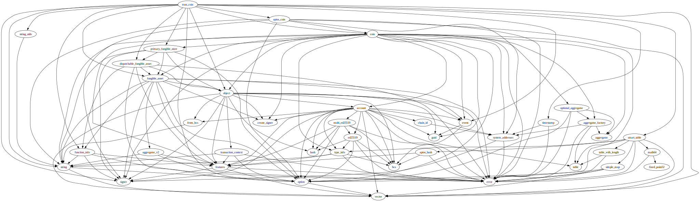
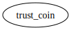

# Module `0xce3824597867081e7e16b21f4d364f90b1abae40b92e23dd915e5330719c2e98::trust_coin`

-  [Resource `Roles`](#0xce3824597867081e7e16b21f4d364f90b1abae40b92e23dd915e5330719c2e98_trust_coin_Roles)
-  [Resource `Management`](#0xce3824597867081e7e16b21f4d364f90b1abae40b92e23dd915e5330719c2e98_trust_coin_Management)
-  [Resource `State`](#0xce3824597867081e7e16b21f4d364f90b1abae40b92e23dd915e5330719c2e98_trust_coin_State)
-  [Resource `ExchangeRates`](#0xce3824597867081e7e16b21f4d364f90b1abae40b92e23dd915e5330719c2e98_trust_coin_ExchangeRates)
-  [Resource `ExchangeData`](#0xce3824597867081e7e16b21f4d364f90b1abae40b92e23dd915e5330719c2e98_trust_coin_ExchangeData)
-  [Resource `AllowDeposit`](#0xce3824597867081e7e16b21f4d364f90b1abae40b92e23dd915e5330719c2e98_trust_coin_AllowDeposit)
-  [Resource `AllowWithdraw`](#0xce3824597867081e7e16b21f4d364f90b1abae40b92e23dd915e5330719c2e98_trust_coin_AllowWithdraw)
-  [Struct `Burned`](#0xce3824597867081e7e16b21f4d364f90b1abae40b92e23dd915e5330719c2e98_trust_coin_Burned)
-  [Struct `Minted`](#0xce3824597867081e7e16b21f4d364f90b1abae40b92e23dd915e5330719c2e98_trust_coin_Minted)
-  [Struct `Paused`](#0xce3824597867081e7e16b21f4d364f90b1abae40b92e23dd915e5330719c2e98_trust_coin_Paused)
-  [Struct `DenylistUpdated`](#0xce3824597867081e7e16b21f4d364f90b1abae40b92e23dd915e5330719c2e98_trust_coin_DenylistUpdated)
-  [Struct `CoinsBurned`](#0xce3824597867081e7e16b21f4d364f90b1abae40b92e23dd915e5330719c2e98_trust_coin_CoinsBurned)
-  [Struct `CoinsFrozen`](#0xce3824597867081e7e16b21f4d364f90b1abae40b92e23dd915e5330719c2e98_trust_coin_CoinsFrozen)
-  [Struct `ExchangeAdded`](#0xce3824597867081e7e16b21f4d364f90b1abae40b92e23dd915e5330719c2e98_trust_coin_ExchangeAdded)
-  [Constants](#@Constants_0)
-  [Function `assert_minter`](#0xce3824597867081e7e16b21f4d364f90b1abae40b92e23dd915e5330719c2e98_trust_coin_assert_minter)
-  [Function `assert_owner`](#0xce3824597867081e7e16b21f4d364f90b1abae40b92e23dd915e5330719c2e98_trust_coin_assert_owner)
-  [Function `assert_pauser`](#0xce3824597867081e7e16b21f4d364f90b1abae40b92e23dd915e5330719c2e98_trust_coin_assert_pauser)
-  [Function `assert_denylister`](#0xce3824597867081e7e16b21f4d364f90b1abae40b92e23dd915e5330719c2e98_trust_coin_assert_denylister)
-  [Function `assert_not_paused`](#0xce3824597867081e7e16b21f4d364f90b1abae40b92e23dd915e5330719c2e98_trust_coin_assert_not_paused)
-  [Function `assert_allowlisted`](#0xce3824597867081e7e16b21f4d364f90b1abae40b92e23dd915e5330719c2e98_trust_coin_assert_allowlisted)
-  [Function `assert_withdrawer`](#0xce3824597867081e7e16b21f4d364f90b1abae40b92e23dd915e5330719c2e98_trust_coin_assert_withdrawer)
-  [Function `init_module`](#0xce3824597867081e7e16b21f4d364f90b1abae40b92e23dd915e5330719c2e98_trust_coin_init_module)
-  [Function `withdraw`](#0xce3824597867081e7e16b21f4d364f90b1abae40b92e23dd915e5330719c2e98_trust_coin_withdraw)
-  [Function `mint`](#0xce3824597867081e7e16b21f4d364f90b1abae40b92e23dd915e5330719c2e98_trust_coin_mint)
-  [Function `burn`](#0xce3824597867081e7e16b21f4d364f90b1abae40b92e23dd915e5330719c2e98_trust_coin_burn)
-  [Function `admin_add_to_denylist`](#0xce3824597867081e7e16b21f4d364f90b1abae40b92e23dd915e5330719c2e98_trust_coin_admin_add_to_denylist)
-  [Function `admin_add_all_to_denylist`](#0xce3824597867081e7e16b21f4d364f90b1abae40b92e23dd915e5330719c2e98_trust_coin_admin_add_all_to_denylist)
-  [Function `admin_remove_from_denylist`](#0xce3824597867081e7e16b21f4d364f90b1abae40b92e23dd915e5330719c2e98_trust_coin_admin_remove_from_denylist)
-  [Function `admin_remove_all_from_denylist`](#0xce3824597867081e7e16b21f4d364f90b1abae40b92e23dd915e5330719c2e98_trust_coin_admin_remove_all_from_denylist)
-  [Function `admin_add_limited_exchange_entry`](#0xce3824597867081e7e16b21f4d364f90b1abae40b92e23dd915e5330719c2e98_trust_coin_admin_add_limited_exchange_entry)
-  [Function `admin_add_default_exchange_entry`](#0xce3824597867081e7e16b21f4d364f90b1abae40b92e23dd915e5330719c2e98_trust_coin_admin_add_default_exchange_entry)
-  [Function `add_exchange_entry_internal`](#0xce3824597867081e7e16b21f4d364f90b1abae40b92e23dd915e5330719c2e98_trust_coin_add_exchange_entry_internal)
-  [Function `apt_metadata`](#0xce3824597867081e7e16b21f4d364f90b1abae40b92e23dd915e5330719c2e98_trust_coin_apt_metadata)
-  [Function `withdraw_seed`](#0xce3824597867081e7e16b21f4d364f90b1abae40b92e23dd915e5330719c2e98_trust_coin_withdraw_seed)
-  [Function `allow_direct_transfer`](#0xce3824597867081e7e16b21f4d364f90b1abae40b92e23dd915e5330719c2e98_trust_coin_allow_direct_transfer)
-  [Function `coin_address`](#0xce3824597867081e7e16b21f4d364f90b1abae40b92e23dd915e5330719c2e98_trust_coin_coin_address)
-  [Function `metadata`](#0xce3824597867081e7e16b21f4d364f90b1abae40b92e23dd915e5330719c2e98_trust_coin_metadata)
-  [Function `mint_obj_addr`](#0xce3824597867081e7e16b21f4d364f90b1abae40b92e23dd915e5330719c2e98_trust_coin_mint_obj_addr)
-  [Function `withdraw_obj_addr`](#0xce3824597867081e7e16b21f4d364f90b1abae40b92e23dd915e5330719c2e98_trust_coin_withdraw_obj_addr)

<pre><code><b>use</b> <a href="">0x1::aptos_coin</a>;
<b>use</b> <a href="">0x1::coin</a>;
<b>use</b> <a href="">0x1::dispatchable_fungible_asset</a>;
<b>use</b> <a href="">0x1::event</a>;
<b>use</b> <a href="">0x1::function_info</a>;
<b>use</b> <a href="">0x1::fungible_asset</a>;
<b>use</b> <a href="">0x1::object</a>;
<b>use</b> <a href="">0x1::option</a>;
<b>use</b> <a href="">0x1::primary_fungible_store</a>;
<b>use</b> <a href="">0x1::signer</a>;
<b>use</b> <a href="">0x1::smart_table</a>;
<b>use</b> <a href="">0x1::string</a>;
<b>use</b> <a href="">0x1::string_utils</a>;
<b>use</b> <a href="">0x1::timestamp</a>;
<b>use</b> <a href="">0x1::vector</a>;
</code></pre>

##### Show all the modules that "trust_coin" depends on directly or indirectly

##### Show all the modules that depend on "trust_coin" directly or indirectly

## Resource `Roles`

Global storage for trust coin's roles

<pre><code>#[resource_group_member(#[group = <a href="_ObjectGroup">0x1::object::ObjectGroup</a>])]
<b>struct</b> <a href="trust_coin.md#0xce3824597867081e7e16b21f4d364f90b1abae40b92e23dd915e5330719c2e98_trust_coin_Roles">Roles</a> <b>has</b> key
</code></pre>

##### Fields

<dl>
<dt>
<code>denylisters: <a href="">vector</a>&lt;<b>address</b>&gt;</code>
</dt>
<dd>

</dd>
<dt>
<code>minters: <a href="">vector</a>&lt;<b>address</b>&gt;</code>
</dt>
<dd>

</dd>
<dt>
<code>pausers: <a href="">vector</a>&lt;<b>address</b>&gt;</code>
</dt>
<dd>

</dd>
<dt>
<code>withdrawers: <a href="">vector</a>&lt;<b>address</b>&gt;</code>
</dt>
<dd>

</dd>
</dl>

## Resource `Management`

Global storage for trust coin's refs

<pre><code>#[resource_group_member(#[group = <a href="_ObjectGroup">0x1::object::ObjectGroup</a>])]
<b>struct</b> <a href="trust_coin.md#0xce3824597867081e7e16b21f4d364f90b1abae40b92e23dd915e5330719c2e98_trust_coin_Management">Management</a> <b>has</b> key
</code></pre>

##### Fields

<dl>
<dt>
<code>burn_ref: <a href="_BurnRef">fungible_asset::BurnRef</a></code>
</dt>
<dd>

</dd>
<dt>
<code>mint_ref: <a href="_MintRef">fungible_asset::MintRef</a></code>
</dt>
<dd>

</dd>
<dt>
<code>transfer_ref: <a href="_TransferRef">fungible_asset::TransferRef</a></code>
</dt>
<dd>

</dd>
</dl>

## Resource `State`

Global storage for trust coin's state

<pre><code>#[resource_group_member(#[group = <a href="_ObjectGroup">0x1::object::ObjectGroup</a>])]
<b>struct</b> <a href="trust_coin.md#0xce3824597867081e7e16b21f4d364f90b1abae40b92e23dd915e5330719c2e98_trust_coin_State">State</a> <b>has</b> key
</code></pre>

##### Fields

<dl>
<dt>
<code>paused: bool</code>
</dt>
<dd>

</dd>
</dl>

## Resource `ExchangeRates`

Global storage for trust coin's fixed exchange <Name, ExchangeData>

<pre><code>#[resource_group_member(#[group = <a href="_ObjectGroup">0x1::object::ObjectGroup</a>])]
<b>struct</b> <a href="trust_coin.md#0xce3824597867081e7e16b21f4d364f90b1abae40b92e23dd915e5330719c2e98_trust_coin_ExchangeRates">ExchangeRates</a> <b>has</b> key
</code></pre>

##### Fields

<dl>
<dt>
<code>default: <a href="_SmartTable">smart_table::SmartTable</a>&lt;<a href="_String">string::String</a>, <a href="trust_coin.md#0xce3824597867081e7e16b21f4d364f90b1abae40b92e23dd915e5330719c2e98_trust_coin_ExchangeData">trust_coin::ExchangeData</a>&gt;</code>
</dt>
<dd>

</dd>
<dt>
<code>limited: <a href="_SmartTable">smart_table::SmartTable</a>&lt;<a href="_String">string::String</a>, <a href="trust_coin.md#0xce3824597867081e7e16b21f4d364f90b1abae40b92e23dd915e5330719c2e98_trust_coin_ExchangeData">trust_coin::ExchangeData</a>&gt;</code>
</dt>
<dd>

</dd>
</dl>

## Resource `ExchangeData`

Global storage for trust coin's exchange data

<pre><code>#[resource_group_member(#[group = <a href="_ObjectGroup">0x1::object::ObjectGroup</a>])]
<b>struct</b> <a href="trust_coin.md#0xce3824597867081e7e16b21f4d364f90b1abae40b92e23dd915e5330719c2e98_trust_coin_ExchangeData">ExchangeData</a> <b>has</b> store, key
</code></pre>

##### Fields

<dl>
<dt>
<code>coin_metadata: <a href="_Object">object::Object</a>&lt;<a href="_Metadata">fungible_asset::Metadata</a>&gt;</code>
</dt>
<dd>

</dd>
<dt>
<code>coin_amount: u64</code>
</dt>
<dd>

</dd>
<dt>
<code>trust_amount_to_receive: u64</code>
</dt>
<dd>

</dd>
<dt>
<code>start_time: <a href="_Option">option::Option</a>&lt;u64&gt;</code>
</dt>
<dd>

</dd>
<dt>
<code>end_time: <a href="_Option">option::Option</a>&lt;u64&gt;</code>
</dt>
<dd>

</dd>
</dl>

## Resource `AllowDeposit`

Resource that is used to allow an account to use the deposit function

<pre><code><b>struct</b> <a href="trust_coin.md#0xce3824597867081e7e16b21f4d364f90b1abae40b92e23dd915e5330719c2e98_trust_coin_AllowDeposit">AllowDeposit</a> <b>has</b> key
</code></pre>

##### Fields

<dl>
<dt>
<code>dummy_field: bool</code>
</dt>
<dd>

</dd>
</dl>

## Resource `AllowWithdraw`

Resource that is used to allow an account to use the withdraw function

<pre><code><b>struct</b> <a href="trust_coin.md#0xce3824597867081e7e16b21f4d364f90b1abae40b92e23dd915e5330719c2e98_trust_coin_AllowWithdraw">AllowWithdraw</a> <b>has</b> key
</code></pre>

##### Fields

<dl>
<dt>
<code>dummy_field: bool</code>
</dt>
<dd>

</dd>
</dl>

## Struct `Burned`

<pre><code>#[<a href="">event</a>]
<b>struct</b> <a href="trust_coin.md#0xce3824597867081e7e16b21f4d364f90b1abae40b92e23dd915e5330719c2e98_trust_coin_Burned">Burned</a> <b>has</b> drop, store
</code></pre>

##### Fields

<dl>
<dt>
<code>coin_address: <b>address</b></code>
</dt>
<dd>

</dd>
<dt>
<code>burner: <b>address</b></code>
</dt>
<dd>

</dd>
<dt>
<code>from: <b>address</b></code>
</dt>
<dd>

</dd>
<dt>
<code>amount: u64</code>
</dt>
<dd>

</dd>
</dl>

## Struct `Minted`

<pre><code>#[<a href="">event</a>]
<b>struct</b> <a href="trust_coin.md#0xce3824597867081e7e16b21f4d364f90b1abae40b92e23dd915e5330719c2e98_trust_coin_Minted">Minted</a> <b>has</b> drop, store
</code></pre>

##### Fields

<dl>
<dt>
<code>coin_address: <b>address</b></code>
</dt>
<dd>

</dd>
<dt>
<code>minter: <b>address</b></code>
</dt>
<dd>

</dd>
<dt>
<code><b>to</b>: <b>address</b></code>
</dt>
<dd>

</dd>
<dt>
<code>amount: u64</code>
</dt>
<dd>

</dd>
</dl>

## Struct `Paused`

<pre><code>#[<a href="">event</a>]
<b>struct</b> <a href="trust_coin.md#0xce3824597867081e7e16b21f4d364f90b1abae40b92e23dd915e5330719c2e98_trust_coin_Paused">Paused</a> <b>has</b> drop, store
</code></pre>

##### Fields

<dl>
<dt>
<code>pauser: <b>address</b></code>
</dt>
<dd>

</dd>
<dt>
<code>is_paused: bool</code>
</dt>
<dd>

</dd>
</dl>

## Struct `DenylistUpdated`

<pre><code>#[<a href="">event</a>]
<b>struct</b> <a href="trust_coin.md#0xce3824597867081e7e16b21f4d364f90b1abae40b92e23dd915e5330719c2e98_trust_coin_DenylistUpdated">DenylistUpdated</a> <b>has</b> drop, store
</code></pre>

##### Fields

<dl>
<dt>
<code>denylister: <b>address</b></code>
</dt>
<dd>

</dd>
<dt>
<code><a href="">account</a>: <b>address</b></code>
</dt>
<dd>

</dd>
<dt>
<code>action: <a href="_String">string::String</a></code>
</dt>
<dd>

</dd>
</dl>

## Struct `CoinsBurned`

<pre><code>#[<a href="">event</a>]
<b>struct</b> <a href="trust_coin.md#0xce3824597867081e7e16b21f4d364f90b1abae40b92e23dd915e5330719c2e98_trust_coin_CoinsBurned">CoinsBurned</a> <b>has</b> drop, store
</code></pre>

##### Fields

<dl>
<dt>
<code>cointype: <a href="_String">string::String</a></code>
</dt>
<dd>

</dd>
<dt>
<code>amount: u64</code>
</dt>
<dd>

</dd>
</dl>

## Struct `CoinsFrozen`

<pre><code>#[<a href="">event</a>]
<b>struct</b> <a href="trust_coin.md#0xce3824597867081e7e16b21f4d364f90b1abae40b92e23dd915e5330719c2e98_trust_coin_CoinsFrozen">CoinsFrozen</a> <b>has</b> drop, store
</code></pre>

##### Fields

<dl>
<dt>
<code>cointype: <a href="_String">string::String</a></code>
</dt>
<dd>

</dd>
<dt>
<code>amount: u64</code>
</dt>
<dd>

</dd>
</dl>

## Struct `ExchangeAdded`

<pre><code>#[<a href="">event</a>]
<b>struct</b> <a href="trust_coin.md#0xce3824597867081e7e16b21f4d364f90b1abae40b92e23dd915e5330719c2e98_trust_coin_ExchangeAdded">ExchangeAdded</a> <b>has</b> drop, store
</code></pre>

##### Fields

<dl>
<dt>
<code>coin_metadata: <a href="_Object">object::Object</a>&lt;<a href="_Metadata">fungible_asset::Metadata</a>&gt;</code>
</dt>
<dd>

</dd>
<dt>
<code>coin_amount: u64</code>
</dt>
<dd>

</dd>
<dt>
<code>trust_amount_to_receive: u64</code>
</dt>
<dd>

</dd>
<dt>
<code>start_time: <a href="_Option">option::Option</a>&lt;u64&gt;</code>
</dt>
<dd>

</dd>
<dt>
<code>end_time: <a href="_Option">option::Option</a>&lt;u64&gt;</code>
</dt>
<dd>

</dd>
</dl>

## Constants

Caller is not authorized to make this call

<pre><code><b>const</b> <a href="trust_coin.md#0xce3824597867081e7e16b21f4d364f90b1abae40b92e23dd915e5330719c2e98_trust_coin_EUNAUTHORIZED">EUNAUTHORIZED</a>: u64 = 4;
</code></pre>

The caller is not the owner of the token

<pre><code><b>const</b> <a href="trust_coin.md#0xce3824597867081e7e16b21f4d364f90b1abae40b92e23dd915e5330719c2e98_trust_coin_ENOT_OWNER">ENOT_OWNER</a>: u64 = 0;
</code></pre>

denylist actions

<pre><code><b>const</b> <a href="trust_coin.md#0xce3824597867081e7e16b21f4d364f90b1abae40b92e23dd915e5330719c2e98_trust_coin_ADDED">ADDED</a>: <a href="">vector</a>&lt;u8&gt; = [100, 101, 110, 121, 108, 105, 115, 116, 101, 100];
</code></pre>

The coin is not burnable

<pre><code><b>const</b> <a href="trust_coin.md#0xce3824597867081e7e16b21f4d364f90b1abae40b92e23dd915e5330719c2e98_trust_coin_ECOIN_NOT_BURNABLE">ECOIN_NOT_BURNABLE</a>: u64 = 1;
</code></pre>

The coin is not freezable

<pre><code><b>const</b> <a href="trust_coin.md#0xce3824597867081e7e16b21f4d364f90b1abae40b92e23dd915e5330719c2e98_trust_coin_ECOIN_NOT_FREEZABLE">ECOIN_NOT_FREEZABLE</a>: u64 = 2;
</code></pre>

The account is denylisted

<pre><code><b>const</b> <a href="trust_coin.md#0xce3824597867081e7e16b21f4d364f90b1abae40b92e23dd915e5330719c2e98_trust_coin_EDENYLISTED">EDENYLISTED</a>: u64 = 5;
</code></pre>

Invalid time settings

<pre><code><b>const</b> <a href="trust_coin.md#0xce3824597867081e7e16b21f4d364f90b1abae40b92e23dd915e5330719c2e98_trust_coin_EINVALID_TIME">EINVALID_TIME</a>: u64 = 6;
</code></pre>

No operations are allowed when contract is paused

<pre><code><b>const</b> <a href="trust_coin.md#0xce3824597867081e7e16b21f4d364f90b1abae40b92e23dd915e5330719c2e98_trust_coin_EPAUSED">EPAUSED</a>: u64 = 3;
</code></pre>

<pre><code><b>const</b> <a href="trust_coin.md#0xce3824597867081e7e16b21f4d364f90b1abae40b92e23dd915e5330719c2e98_trust_coin_ICON">ICON</a>: <a href="">vector</a>&lt;u8&gt; = [104, 116, 116, 112, 115, 58, 47, 47, 116, 114, 117, 115, 116, 45, 49, 54, 46, 99, 111, 109, 47, 102, 97, 118, 105, 99, 111, 110, 46, 105, 99, 111];
</code></pre>

<pre><code><b>const</b> <a href="trust_coin.md#0xce3824597867081e7e16b21f4d364f90b1abae40b92e23dd915e5330719c2e98_trust_coin_MINT_SEED">MINT_SEED</a>: <a href="">vector</a>&lt;u8&gt; = [116, 114, 117, 115, 116, 95, 99, 111, 105, 110, 58, 58, 109, 105, 110, 116];
</code></pre>

<pre><code><b>const</b> <a href="trust_coin.md#0xce3824597867081e7e16b21f4d364f90b1abae40b92e23dd915e5330719c2e98_trust_coin_PROJECT">PROJECT</a>: <a href="">vector</a>&lt;u8&gt; = [104, 116, 116, 112, 115, 58, 47, 47, 116, 114, 117, 115, 116, 45, 49, 54, 46, 99, 111, 109];
</code></pre>

<pre><code><b>const</b> <a href="trust_coin.md#0xce3824597867081e7e16b21f4d364f90b1abae40b92e23dd915e5330719c2e98_trust_coin_REMOVED">REMOVED</a>: <a href="">vector</a>&lt;u8&gt; = [85, 110, 100, 101, 110, 121, 108, 105, 115, 116, 101, 100];
</code></pre>

<pre><code><b>const</b> <a href="trust_coin.md#0xce3824597867081e7e16b21f4d364f90b1abae40b92e23dd915e5330719c2e98_trust_coin_TRUST_NAME">TRUST_NAME</a>: <a href="">vector</a>&lt;u8&gt; = [84, 114, 117, 115, 116, 32, 67, 111, 105, 110];
</code></pre>

<pre><code><b>const</b> <a href="trust_coin.md#0xce3824597867081e7e16b21f4d364f90b1abae40b92e23dd915e5330719c2e98_trust_coin_TRUST_SYMBOL">TRUST_SYMBOL</a>: <a href="">vector</a>&lt;u8&gt; = [84, 82, 85, 83, 84];
</code></pre>

<pre><code><b>const</b> <a href="trust_coin.md#0xce3824597867081e7e16b21f4d364f90b1abae40b92e23dd915e5330719c2e98_trust_coin_WITHDRAW_SEED">WITHDRAW_SEED</a>: <a href="">vector</a>&lt;u8&gt; = [116, 114, 117, 115, 116, 95, 99, 111, 105, 110, 58, 58, 119, 105, 116, 104, 100, 114, 97, 119];
</code></pre>

## Function `assert_minter`

Assert the caller is the minter of the token

<pre><code><b>public</b> <b>fun</b> <a href="trust_coin.md#0xce3824597867081e7e16b21f4d364f90b1abae40b92e23dd915e5330719c2e98_trust_coin_assert_minter">assert_minter</a>(signer_ref: &<a href="">signer</a>)
</code></pre>

##### Implementation

<pre><code><b>public</b> <b>fun</b> <a href="trust_coin.md#0xce3824597867081e7e16b21f4d364f90b1abae40b92e23dd915e5330719c2e98_trust_coin_assert_minter">assert_minter</a>(signer_ref: &<a href="">signer</a>) <b>acquires</b> <a href="trust_coin.md#0xce3824597867081e7e16b21f4d364f90b1abae40b92e23dd915e5330719c2e98_trust_coin_Roles">Roles</a> {
    <b>let</b> signer_addr = <a href="_address_of">signer::address_of</a>(signer_ref);
    <b>let</b> roles = <b>borrow_global</b>&lt;<a href="trust_coin.md#0xce3824597867081e7e16b21f4d364f90b1abae40b92e23dd915e5330719c2e98_trust_coin_Roles">Roles</a>&gt;(<a href="trust_coin.md#0xce3824597867081e7e16b21f4d364f90b1abae40b92e23dd915e5330719c2e98_trust_coin_coin_address">coin_address</a>());
    <b>assert</b>!(<a href="_contains">vector::contains</a>(&roles.minters, &signer_addr), <a href="trust_coin.md#0xce3824597867081e7e16b21f4d364f90b1abae40b92e23dd915e5330719c2e98_trust_coin_EUNAUTHORIZED">EUNAUTHORIZED</a>);
}
</code></pre>

## Function `assert_owner`

Assert the address is the owner of the token

<pre><code><b>public</b> <b>fun</b> <a href="trust_coin.md#0xce3824597867081e7e16b21f4d364f90b1abae40b92e23dd915e5330719c2e98_trust_coin_assert_owner">assert_owner</a>(metadata: <a href="_Object">object::Object</a>&lt;<a href="_Metadata">fungible_asset::Metadata</a>&gt;, addr: <b>address</b>)
</code></pre>

##### Implementation

<pre><code><b>public</b> <b>fun</b> <a href="trust_coin.md#0xce3824597867081e7e16b21f4d364f90b1abae40b92e23dd915e5330719c2e98_trust_coin_assert_owner">assert_owner</a>(metadata: Object&lt;Metadata&gt;, addr: <b>address</b>) {
    <b>assert</b>!(<a href="_is_owner">object::is_owner</a>&lt;Metadata&gt;(metadata, addr), <a href="trust_coin.md#0xce3824597867081e7e16b21f4d364f90b1abae40b92e23dd915e5330719c2e98_trust_coin_ENOT_OWNER">ENOT_OWNER</a>);
}
</code></pre>

## Function `assert_pauser`

<pre><code><b>public</b> <b>fun</b> <a href="trust_coin.md#0xce3824597867081e7e16b21f4d364f90b1abae40b92e23dd915e5330719c2e98_trust_coin_assert_pauser">assert_pauser</a>(signer_ref: &<a href="">signer</a>)
</code></pre>

##### Implementation

<pre><code><b>public</b> <b>fun</b> <a href="trust_coin.md#0xce3824597867081e7e16b21f4d364f90b1abae40b92e23dd915e5330719c2e98_trust_coin_assert_pauser">assert_pauser</a>(signer_ref: &<a href="">signer</a>) <b>acquires</b> <a href="trust_coin.md#0xce3824597867081e7e16b21f4d364f90b1abae40b92e23dd915e5330719c2e98_trust_coin_Roles">Roles</a> {
    <b>let</b> signer_addr = <a href="_address_of">signer::address_of</a>(signer_ref);
    <b>let</b> roles = <b>borrow_global</b>&lt;<a href="trust_coin.md#0xce3824597867081e7e16b21f4d364f90b1abae40b92e23dd915e5330719c2e98_trust_coin_Roles">Roles</a>&gt;(<a href="trust_coin.md#0xce3824597867081e7e16b21f4d364f90b1abae40b92e23dd915e5330719c2e98_trust_coin_coin_address">coin_address</a>());
    <b>assert</b>!(<a href="_contains">vector::contains</a>(&roles.pausers, &signer_addr), <a href="trust_coin.md#0xce3824597867081e7e16b21f4d364f90b1abae40b92e23dd915e5330719c2e98_trust_coin_EUNAUTHORIZED">EUNAUTHORIZED</a>);
}
</code></pre>

## Function `assert_denylister`

<pre><code><b>public</b> <b>fun</b> <a href="trust_coin.md#0xce3824597867081e7e16b21f4d364f90b1abae40b92e23dd915e5330719c2e98_trust_coin_assert_denylister">assert_denylister</a>(signer_ref: &<a href="">signer</a>)
</code></pre>

##### Implementation

<pre><code><b>public</b> <b>fun</b> <a href="trust_coin.md#0xce3824597867081e7e16b21f4d364f90b1abae40b92e23dd915e5330719c2e98_trust_coin_assert_denylister">assert_denylister</a>(signer_ref: &<a href="">signer</a>) <b>acquires</b> <a href="trust_coin.md#0xce3824597867081e7e16b21f4d364f90b1abae40b92e23dd915e5330719c2e98_trust_coin_Roles">Roles</a> {
    <b>let</b> signer_addr = <a href="_address_of">signer::address_of</a>(signer_ref);
    <b>let</b> roles = <b>borrow_global</b>&lt;<a href="trust_coin.md#0xce3824597867081e7e16b21f4d364f90b1abae40b92e23dd915e5330719c2e98_trust_coin_Roles">Roles</a>&gt;(<a href="trust_coin.md#0xce3824597867081e7e16b21f4d364f90b1abae40b92e23dd915e5330719c2e98_trust_coin_coin_address">coin_address</a>());
    <b>assert</b>!(<a href="_contains">vector::contains</a>(&roles.denylisters, &signer_addr), <a href="trust_coin.md#0xce3824597867081e7e16b21f4d364f90b1abae40b92e23dd915e5330719c2e98_trust_coin_EUNAUTHORIZED">EUNAUTHORIZED</a>);
}
</code></pre>

## Function `assert_not_paused`

<pre><code><b>public</b> <b>fun</b> <a href="trust_coin.md#0xce3824597867081e7e16b21f4d364f90b1abae40b92e23dd915e5330719c2e98_trust_coin_assert_not_paused">assert_not_paused</a>()
</code></pre>

##### Implementation

<pre><code><b>public</b> <b>fun</b> <a href="trust_coin.md#0xce3824597867081e7e16b21f4d364f90b1abae40b92e23dd915e5330719c2e98_trust_coin_assert_not_paused">assert_not_paused</a>() <b>acquires</b> <a href="trust_coin.md#0xce3824597867081e7e16b21f4d364f90b1abae40b92e23dd915e5330719c2e98_trust_coin_State">State</a> {
    <b>let</b> state = <b>borrow_global</b>&lt;<a href="trust_coin.md#0xce3824597867081e7e16b21f4d364f90b1abae40b92e23dd915e5330719c2e98_trust_coin_State">State</a>&gt;(<a href="trust_coin.md#0xce3824597867081e7e16b21f4d364f90b1abae40b92e23dd915e5330719c2e98_trust_coin_coin_address">coin_address</a>());
    <b>assert</b>!(!state.paused, <a href="trust_coin.md#0xce3824597867081e7e16b21f4d364f90b1abae40b92e23dd915e5330719c2e98_trust_coin_EPAUSED">EPAUSED</a>);
}
</code></pre>

## Function `assert_allowlisted`

<pre><code><b>public</b> <b>fun</b> <a href="trust_coin.md#0xce3824597867081e7e16b21f4d364f90b1abae40b92e23dd915e5330719c2e98_trust_coin_assert_allowlisted">assert_allowlisted</a>(<a href="">account</a>: <b>address</b>)
</code></pre>

##### Implementation

<pre><code><b>public</b> <b>fun</b> <a href="trust_coin.md#0xce3824597867081e7e16b21f4d364f90b1abae40b92e23dd915e5330719c2e98_trust_coin_assert_allowlisted">assert_allowlisted</a>(<a href="">account</a>: <b>address</b>) {
    <b>let</b> metadata = <a href="trust_coin.md#0xce3824597867081e7e16b21f4d364f90b1abae40b92e23dd915e5330719c2e98_trust_coin_metadata">metadata</a>();
    <b>if</b> (<a href="_primary_store_exists">primary_fungible_store::primary_store_exists</a>(<a href="">account</a>, metadata)) {
        <b>assert</b>!(<a href="_is_frozen">fungible_asset::is_frozen</a>(<a href="_primary_store">primary_fungible_store::primary_store</a>(<a href="">account</a>, metadata)), <a href="trust_coin.md#0xce3824597867081e7e16b21f4d364f90b1abae40b92e23dd915e5330719c2e98_trust_coin_EDENYLISTED">EDENYLISTED</a>);
    }
}
</code></pre>

## Function `assert_withdrawer`

<pre><code><b>public</b> <b>fun</b> <a href="trust_coin.md#0xce3824597867081e7e16b21f4d364f90b1abae40b92e23dd915e5330719c2e98_trust_coin_assert_withdrawer">assert_withdrawer</a>(signer_ref: &<a href="">signer</a>)
</code></pre>

##### Implementation

<pre><code><b>public</b> <b>fun</b> <a href="trust_coin.md#0xce3824597867081e7e16b21f4d364f90b1abae40b92e23dd915e5330719c2e98_trust_coin_assert_withdrawer">assert_withdrawer</a>(signer_ref: &<a href="">signer</a>) <b>acquires</b> <a href="trust_coin.md#0xce3824597867081e7e16b21f4d364f90b1abae40b92e23dd915e5330719c2e98_trust_coin_Roles">Roles</a> {
    <b>let</b> signer_addr = <a href="_address_of">signer::address_of</a>(signer_ref);
    <b>let</b> roles = <b>borrow_global</b>&lt;<a href="trust_coin.md#0xce3824597867081e7e16b21f4d364f90b1abae40b92e23dd915e5330719c2e98_trust_coin_Roles">Roles</a>&gt;(<a href="trust_coin.md#0xce3824597867081e7e16b21f4d364f90b1abae40b92e23dd915e5330719c2e98_trust_coin_coin_address">coin_address</a>());
    <b>assert</b>!(<a href="_contains">vector::contains</a>(&roles.withdrawers, &signer_addr), <a href="trust_coin.md#0xce3824597867081e7e16b21f4d364f90b1abae40b92e23dd915e5330719c2e98_trust_coin_EUNAUTHORIZED">EUNAUTHORIZED</a>);
}
</code></pre>

## Function `init_module`

Initializer function

<pre><code><b>fun</b> <a href="trust_coin.md#0xce3824597867081e7e16b21f4d364f90b1abae40b92e23dd915e5330719c2e98_trust_coin_init_module">init_module</a>(deployer: &<a href="">signer</a>)
</code></pre>

##### Implementation

<pre><code><b>fun</b> <a href="trust_coin.md#0xce3824597867081e7e16b21f4d364f90b1abae40b92e23dd915e5330719c2e98_trust_coin_init_module">init_module</a>(deployer: &<a href="">signer</a>) {
    // <b>assert</b>!(<a href="_address_of">signer::address_of</a>(deployer) == @dev, 0xc1);
    // Create the <a href="">coin</a> <b>with</b> primary store support.
    <b>let</b> constructor_ref = &<a href="_create_named_object">object::create_named_object</a>(deployer, <a href="trust_coin.md#0xce3824597867081e7e16b21f4d364f90b1abae40b92e23dd915e5330719c2e98_trust_coin_TRUST_SYMBOL">TRUST_SYMBOL</a>);
    <a href="_create_primary_store_enabled_fungible_asset">primary_fungible_store::create_primary_store_enabled_fungible_asset</a>(
        constructor_ref,
        <a href="_none">option::none</a>(),
        <a href="_utf8">string::utf8</a>(<a href="trust_coin.md#0xce3824597867081e7e16b21f4d364f90b1abae40b92e23dd915e5330719c2e98_trust_coin_TRUST_NAME">TRUST_NAME</a>),
        <a href="_utf8">string::utf8</a>(<a href="trust_coin.md#0xce3824597867081e7e16b21f4d364f90b1abae40b92e23dd915e5330719c2e98_trust_coin_TRUST_SYMBOL">TRUST_SYMBOL</a>),
        8,
        <a href="_utf8">string::utf8</a>(<a href="trust_coin.md#0xce3824597867081e7e16b21f4d364f90b1abae40b92e23dd915e5330719c2e98_trust_coin_ICON">ICON</a>),
        <a href="_utf8">string::utf8</a>(<a href="trust_coin.md#0xce3824597867081e7e16b21f4d364f90b1abae40b92e23dd915e5330719c2e98_trust_coin_PROJECT">PROJECT</a>),
    );

    // Set ALL stores for the fungible asset <b>to</b> untransferable.
    <a href="_set_untransferable">fungible_asset::set_untransferable</a>(constructor_ref);

    // All resources created will be kept in the asset metadata <a href="">object</a>.
    <b>let</b> obj_signer_ref = &<a href="_generate_signer">object::generate_signer</a>(constructor_ref);
    <b>move_to</b>(obj_signer_ref, <a href="trust_coin.md#0xce3824597867081e7e16b21f4d364f90b1abae40b92e23dd915e5330719c2e98_trust_coin_Roles">Roles</a> {
        denylisters: <a href="">vector</a>[@dev],
        minters: <a href="">vector</a>[@dev],
        pausers: <a href="">vector</a>[@dev],
        withdrawers: <a href="">vector</a>[@dev],
    });

    // Create mint/burn/transfer refs <b>to</b> allow creator <b>to</b> manage the <a href="">coin</a>.
    <b>move_to</b>(obj_signer_ref, <a href="trust_coin.md#0xce3824597867081e7e16b21f4d364f90b1abae40b92e23dd915e5330719c2e98_trust_coin_Management">Management</a> {
        burn_ref: <a href="_generate_burn_ref">fungible_asset::generate_burn_ref</a>(constructor_ref),
        mint_ref: <a href="_generate_mint_ref">fungible_asset::generate_mint_ref</a>(constructor_ref),
        transfer_ref: <a href="_generate_transfer_ref">fungible_asset::generate_transfer_ref</a>(constructor_ref),
    });

    <b>move_to</b>(obj_signer_ref, <a href="trust_coin.md#0xce3824597867081e7e16b21f4d364f90b1abae40b92e23dd915e5330719c2e98_trust_coin_State">State</a> { paused: <b>false</b> });

    // initiate the default exchange <a href="">table</a>
    <b>let</b> default = <a href="_new">smart_table::new</a>&lt;String, <a href="trust_coin.md#0xce3824597867081e7e16b21f4d364f90b1abae40b92e23dd915e5330719c2e98_trust_coin_ExchangeData">ExchangeData</a>&gt;();
    // initiate the limited exchange <a href="">table</a>
    <b>let</b> limited = <a href="_new">smart_table::new</a>&lt;String, <a href="trust_coin.md#0xce3824597867081e7e16b21f4d364f90b1abae40b92e23dd915e5330719c2e98_trust_coin_ExchangeData">ExchangeData</a>&gt;();

    <b>move_to</b>(obj_signer_ref, <a href="trust_coin.md#0xce3824597867081e7e16b21f4d364f90b1abae40b92e23dd915e5330719c2e98_trust_coin_ExchangeRates">ExchangeRates</a> { default, limited });

    <b>let</b> withdraw = <a href="_new_function_info">function_info::new_function_info</a>(
        deployer,
        <a href="_utf8">string::utf8</a>(b"<a href="trust_coin.md#0xce3824597867081e7e16b21f4d364f90b1abae40b92e23dd915e5330719c2e98_trust_coin">trust_coin</a>"),
        <a href="_utf8">string::utf8</a>(b"withdraw"),
    );

    <a href="_register_dispatch_functions">dispatchable_fungible_asset::register_dispatch_functions</a>(
        constructor_ref,
        <a href="_some">option::some</a>(withdraw),
        <a href="_none">option::none</a>(),
        <a href="_none">option::none</a>(),
    );
}
</code></pre>

## Function `withdraw`

Withdraw function override to impose requirements on the account
Callable only by admins or allowed accounts

<pre><code><b>public</b> <b>fun</b> <a href="trust_coin.md#0xce3824597867081e7e16b21f4d364f90b1abae40b92e23dd915e5330719c2e98_trust_coin_withdraw">withdraw</a>&lt;T: key&gt;(store: <a href="_Object">object::Object</a>&lt;T&gt;, amount: u64, transfer_ref: &<a href="_TransferRef">fungible_asset::TransferRef</a>): <a href="_FungibleAsset">fungible_asset::FungibleAsset</a>
</code></pre>

##### Implementation

<pre><code><b>public</b> <b>fun</b> <a href="trust_coin.md#0xce3824597867081e7e16b21f4d364f90b1abae40b92e23dd915e5330719c2e98_trust_coin_withdraw">withdraw</a>&lt;T: key&gt;(
    store: Object&lt;T&gt;,
    amount: u64,
    transfer_ref: &TransferRef,
): FungibleAsset <b>acquires</b> <a href="trust_coin.md#0xce3824597867081e7e16b21f4d364f90b1abae40b92e23dd915e5330719c2e98_trust_coin_State">State</a> {
    <a href="trust_coin.md#0xce3824597867081e7e16b21f4d364f90b1abae40b92e23dd915e5330719c2e98_trust_coin_assert_not_paused">assert_not_paused</a>();
    // check <b>if</b> the <a href="">account</a> <b>has</b> primary store for the fa, <b>if</b> not create one
    <a href="_ensure_primary_store_exists">primary_fungible_store::ensure_primary_store_exists</a>(<a href="_owner">object::owner</a>(store), <a href="trust_coin.md#0xce3824597867081e7e16b21f4d364f90b1abae40b92e23dd915e5330719c2e98_trust_coin_metadata">metadata</a>());
    <a href="trust_coin.md#0xce3824597867081e7e16b21f4d364f90b1abae40b92e23dd915e5330719c2e98_trust_coin_assert_allowlisted">assert_allowlisted</a>(<a href="_owner">object::owner</a>(store));
    // Withdraw the amount from the input store and <b>return</b> it.
    <b>let</b> fa = <a href="_withdraw_with_ref">fungible_asset::withdraw_with_ref</a>(transfer_ref, store, amount);
    // <b>freeze</b> the store, disallowing direct transfers
    <a href="_set_frozen_flag">fungible_asset::set_frozen_flag</a>(transfer_ref, store, <b>true</b>);

    fa
}
</code></pre>

## Function `mint`

Mint new assets to the specified account.
TODO: should take key instead of amount
TODO: This should be in router module in order to be able to use both trust_coin and rewards_pool modules

<pre><code><b>public</b> entry <b>fun</b> <a href="trust_coin.md#0xce3824597867081e7e16b21f4d364f90b1abae40b92e23dd915e5330719c2e98_trust_coin_mint">mint</a>(minter: &<a href="">signer</a>, <b>to</b>: <b>address</b>, amount: u64)
</code></pre>

##### Implementation

<pre><code><b>public</b> entry <b>fun</b> <a href="trust_coin.md#0xce3824597867081e7e16b21f4d364f90b1abae40b92e23dd915e5330719c2e98_trust_coin_mint">mint</a>(minter: &<a href="">signer</a>, <b>to</b>: <b>address</b>, /*exchange_key: String*/ amount: u64) <b>acquires</b> <a href="trust_coin.md#0xce3824597867081e7e16b21f4d364f90b1abae40b92e23dd915e5330719c2e98_trust_coin_Management">Management</a>, <a href="trust_coin.md#0xce3824597867081e7e16b21f4d364f90b1abae40b92e23dd915e5330719c2e98_trust_coin_Roles">Roles</a> {
    <a href="trust_coin.md#0xce3824597867081e7e16b21f4d364f90b1abae40b92e23dd915e5330719c2e98_trust_coin_assert_minter">assert_minter</a>(minter);
    <b>let</b> management = <b>borrow_global</b>&lt;<a href="trust_coin.md#0xce3824597867081e7e16b21f4d364f90b1abae40b92e23dd915e5330719c2e98_trust_coin_Management">Management</a>&gt;(<a href="trust_coin.md#0xce3824597867081e7e16b21f4d364f90b1abae40b92e23dd915e5330719c2e98_trust_coin_coin_address">coin_address</a>());
    <b>let</b> fa_to_minter = <a href="_mint">fungible_asset::mint</a>(&management.mint_ref, amount);
    // <b>let</b> fa_to_rewards_pool = <a href="_mint">fungible_asset::mint</a>(&management.mint_ref, amount);
    // <b>let</b> rewards_pool_addr = <a href="_create_object_address">object::create_object_address</a>(&@<a href="trust_coin.md#0xce3824597867081e7e16b21f4d364f90b1abae40b92e23dd915e5330719c2e98_trust_coin">trust_coin</a>, <a href="trust_coin.md#0xce3824597867081e7e16b21f4d364f90b1abae40b92e23dd915e5330719c2e98_trust_coin_WITHDRAW_SEED">WITHDRAW_SEED</a>);
    <a href="_deposit_with_ref">fungible_asset::deposit_with_ref</a>(&management.transfer_ref, <a href="_ensure_primary_store_exists">primary_fungible_store::ensure_primary_store_exists</a>(<b>to</b>, <a href="trust_coin.md#0xce3824597867081e7e16b21f4d364f90b1abae40b92e23dd915e5330719c2e98_trust_coin_metadata">metadata</a>()), fa_to_minter);
    // <a href="_deposit_with_ref">fungible_asset::deposit_with_ref</a>(&management.transfer_ref, <a href="_primary_store">primary_fungible_store::primary_store</a>(rewards_pool_addr, <a href="trust_coin.md#0xce3824597867081e7e16b21f4d364f90b1abae40b92e23dd915e5330719c2e98_trust_coin_metadata">metadata</a>()), fa_to_rewards_pool);

    <a href="_emit">event::emit</a>(<a href="trust_coin.md#0xce3824597867081e7e16b21f4d364f90b1abae40b92e23dd915e5330719c2e98_trust_coin_Minted">Minted</a> {
        coin_address: <a href="trust_coin.md#0xce3824597867081e7e16b21f4d364f90b1abae40b92e23dd915e5330719c2e98_trust_coin_coin_address">coin_address</a>(),
        minter: <a href="_address_of">signer::address_of</a>(minter),
        <b>to</b>,
        amount,
    });

    // TODO: add events for rewards pool
}
</code></pre>

## Function `burn`

Burn assets from the specified account.

<pre><code><b>public</b> entry <b>fun</b> <a href="trust_coin.md#0xce3824597867081e7e16b21f4d364f90b1abae40b92e23dd915e5330719c2e98_trust_coin_burn">burn</a>(obj_signer_ref: &<a href="">signer</a>, from: <b>address</b>, amount: u64)
</code></pre>

##### Implementation

<pre><code><b>public</b> entry <b>fun</b> <a href="trust_coin.md#0xce3824597867081e7e16b21f4d364f90b1abae40b92e23dd915e5330719c2e98_trust_coin_burn">burn</a>(obj_signer_ref: &<a href="">signer</a>, from: <b>address</b>, amount: u64) <b>acquires</b> <a href="trust_coin.md#0xce3824597867081e7e16b21f4d364f90b1abae40b92e23dd915e5330719c2e98_trust_coin_Management">Management</a>, <a href="trust_coin.md#0xce3824597867081e7e16b21f4d364f90b1abae40b92e23dd915e5330719c2e98_trust_coin_State">State</a> {
    // Withdraw the assets from the <a href="">account</a> and burn them.
    <b>let</b> management = <b>borrow_global</b>&lt;<a href="trust_coin.md#0xce3824597867081e7e16b21f4d364f90b1abae40b92e23dd915e5330719c2e98_trust_coin_Management">Management</a>&gt;(<a href="trust_coin.md#0xce3824597867081e7e16b21f4d364f90b1abae40b92e23dd915e5330719c2e98_trust_coin_coin_address">coin_address</a>());
    <b>let</b> assets = <a href="trust_coin.md#0xce3824597867081e7e16b21f4d364f90b1abae40b92e23dd915e5330719c2e98_trust_coin_withdraw">withdraw</a>&lt;FungibleStore&gt;(
        <a href="_ensure_primary_store_exists">primary_fungible_store::ensure_primary_store_exists</a>(from, <a href="trust_coin.md#0xce3824597867081e7e16b21f4d364f90b1abae40b92e23dd915e5330719c2e98_trust_coin_metadata">metadata</a>()),
        amount,
        &management.transfer_ref
    );
    <a href="_burn">fungible_asset::burn</a>(&management.burn_ref, assets);

    <a href="_emit">event::emit</a>(<a href="trust_coin.md#0xce3824597867081e7e16b21f4d364f90b1abae40b92e23dd915e5330719c2e98_trust_coin_Burned">Burned</a> {
        coin_address: <a href="trust_coin.md#0xce3824597867081e7e16b21f4d364f90b1abae40b92e23dd915e5330719c2e98_trust_coin_coin_address">coin_address</a>(),
        burner: <a href="_address_of">signer::address_of</a>(obj_signer_ref),
        from,
        amount,
    });
}
</code></pre>

## Function `admin_add_to_denylist`

Add an account to the denylist. This checks that the caller is the denylister.

<pre><code><b>public</b> entry <b>fun</b> <a href="trust_coin.md#0xce3824597867081e7e16b21f4d364f90b1abae40b92e23dd915e5330719c2e98_trust_coin_admin_add_to_denylist">admin_add_to_denylist</a>(denylister: &<a href="">signer</a>, <a href="">account</a>: <b>address</b>)
</code></pre>

##### Implementation

<pre><code><b>public</b> entry <b>fun</b> <a href="trust_coin.md#0xce3824597867081e7e16b21f4d364f90b1abae40b92e23dd915e5330719c2e98_trust_coin_admin_add_to_denylist">admin_add_to_denylist</a>(denylister: &<a href="">signer</a>, <a href="">account</a>: <b>address</b>) <b>acquires</b> <a href="trust_coin.md#0xce3824597867081e7e16b21f4d364f90b1abae40b92e23dd915e5330719c2e98_trust_coin_Management">Management</a>, <a href="trust_coin.md#0xce3824597867081e7e16b21f4d364f90b1abae40b92e23dd915e5330719c2e98_trust_coin_Roles">Roles</a>, <a href="trust_coin.md#0xce3824597867081e7e16b21f4d364f90b1abae40b92e23dd915e5330719c2e98_trust_coin_State">State</a> {
    <b>let</b> fa_address = <a href="_object_address">object::object_address</a>&lt;Metadata&gt;(&<a href="trust_coin.md#0xce3824597867081e7e16b21f4d364f90b1abae40b92e23dd915e5330719c2e98_trust_coin_metadata">metadata</a>());
    <a href="trust_coin.md#0xce3824597867081e7e16b21f4d364f90b1abae40b92e23dd915e5330719c2e98_trust_coin_assert_not_paused">assert_not_paused</a>();
    <a href="trust_coin.md#0xce3824597867081e7e16b21f4d364f90b1abae40b92e23dd915e5330719c2e98_trust_coin_assert_denylister">assert_denylister</a>(denylister);

    <b>let</b> freeze_ref = &<b>borrow_global</b>&lt;<a href="trust_coin.md#0xce3824597867081e7e16b21f4d364f90b1abae40b92e23dd915e5330719c2e98_trust_coin_Management">Management</a>&gt;(fa_address).transfer_ref;
    <a href="_set_frozen_flag">primary_fungible_store::set_frozen_flag</a>(freeze_ref, <a href="">account</a>, <b>true</b>);

    <a href="_emit">event::emit</a>(
        <a href="trust_coin.md#0xce3824597867081e7e16b21f4d364f90b1abae40b92e23dd915e5330719c2e98_trust_coin_DenylistUpdated">DenylistUpdated</a> {
            denylister: <a href="_address_of">signer::address_of</a>(denylister),
            <a href="">account</a>,
            action: <a href="_utf8">string::utf8</a>(<a href="trust_coin.md#0xce3824597867081e7e16b21f4d364f90b1abae40b92e23dd915e5330719c2e98_trust_coin_ADDED">ADDED</a>)
        }
    );
}
</code></pre>

## Function `admin_add_all_to_denylist`

Add all accounts in the given list to the denylist. This checks that the caller is the denylister.

<pre><code><b>public</b> entry <b>fun</b> <a href="trust_coin.md#0xce3824597867081e7e16b21f4d364f90b1abae40b92e23dd915e5330719c2e98_trust_coin_admin_add_all_to_denylist">admin_add_all_to_denylist</a>(denylister: &<a href="">signer</a>, accounts: <a href="">vector</a>&lt;<b>address</b>&gt;)
</code></pre>

##### Implementation

<pre><code><b>public</b> entry <b>fun</b> <a href="trust_coin.md#0xce3824597867081e7e16b21f4d364f90b1abae40b92e23dd915e5330719c2e98_trust_coin_admin_add_all_to_denylist">admin_add_all_to_denylist</a>(denylister: &<a href="">signer</a>, accounts: <a href="">vector</a>&lt;<b>address</b>&gt;) <b>acquires</b> <a href="trust_coin.md#0xce3824597867081e7e16b21f4d364f90b1abae40b92e23dd915e5330719c2e98_trust_coin_Management">Management</a>, <a href="trust_coin.md#0xce3824597867081e7e16b21f4d364f90b1abae40b92e23dd915e5330719c2e98_trust_coin_Roles">Roles</a>, <a href="trust_coin.md#0xce3824597867081e7e16b21f4d364f90b1abae40b92e23dd915e5330719c2e98_trust_coin_State">State</a> {
    for (i in 0..<a href="_length">vector::length</a>(&accounts)) {
        <a href="trust_coin.md#0xce3824597867081e7e16b21f4d364f90b1abae40b92e23dd915e5330719c2e98_trust_coin_admin_add_to_denylist">admin_add_to_denylist</a>(denylister, *<a href="_borrow">vector::borrow</a>(&accounts, i));
    }
}
</code></pre>

## Function `admin_remove_from_denylist`

Remove an account from the denylist. This checks that the caller is the denylister.

<pre><code><b>public</b> entry <b>fun</b> <a href="trust_coin.md#0xce3824597867081e7e16b21f4d364f90b1abae40b92e23dd915e5330719c2e98_trust_coin_admin_remove_from_denylist">admin_remove_from_denylist</a>(denylister: &<a href="">signer</a>, <a href="">account</a>: <b>address</b>)
</code></pre>

##### Implementation

<pre><code><b>public</b> entry <b>fun</b> <a href="trust_coin.md#0xce3824597867081e7e16b21f4d364f90b1abae40b92e23dd915e5330719c2e98_trust_coin_admin_remove_from_denylist">admin_remove_from_denylist</a>(denylister: &<a href="">signer</a>, <a href="">account</a>: <b>address</b>) <b>acquires</b> <a href="trust_coin.md#0xce3824597867081e7e16b21f4d364f90b1abae40b92e23dd915e5330719c2e98_trust_coin_Management">Management</a>, <a href="trust_coin.md#0xce3824597867081e7e16b21f4d364f90b1abae40b92e23dd915e5330719c2e98_trust_coin_Roles">Roles</a>, <a href="trust_coin.md#0xce3824597867081e7e16b21f4d364f90b1abae40b92e23dd915e5330719c2e98_trust_coin_State">State</a> {
    <b>let</b> fa_address = <a href="trust_coin.md#0xce3824597867081e7e16b21f4d364f90b1abae40b92e23dd915e5330719c2e98_trust_coin_coin_address">coin_address</a>();
    <a href="trust_coin.md#0xce3824597867081e7e16b21f4d364f90b1abae40b92e23dd915e5330719c2e98_trust_coin_assert_not_paused">assert_not_paused</a>();
    <a href="trust_coin.md#0xce3824597867081e7e16b21f4d364f90b1abae40b92e23dd915e5330719c2e98_trust_coin_assert_denylister">assert_denylister</a>(denylister);

    <b>let</b> freeze_ref = &<b>borrow_global</b>&lt;<a href="trust_coin.md#0xce3824597867081e7e16b21f4d364f90b1abae40b92e23dd915e5330719c2e98_trust_coin_Management">Management</a>&gt;(fa_address).transfer_ref;
    <a href="_set_frozen_flag">primary_fungible_store::set_frozen_flag</a>(freeze_ref, <a href="">account</a>, <b>false</b>);

    <a href="_emit">event::emit</a>(<a href="trust_coin.md#0xce3824597867081e7e16b21f4d364f90b1abae40b92e23dd915e5330719c2e98_trust_coin_DenylistUpdated">DenylistUpdated</a> {
        denylister: <a href="_address_of">signer::address_of</a>(denylister),
        <a href="">account</a>,
        action: <a href="_utf8">string::utf8</a>(<a href="trust_coin.md#0xce3824597867081e7e16b21f4d364f90b1abae40b92e23dd915e5330719c2e98_trust_coin_REMOVED">REMOVED</a>)
    });
}
</code></pre>

## Function `admin_remove_all_from_denylist`

Remove all accounts in the given list from the denylist. This checks that the caller is the denylister.

<pre><code><b>public</b> entry <b>fun</b> <a href="trust_coin.md#0xce3824597867081e7e16b21f4d364f90b1abae40b92e23dd915e5330719c2e98_trust_coin_admin_remove_all_from_denylist">admin_remove_all_from_denylist</a>(denylister: &<a href="">signer</a>, accounts: <a href="">vector</a>&lt;<b>address</b>&gt;)
</code></pre>

##### Implementation

<pre><code><b>public</b> entry <b>fun</b> <a href="trust_coin.md#0xce3824597867081e7e16b21f4d364f90b1abae40b92e23dd915e5330719c2e98_trust_coin_admin_remove_all_from_denylist">admin_remove_all_from_denylist</a>(denylister: &<a href="">signer</a>, accounts: <a href="">vector</a>&lt;<b>address</b>&gt;) <b>acquires</b> <a href="trust_coin.md#0xce3824597867081e7e16b21f4d364f90b1abae40b92e23dd915e5330719c2e98_trust_coin_Management">Management</a>, <a href="trust_coin.md#0xce3824597867081e7e16b21f4d364f90b1abae40b92e23dd915e5330719c2e98_trust_coin_Roles">Roles</a>, <a href="trust_coin.md#0xce3824597867081e7e16b21f4d364f90b1abae40b92e23dd915e5330719c2e98_trust_coin_State">State</a> {
    for (i in 0..<a href="_length">vector::length</a>(&accounts)) {
        <a href="trust_coin.md#0xce3824597867081e7e16b21f4d364f90b1abae40b92e23dd915e5330719c2e98_trust_coin_admin_remove_from_denylist">admin_remove_from_denylist</a>(denylister, *<a href="_borrow">vector::borrow</a>(&accounts, i));
    }
}
</code></pre>

## Function `admin_add_limited_exchange_entry`

Add a new limited exchange entry to the exchange table
Callable only by the owner of the token only

<pre><code><b>public</b> entry <b>fun</b> <a href="trust_coin.md#0xce3824597867081e7e16b21f4d364f90b1abae40b92e23dd915e5330719c2e98_trust_coin_admin_add_limited_exchange_entry">admin_add_limited_exchange_entry</a>(signer_ref: &<a href="">signer</a>, coin_metadata: <a href="_Object">object::Object</a>&lt;<a href="_Metadata">fungible_asset::Metadata</a>&gt;, coin_amount: u64, trust_amount_to_receive: u64, maybe_start_time: u64, maybe_end_time: u64)
</code></pre>

##### Implementation

<pre><code><b>public</b> entry <b>fun</b> <a href="trust_coin.md#0xce3824597867081e7e16b21f4d364f90b1abae40b92e23dd915e5330719c2e98_trust_coin_admin_add_limited_exchange_entry">admin_add_limited_exchange_entry</a>(
    signer_ref: &<a href="">signer</a>,
    coin_metadata: Object&lt;Metadata&gt;,
    coin_amount: u64,
    trust_amount_to_receive: u64,
    maybe_start_time: u64,
    maybe_end_time: u64,
) <b>acquires</b> <a href="trust_coin.md#0xce3824597867081e7e16b21f4d364f90b1abae40b92e23dd915e5330719c2e98_trust_coin_ExchangeRates">ExchangeRates</a> {
    <a href="trust_coin.md#0xce3824597867081e7e16b21f4d364f90b1abae40b92e23dd915e5330719c2e98_trust_coin_assert_owner">assert_owner</a>(coin_metadata, <a href="_address_of">signer::address_of</a>(signer_ref));
    <b>let</b> exchange_rates = <b>borrow_global_mut</b>&lt;<a href="trust_coin.md#0xce3824597867081e7e16b21f4d364f90b1abae40b92e23dd915e5330719c2e98_trust_coin_ExchangeRates">ExchangeRates</a>&gt;(<a href="trust_coin.md#0xce3824597867081e7e16b21f4d364f90b1abae40b92e23dd915e5330719c2e98_trust_coin_coin_address">coin_address</a>());
    <a href="trust_coin.md#0xce3824597867081e7e16b21f4d364f90b1abae40b92e23dd915e5330719c2e98_trust_coin_add_exchange_entry_internal">add_exchange_entry_internal</a>(
        &<b>mut</b> exchange_rates.limited,
        coin_metadata,
        coin_amount,
        trust_amount_to_receive,
        <a href="_some">option::some</a>(maybe_start_time),
        <a href="_some">option::some</a>(maybe_end_time),
    );
}
</code></pre>

## Function `admin_add_default_exchange_entry`

Add a new default exchange entry to the exchange table
Callable only by the owner of the token only

<pre><code><b>public</b> entry <b>fun</b> <a href="trust_coin.md#0xce3824597867081e7e16b21f4d364f90b1abae40b92e23dd915e5330719c2e98_trust_coin_admin_add_default_exchange_entry">admin_add_default_exchange_entry</a>(signer_ref: &<a href="">signer</a>, coin_metadata: <a href="_Object">object::Object</a>&lt;<a href="_Metadata">fungible_asset::Metadata</a>&gt;, coin_amount: u64, trust_amount_to_receive: u64, maybe_start_time: u64, maybe_end_time: u64)
</code></pre>

##### Implementation

<pre><code><b>public</b> entry <b>fun</b> <a href="trust_coin.md#0xce3824597867081e7e16b21f4d364f90b1abae40b92e23dd915e5330719c2e98_trust_coin_admin_add_default_exchange_entry">admin_add_default_exchange_entry</a>(
    signer_ref: &<a href="">signer</a>,
    coin_metadata: Object&lt;Metadata&gt;,
    coin_amount: u64,
    trust_amount_to_receive: u64,
    maybe_start_time: u64,
    maybe_end_time: u64,
) <b>acquires</b> <a href="trust_coin.md#0xce3824597867081e7e16b21f4d364f90b1abae40b92e23dd915e5330719c2e98_trust_coin_ExchangeRates">ExchangeRates</a> {
    <a href="trust_coin.md#0xce3824597867081e7e16b21f4d364f90b1abae40b92e23dd915e5330719c2e98_trust_coin_assert_owner">assert_owner</a>(coin_metadata, <a href="_address_of">signer::address_of</a>(signer_ref));
    <b>let</b> exchange_rates = <b>borrow_global_mut</b>&lt;<a href="trust_coin.md#0xce3824597867081e7e16b21f4d364f90b1abae40b92e23dd915e5330719c2e98_trust_coin_ExchangeRates">ExchangeRates</a>&gt;(<a href="trust_coin.md#0xce3824597867081e7e16b21f4d364f90b1abae40b92e23dd915e5330719c2e98_trust_coin_coin_address">coin_address</a>());
    <a href="trust_coin.md#0xce3824597867081e7e16b21f4d364f90b1abae40b92e23dd915e5330719c2e98_trust_coin_add_exchange_entry_internal">add_exchange_entry_internal</a>(
        &<b>mut</b> exchange_rates.default,
        coin_metadata,
        coin_amount,
        trust_amount_to_receive,
        <a href="_some">option::some</a>(maybe_start_time),
        <a href="_some">option::some</a>(maybe_end_time),
    );
}
</code></pre>

## Function `add_exchange_entry_internal`

TODO: Remove an exchange entry from the exchange table
TODO: Add a denylister to the denylisters list
TODO: Add a minter to the minters list
TODO: Add a pauser to the pausers list
TODO: Add a withdrawer to the withdrawers list
TODO: Remove a denylister from the denylisters list
TODO: Remove a minter from the minters list
TODO: Remove a pauser from the pausers list
TODO: Remove a withdrawer from the withdrawers list
TODO: Pause the contract
TODO: Unpause the contract
Internal function to add a new exchange entry to the exchange table
name should be: "coin_amount + coin_symbol => trust_amount_to_receive"

<pre><code><b>fun</b> <a href="trust_coin.md#0xce3824597867081e7e16b21f4d364f90b1abae40b92e23dd915e5330719c2e98_trust_coin_add_exchange_entry_internal">add_exchange_entry_internal</a>(exchange_table_mut_ref: &<b>mut</b> <a href="_SmartTable">smart_table::SmartTable</a>&lt;<a href="_String">string::String</a>, <a href="trust_coin.md#0xce3824597867081e7e16b21f4d364f90b1abae40b92e23dd915e5330719c2e98_trust_coin_ExchangeData">trust_coin::ExchangeData</a>&gt;, coin_metadata: <a href="_Object">object::Object</a>&lt;<a href="_Metadata">fungible_asset::Metadata</a>&gt;, coin_amount: u64, trust_amount_to_receive: u64, maybe_start_time: <a href="_Option">option::Option</a>&lt;u64&gt;, maybe_end_time: <a href="_Option">option::Option</a>&lt;u64&gt;)
</code></pre>

##### Implementation

<pre><code>inline <b>fun</b> <a href="trust_coin.md#0xce3824597867081e7e16b21f4d364f90b1abae40b92e23dd915e5330719c2e98_trust_coin_add_exchange_entry_internal">add_exchange_entry_internal</a>(
    exchange_table_mut_ref: &<b>mut</b> SmartTable&lt;String, <a href="trust_coin.md#0xce3824597867081e7e16b21f4d364f90b1abae40b92e23dd915e5330719c2e98_trust_coin_ExchangeData">ExchangeData</a>&gt;,
    coin_metadata: Object&lt;Metadata&gt;,
    coin_amount: u64,
    trust_amount_to_receive: u64,
    maybe_start_time: Option&lt;u64&gt;,
    maybe_end_time: Option&lt;u64&gt;,
) {
    <b>if</b> (<a href="_is_some">option::is_some</a>(&maybe_start_time) && <a href="_is_some">option::is_some</a>(&maybe_end_time)) {
        // <b>assert</b> now &lt;= start_time &lt; end_time
        <b>let</b> start_time = *<a href="_borrow">option::borrow</a>(&maybe_start_time);
        <b>let</b> end_time = *<a href="_borrow">option::borrow</a>(&maybe_end_time);
        <b>assert</b>!(<a href="_now_seconds">timestamp::now_seconds</a>() &lt;= start_time, <a href="trust_coin.md#0xce3824597867081e7e16b21f4d364f90b1abae40b92e23dd915e5330719c2e98_trust_coin_EINVALID_TIME">EINVALID_TIME</a>);
        <b>assert</b>!(start_time &lt; end_time, <a href="trust_coin.md#0xce3824597867081e7e16b21f4d364f90b1abae40b92e23dd915e5330719c2e98_trust_coin_EINVALID_TIME">EINVALID_TIME</a>);
    };
    // prepare the exchange name
    <b>let</b> name = <a href="_utf8">string::utf8</a>(b"");
    <a href="_append">string::append</a>(&<b>mut</b> name, <a href="_to_string">string_utils::to_string</a>&lt;u64&gt;(&coin_amount));
    <a href="_append">string::append</a>(&<b>mut</b> name, <a href="_symbol">fungible_asset::symbol</a>(coin_metadata));
    <a href="_append">string::append</a>(&<b>mut</b> name, <a href="_to_string">string_utils::to_string</a>&lt;u64&gt;(&trust_amount_to_receive));

    <b>let</b> exchange_data = <a href="trust_coin.md#0xce3824597867081e7e16b21f4d364f90b1abae40b92e23dd915e5330719c2e98_trust_coin_ExchangeData">ExchangeData</a> {
        coin_metadata,
        coin_amount,
        trust_amount_to_receive,
        start_time: maybe_start_time,
        end_time: maybe_end_time,
    };

    <a href="_add">smart_table::add</a>(exchange_table_mut_ref, name, exchange_data);

    <a href="_emit">event::emit</a>(<a href="trust_coin.md#0xce3824597867081e7e16b21f4d364f90b1abae40b92e23dd915e5330719c2e98_trust_coin_ExchangeAdded">ExchangeAdded</a> {
        coin_metadata,
        coin_amount,
        trust_amount_to_receive,
        start_time: maybe_start_time,
        end_time: maybe_end_time,
    });
}
</code></pre>

## Function `apt_metadata`

Internal function to get the metadata of aptos coin

<pre><code><b>fun</b> <a href="trust_coin.md#0xce3824597867081e7e16b21f4d364f90b1abae40b92e23dd915e5330719c2e98_trust_coin_apt_metadata">apt_metadata</a>(): <a href="_Object">object::Object</a>&lt;<a href="_Metadata">fungible_asset::Metadata</a>&gt;
</code></pre>

##### Implementation

<pre><code><b>fun</b> <a href="trust_coin.md#0xce3824597867081e7e16b21f4d364f90b1abae40b92e23dd915e5330719c2e98_trust_coin_apt_metadata">apt_metadata</a>(): Object&lt;Metadata&gt; {
    <b>let</b> paired_metadata_opt = <a href="_paired_metadata">coin::paired_metadata</a>&lt;APT&gt;();
    <a href="_extract">option::extract</a>&lt;Object&lt;<a href="_Metadata">fungible_asset::Metadata</a>&gt;&gt;(&<b>mut</b> paired_metadata_opt)
}
</code></pre>

## Function `withdraw_seed`

Helper function to get the withraw seed

<pre><code><b>public</b> <b>fun</b> <a href="trust_coin.md#0xce3824597867081e7e16b21f4d364f90b1abae40b92e23dd915e5330719c2e98_trust_coin_withdraw_seed">withdraw_seed</a>(): <a href="">vector</a>&lt;u8&gt;
</code></pre>

##### Implementation

<pre><code><b>public</b> <b>fun</b> <a href="trust_coin.md#0xce3824597867081e7e16b21f4d364f90b1abae40b92e23dd915e5330719c2e98_trust_coin_withdraw_seed">withdraw_seed</a>(): <a href="">vector</a>&lt;u8&gt; {
    <a href="trust_coin.md#0xce3824597867081e7e16b21f4d364f90b1abae40b92e23dd915e5330719c2e98_trust_coin_WITHDRAW_SEED">WITHDRAW_SEED</a>
}
</code></pre>

## Function `allow_direct_transfer`

Helper function to allow direct transfer of a given account

<pre><code><b>fun</b> <a href="trust_coin.md#0xce3824597867081e7e16b21f4d364f90b1abae40b92e23dd915e5330719c2e98_trust_coin_allow_direct_transfer">allow_direct_transfer</a>&lt;T: key&gt;(signer_ref: &<a href="">signer</a>, store: <a href="_Object">object::Object</a>&lt;T&gt;)
</code></pre>

##### Implementation

<pre><code><b>fun</b> <a href="trust_coin.md#0xce3824597867081e7e16b21f4d364f90b1abae40b92e23dd915e5330719c2e98_trust_coin_allow_direct_transfer">allow_direct_transfer</a>&lt;T: key&gt;(signer_ref: &<a href="">signer</a>, store: Object&lt;T&gt;) <b>acquires</b> <a href="trust_coin.md#0xce3824597867081e7e16b21f4d364f90b1abae40b92e23dd915e5330719c2e98_trust_coin_Management">Management</a>, <a href="trust_coin.md#0xce3824597867081e7e16b21f4d364f90b1abae40b92e23dd915e5330719c2e98_trust_coin_Roles">Roles</a> {
    // ensure <a href="">signer</a> is authorized <b>to</b> make this call
    <a href="trust_coin.md#0xce3824597867081e7e16b21f4d364f90b1abae40b92e23dd915e5330719c2e98_trust_coin_assert_withdrawer">assert_withdrawer</a>(signer_ref);
    <b>let</b> management = <b>borrow_global</b>&lt;<a href="trust_coin.md#0xce3824597867081e7e16b21f4d364f90b1abae40b92e23dd915e5330719c2e98_trust_coin_Management">Management</a>&gt;(<a href="trust_coin.md#0xce3824597867081e7e16b21f4d364f90b1abae40b92e23dd915e5330719c2e98_trust_coin_coin_address">coin_address</a>());
    <a href="_set_frozen_flag">fungible_asset::set_frozen_flag</a>&lt;T&gt;(&management.transfer_ref, store, <b>false</b>);
}
</code></pre>

## Function `coin_address`

Returns the address of trust coin

<pre><code>#[view]
<b>public</b> <b>fun</b> <a href="trust_coin.md#0xce3824597867081e7e16b21f4d364f90b1abae40b92e23dd915e5330719c2e98_trust_coin_coin_address">coin_address</a>(): <b>address</b>
</code></pre>

##### Implementation

<pre><code><b>public</b> <b>fun</b> <a href="trust_coin.md#0xce3824597867081e7e16b21f4d364f90b1abae40b92e23dd915e5330719c2e98_trust_coin_coin_address">coin_address</a>(): <b>address</b> {
    <a href="_create_object_address">object::create_object_address</a>(&@<a href="trust_coin.md#0xce3824597867081e7e16b21f4d364f90b1abae40b92e23dd915e5330719c2e98_trust_coin">trust_coin</a>, <a href="trust_coin.md#0xce3824597867081e7e16b21f4d364f90b1abae40b92e23dd915e5330719c2e98_trust_coin_TRUST_SYMBOL">TRUST_SYMBOL</a>)
}
</code></pre>

## Function `metadata`

Returns the metadata of trust coin

<pre><code>#[view]
<b>public</b> <b>fun</b> <a href="trust_coin.md#0xce3824597867081e7e16b21f4d364f90b1abae40b92e23dd915e5330719c2e98_trust_coin_metadata">metadata</a>(): <a href="_Object">object::Object</a>&lt;<a href="_Metadata">fungible_asset::Metadata</a>&gt;
</code></pre>

##### Implementation

<pre><code><b>public</b> <b>fun</b> <a href="trust_coin.md#0xce3824597867081e7e16b21f4d364f90b1abae40b92e23dd915e5330719c2e98_trust_coin_metadata">metadata</a>(): Object&lt;Metadata&gt; {
    <a href="_address_to_object">object::address_to_object</a>(<a href="trust_coin.md#0xce3824597867081e7e16b21f4d364f90b1abae40b92e23dd915e5330719c2e98_trust_coin_coin_address">coin_address</a>())
}
</code></pre>

## Function `mint_obj_addr`

Returns the address of the mint object

<pre><code>#[view]
<b>public</b> <b>fun</b> <a href="trust_coin.md#0xce3824597867081e7e16b21f4d364f90b1abae40b92e23dd915e5330719c2e98_trust_coin_mint_obj_addr">mint_obj_addr</a>(): <b>address</b>
</code></pre>

##### Implementation

<pre><code><b>public</b> <b>fun</b> <a href="trust_coin.md#0xce3824597867081e7e16b21f4d364f90b1abae40b92e23dd915e5330719c2e98_trust_coin_mint_obj_addr">mint_obj_addr</a>(): <b>address</b> {
    <a href="_create_object_address">object::create_object_address</a>(&@<a href="trust_coin.md#0xce3824597867081e7e16b21f4d364f90b1abae40b92e23dd915e5330719c2e98_trust_coin">trust_coin</a>, <a href="trust_coin.md#0xce3824597867081e7e16b21f4d364f90b1abae40b92e23dd915e5330719c2e98_trust_coin_MINT_SEED">MINT_SEED</a>)
}
</code></pre>

## Function `withdraw_obj_addr`

Returns the address of the withdraw object

<pre><code>#[view]
<b>public</b> <b>fun</b> <a href="trust_coin.md#0xce3824597867081e7e16b21f4d364f90b1abae40b92e23dd915e5330719c2e98_trust_coin_withdraw_obj_addr">withdraw_obj_addr</a>(): <b>address</b>
</code></pre>

##### Implementation

<pre><code><b>public</b> <b>fun</b> <a href="trust_coin.md#0xce3824597867081e7e16b21f4d364f90b1abae40b92e23dd915e5330719c2e98_trust_coin_withdraw_obj_addr">withdraw_obj_addr</a>(): <b>address</b> {
    <a href="_create_object_address">object::create_object_address</a>(&@<a href="trust_coin.md#0xce3824597867081e7e16b21f4d364f90b1abae40b92e23dd915e5330719c2e98_trust_coin">trust_coin</a>, <a href="trust_coin.md#0xce3824597867081e7e16b21f4d364f90b1abae40b92e23dd915e5330719c2e98_trust_coin_WITHDRAW_SEED">WITHDRAW_SEED</a>)
}
</code></pre>
