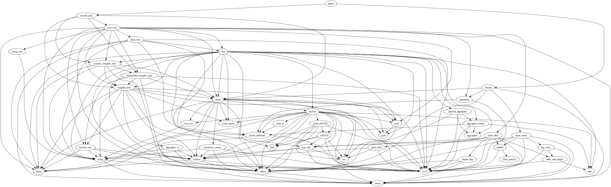
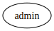

# Module `0x1b70e6e213bfb725f372840f616b3b6339d5ef17c0cacb3fe9a6ca79be1afbfd::admin`

-  [Function `init_module`](#0x1b70e6e213bfb725f372840f616b3b6339d5ef17c0cacb3fe9a6ca79be1afbfd_admin_init_module)
-  [Function `init_for_test`](#0x1b70e6e213bfb725f372840f616b3b6339d5ef17c0cacb3fe9a6ca79be1afbfd_admin_init_for_test)

<pre><code><b>use</b> <a href="rewards_pool.md#0x1b70e6e213bfb725f372840f616b3b6339d5ef17c0cacb3fe9a6ca79be1afbfd_rewards_pool">0x1b70e6e213bfb725f372840f616b3b6339d5ef17c0cacb3fe9a6ca79be1afbfd::rewards_pool</a>;
<b>use</b> <a href="session.md#0x1b70e6e213bfb725f372840f616b3b6339d5ef17c0cacb3fe9a6ca79be1afbfd_session">0x1b70e6e213bfb725f372840f616b3b6339d5ef17c0cacb3fe9a6ca79be1afbfd::session</a>;
</code></pre>

##### Show all the modules that "admin" depends on directly or indirectly

##### Show all the modules that depend on "admin" directly or indirectly

## Function `init_module`

<pre><code><b>fun</b> <a href="admin.md#0x1b70e6e213bfb725f372840f616b3b6339d5ef17c0cacb3fe9a6ca79be1afbfd_admin_init_module">init_module</a>(deployer: &<a href="">signer</a>)
</code></pre>

##### Implementation

<pre><code><b>fun</b> <a href="admin.md#0x1b70e6e213bfb725f372840f616b3b6339d5ef17c0cacb3fe9a6ca79be1afbfd_admin_init_module">init_module</a>(deployer: &<a href="">signer</a>) {
    // init rewards pool
    <a href="rewards_pool.md#0x1b70e6e213bfb725f372840f616b3b6339d5ef17c0cacb3fe9a6ca79be1afbfd_rewards_pool_init">rewards_pool::init</a>(deployer);
    // init <a href="session.md#0x1b70e6e213bfb725f372840f616b3b6339d5ef17c0cacb3fe9a6ca79be1afbfd_session">session</a>
    <a href="session.md#0x1b70e6e213bfb725f372840f616b3b6339d5ef17c0cacb3fe9a6ca79be1afbfd_session_init">session::init</a>(deployer);
}
</code></pre>

## Function `init_for_test`

<pre><code><b>public</b> <b>fun</b> <a href="admin.md#0x1b70e6e213bfb725f372840f616b3b6339d5ef17c0cacb3fe9a6ca79be1afbfd_admin_init_for_test">init_for_test</a>(deployer: &<a href="">signer</a>)
</code></pre>

##### Implementation

<pre><code><b>public</b> <b>fun</b> <a href="admin.md#0x1b70e6e213bfb725f372840f616b3b6339d5ef17c0cacb3fe9a6ca79be1afbfd_admin_init_for_test">init_for_test</a>(deployer: &<a href="">signer</a>) {
    <a href="admin.md#0x1b70e6e213bfb725f372840f616b3b6339d5ef17c0cacb3fe9a6ca79be1afbfd_admin_init_module">init_module</a>(deployer);
}
</code></pre>
