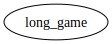

# Module `0x1b70e6e213bfb725f372840f616b3b6339d5ef17c0cacb3fe9a6ca79be1afbfd::long_game`

<pre><code></code></pre>

##### Show all the modules that "long_game" depends on directly or indirectly

##### Show all the modules that depend on "long_game" directly or indirectly

