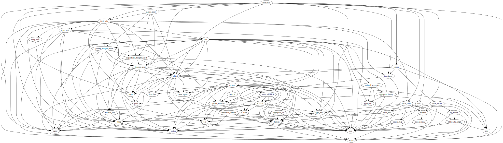
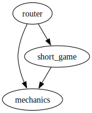

# Module `0x1b70e6e213bfb725f372840f616b3b6339d5ef17c0cacb3fe9a6ca79be1afbfd::mechanics`

-  [Resource `GameInfo`](#0x1b70e6e213bfb725f372840f616b3b6339d5ef17c0cacb3fe9a6ca79be1afbfd_mechanics_GameInfo)
-  [Resource `Round`](#0x1b70e6e213bfb725f372840f616b3b6339d5ef17c0cacb3fe9a6ca79be1afbfd_mechanics_Round)
-  [Struct `DescisionSubmitted`](#0x1b70e6e213bfb725f372840f616b3b6339d5ef17c0cacb3fe9a6ca79be1afbfd_mechanics_DescisionSubmitted)
-  [Struct `PepperSubmitted`](#0x1b70e6e213bfb725f372840f616b3b6339d5ef17c0cacb3fe9a6ca79be1afbfd_mechanics_PepperSubmitted)
-  [Constants](#@Constants_0)
-  [Function `assert_round_valid`](#0x1b70e6e213bfb725f372840f616b3b6339d5ef17c0cacb3fe9a6ca79be1afbfd_mechanics_assert_round_valid)
-  [Function `prepare_game`](#0x1b70e6e213bfb725f372840f616b3b6339d5ef17c0cacb3fe9a6ca79be1afbfd_mechanics_prepare_game)
-  [Function `start_game`](#0x1b70e6e213bfb725f372840f616b3b6339d5ef17c0cacb3fe9a6ca79be1afbfd_mechanics_start_game)
-  [Function `join_game`](#0x1b70e6e213bfb725f372840f616b3b6339d5ef17c0cacb3fe9a6ca79be1afbfd_mechanics_join_game)
-  [Function `finish_game`](#0x1b70e6e213bfb725f372840f616b3b6339d5ef17c0cacb3fe9a6ca79be1afbfd_mechanics_finish_game)
-  [Function `submit_decision`](#0x1b70e6e213bfb725f372840f616b3b6339d5ef17c0cacb3fe9a6ca79be1afbfd_mechanics_submit_decision)
-  [Function `submit_decision_internal`](#0x1b70e6e213bfb725f372840f616b3b6339d5ef17c0cacb3fe9a6ca79be1afbfd_mechanics_submit_decision_internal)
-  [Function `submit_first_decision`](#0x1b70e6e213bfb725f372840f616b3b6339d5ef17c0cacb3fe9a6ca79be1afbfd_mechanics_submit_first_decision)
-  [Function `submit_last_decision`](#0x1b70e6e213bfb725f372840f616b3b6339d5ef17c0cacb3fe9a6ca79be1afbfd_mechanics_submit_last_decision)
-  [Function `submit_pepper`](#0x1b70e6e213bfb725f372840f616b3b6339d5ef17c0cacb3fe9a6ca79be1afbfd_mechanics_submit_pepper)
-  [Function `finish_round`](#0x1b70e6e213bfb725f372840f616b3b6339d5ef17c0cacb3fe9a6ca79be1afbfd_mechanics_finish_round)
-  [Function `borrow_round`](#0x1b70e6e213bfb725f372840f616b3b6339d5ef17c0cacb3fe9a6ca79be1afbfd_mechanics_borrow_round)
-  [Function `borrow_round_mut`](#0x1b70e6e213bfb725f372840f616b3b6339d5ef17c0cacb3fe9a6ca79be1afbfd_mechanics_borrow_round_mut)
-  [Function `current_round_index`](#0x1b70e6e213bfb725f372840f616b3b6339d5ef17c0cacb3fe9a6ca79be1afbfd_mechanics_current_round_index)
-  [Function `initialize_round`](#0x1b70e6e213bfb725f372840f616b3b6339d5ef17c0cacb3fe9a6ca79be1afbfd_mechanics_initialize_round)
-  [Function `calculate_rewards_and_update_balance_tracker`](#0x1b70e6e213bfb725f372840f616b3b6339d5ef17c0cacb3fe9a6ca79be1afbfd_mechanics_calculate_rewards_and_update_balance_tracker)
-  [Function `distribute_rewards`](#0x1b70e6e213bfb725f372840f616b3b6339d5ef17c0cacb3fe9a6ca79be1afbfd_mechanics_distribute_rewards)
-  [Function `game_type`](#0x1b70e6e213bfb725f372840f616b3b6339d5ef17c0cacb3fe9a6ca79be1afbfd_mechanics_game_type)
-  [Function `round_start_time`](#0x1b70e6e213bfb725f372840f616b3b6339d5ef17c0cacb3fe9a6ca79be1afbfd_mechanics_round_start_time)
-  [Function `round_duration`](#0x1b70e6e213bfb725f372840f616b3b6339d5ef17c0cacb3fe9a6ca79be1afbfd_mechanics_round_duration)
-  [Function `round_hashed_decisions_map`](#0x1b70e6e213bfb725f372840f616b3b6339d5ef17c0cacb3fe9a6ca79be1afbfd_mechanics_round_hashed_decisions_map)
-  [Function `player_round_deposit_amount`](#0x1b70e6e213bfb725f372840f616b3b6339d5ef17c0cacb3fe9a6ca79be1afbfd_mechanics_player_round_deposit_amount)
-  [Function `round_deposit_amount`](#0x1b70e6e213bfb725f372840f616b3b6339d5ef17c0cacb3fe9a6ca79be1afbfd_mechanics_round_deposit_amount)
-  [Function `round_total_players_deposit_amount`](#0x1b70e6e213bfb725f372840f616b3b6339d5ef17c0cacb3fe9a6ca79be1afbfd_mechanics_round_total_players_deposit_amount)
-  [Function `round_rewards_pool_deposit_amount`](#0x1b70e6e213bfb725f372840f616b3b6339d5ef17c0cacb3fe9a6ca79be1afbfd_mechanics_round_rewards_pool_deposit_amount)
-  [Function `total_in_round_rewards`](#0x1b70e6e213bfb725f372840f616b3b6339d5ef17c0cacb3fe9a6ca79be1afbfd_mechanics_total_in_round_rewards)
-  [Function `is_active`](#0x1b70e6e213bfb725f372840f616b3b6339d5ef17c0cacb3fe9a6ca79be1afbfd_mechanics_is_active)
-  [Function `are_all_decisions_submitted`](#0x1b70e6e213bfb725f372840f616b3b6339d5ef17c0cacb3fe9a6ca79be1afbfd_mechanics_are_all_decisions_submitted)
-  [Function `reveal_decisions_in_round`](#0x1b70e6e213bfb725f372840f616b3b6339d5ef17c0cacb3fe9a6ca79be1afbfd_mechanics_reveal_decisions_in_round)
-  [Function `is_first_decision_in_round`](#0x1b70e6e213bfb725f372840f616b3b6339d5ef17c0cacb3fe9a6ca79be1afbfd_mechanics_is_first_decision_in_round)
-  [Function `is_last_decision_in_round`](#0x1b70e6e213bfb725f372840f616b3b6339d5ef17c0cacb3fe9a6ca79be1afbfd_mechanics_is_last_decision_in_round)
-  [Function `live_round_index`](#0x1b70e6e213bfb725f372840f616b3b6339d5ef17c0cacb3fe9a6ca79be1afbfd_mechanics_live_round_index)
-  [Function `rounds_count`](#0x1b70e6e213bfb725f372840f616b3b6339d5ef17c0cacb3fe9a6ca79be1afbfd_mechanics_rounds_count)
-  [Function `hashed_decision`](#0x1b70e6e213bfb725f372840f616b3b6339d5ef17c0cacb3fe9a6ca79be1afbfd_mechanics_hashed_decision)

<pre><code><b>use</b> <a href="">0x1::event</a>;
<b>use</b> <a href="">0x1::fungible_asset</a>;
<b>use</b> <a href="">0x1::object</a>;
<b>use</b> <a href="">0x1::option</a>;
<b>use</b> <a href="">0x1::signer</a>;
<b>use</b> <a href="">0x1::simple_map</a>;
<b>use</b> <a href="">0x1::smart_table</a>;
<b>use</b> <a href="">0x1::timestamp</a>;
<b>use</b> <a href="">0x1::type_info</a>;
<b>use</b> <a href="">0x1::vector</a>;
<b>use</b> <a href="rewards_pool.md#0x1b70e6e213bfb725f372840f616b3b6339d5ef17c0cacb3fe9a6ca79be1afbfd_rewards_pool">0x1b70e6e213bfb725f372840f616b3b6339d5ef17c0cacb3fe9a6ca79be1afbfd::rewards_pool</a>;
<b>use</b> <a href="session.md#0x1b70e6e213bfb725f372840f616b3b6339d5ef17c0cacb3fe9a6ca79be1afbfd_session">0x1b70e6e213bfb725f372840f616b3b6339d5ef17c0cacb3fe9a6ca79be1afbfd::session</a>;
<b>use</b> <a href="utils.md#0x1b70e6e213bfb725f372840f616b3b6339d5ef17c0cacb3fe9a6ca79be1afbfd_utils">0x1b70e6e213bfb725f372840f616b3b6339d5ef17c0cacb3fe9a6ca79be1afbfd::utils</a>;
<b>use</b> <a href="">0xce3824597867081e7e16b21f4d364f90b1abae40b92e23dd915e5330719c2e98::trust_coin</a>;
</code></pre>

##### Show all the modules that "mechanics" depends on directly or indirectly

##### Show all the modules that depend on "mechanics" directly or indirectly

## Resource `GameInfo`

Global storage for the game data

<pre><code><b>struct</b> <a href="mechanics.md#0x1b70e6e213bfb725f372840f616b3b6339d5ef17c0cacb3fe9a6ca79be1afbfd_mechanics_GameInfo">GameInfo</a> <b>has</b> key
</code></pre>

##### Fields

<dl>
<dt>
<code>type: <a href="_TypeInfo">type_info::TypeInfo</a></code>
</dt>
<dd>

</dd>
<dt>
<code>rounds_count: u64</code>
</dt>
<dd>

</dd>
<dt>
<code>rounds_durations: <a href="">vector</a>&lt;u64&gt;</code>
</dt>
<dd>

</dd>
<dt>
<code>rounds: <a href="">vector</a>&lt;<a href="mechanics.md#0x1b70e6e213bfb725f372840f616b3b6339d5ef17c0cacb3fe9a6ca79be1afbfd_mechanics_Round">mechanics::Round</a>&gt;</code>
</dt>
<dd>

</dd>
<dt>
<code>initial_balances: <a href="_SmartTable">smart_table::SmartTable</a>&lt;<b>address</b>, u64&gt;</code>
</dt>
<dd>

</dd>
<dt>
<code>balances_tracker: <a href="_SmartTable">smart_table::SmartTable</a>&lt;<b>address</b>, u64&gt;</code>
</dt>
<dd>

</dd>
<dt>
<code>pool: <a href="_Object">object::Object</a>&lt;<a href="_FungibleStore">fungible_asset::FungibleStore</a>&gt;</code>
</dt>
<dd>

</dd>
</dl>

## Resource `Round`

Global storage for the round data

<pre><code><b>struct</b> <a href="mechanics.md#0x1b70e6e213bfb725f372840f616b3b6339d5ef17c0cacb3fe9a6ca79be1afbfd_mechanics_Round">Round</a> <b>has</b> store, key
</code></pre>

##### Fields

<dl>
<dt>
<code>start_time: u64</code>
</dt>
<dd>

</dd>
<dt>
<code>allow_reveal: bool</code>
</dt>
<dd>

</dd>
<dt>
<code>pepper: <a href="_Option">option::Option</a>&lt;<a href="">vector</a>&lt;u8&gt;&gt;</code>
</dt>
<dd>

</dd>
<dt>
<code>decisions: <a href="_SmartTable">smart_table::SmartTable</a>&lt;<b>address</b>, <a href="">vector</a>&lt;u8&gt;&gt;</code>
</dt>
<dd>

</dd>
</dl>

## Struct `DescisionSubmitted`

<pre><code>#[<a href="">event</a>]
<b>struct</b> <a href="mechanics.md#0x1b70e6e213bfb725f372840f616b3b6339d5ef17c0cacb3fe9a6ca79be1afbfd_mechanics_DescisionSubmitted">DescisionSubmitted</a> <b>has</b> drop, store
</code></pre>

##### Fields

<dl>
<dt>
<code><a href="player.md#0x1b70e6e213bfb725f372840f616b3b6339d5ef17c0cacb3fe9a6ca79be1afbfd_player">player</a>: <b>address</b></code>
</dt>
<dd>

</dd>
<dt>
<code>round_index: u64</code>
</dt>
<dd>

</dd>
<dt>
<code>decision: <a href="">vector</a>&lt;u8&gt;</code>
</dt>
<dd>

</dd>
<dt>
<code>is_first_decision_in_round: bool</code>
</dt>
<dd>

</dd>
<dt>
<code>is_last_decision_in_round: bool</code>
</dt>
<dd>

</dd>
</dl>

## Struct `PepperSubmitted`

<pre><code>#[<a href="">event</a>]
<b>struct</b> <a href="mechanics.md#0x1b70e6e213bfb725f372840f616b3b6339d5ef17c0cacb3fe9a6ca79be1afbfd_mechanics_PepperSubmitted">PepperSubmitted</a> <b>has</b> drop, store
</code></pre>

##### Fields

<dl>
<dt>
<code>round_index: u64</code>
</dt>
<dd>

</dd>
<dt>
<code>pepper: <a href="">vector</a>&lt;u8&gt;</code>
</dt>
<dd>

</dd>
</dl>

## Constants

You already submitted a decision

<pre><code><b>const</b> <a href="mechanics.md#0x1b70e6e213bfb725f372840f616b3b6339d5ef17c0cacb3fe9a6ca79be1afbfd_mechanics_EDECSION_ALREADY_SUBMITTED">EDECSION_ALREADY_SUBMITTED</a>: u64 = 3;
</code></pre>

The game is not finished yet

<pre><code><b>const</b> <a href="mechanics.md#0x1b70e6e213bfb725f372840f616b3b6339d5ef17c0cacb3fe9a6ca79be1afbfd_mechanics_EGAME_NOT_FINISHED">EGAME_NOT_FINISHED</a>: u64 = 7;
</code></pre>

The length of the input vector is not as expected

<pre><code><b>const</b> <a href="mechanics.md#0x1b70e6e213bfb725f372840f616b3b6339d5ef17c0cacb3fe9a6ca79be1afbfd_mechanics_ELENGTH_MISMATCH">ELENGTH_MISMATCH</a>: u64 = 1;
</code></pre>

Not all players have submitted their decisions

<pre><code><b>const</b> <a href="mechanics.md#0x1b70e6e213bfb725f372840f616b3b6339d5ef17c0cacb3fe9a6ca79be1afbfd_mechanics_ENOT_ALL_SUBMITTED">ENOT_ALL_SUBMITTED</a>: u64 = 4;
</code></pre>

The pepper is already submitted

<pre><code><b>const</b> <a href="mechanics.md#0x1b70e6e213bfb725f372840f616b3b6339d5ef17c0cacb3fe9a6ca79be1afbfd_mechanics_EPEPPER_SUBMITTED">EPEPPER_SUBMITTED</a>: u64 = 5;
</code></pre>

The round index is invalid

<pre><code><b>const</b> <a href="mechanics.md#0x1b70e6e213bfb725f372840f616b3b6339d5ef17c0cacb3fe9a6ca79be1afbfd_mechanics_EROUND_INVALID">EROUND_INVALID</a>: u64 = 2;
</code></pre>

Hash mismatch

<pre><code><b>const</b> <a href="mechanics.md#0x1b70e6e213bfb725f372840f616b3b6339d5ef17c0cacb3fe9a6ca79be1afbfd_mechanics_E_HASH_MISMATCH">E_HASH_MISMATCH</a>: u64 = 6;
</code></pre>

## Function `assert_round_valid`

Ensure round is valid:
- given round index is equal to the current round index
- the current time is within the round duration

<pre><code><b>public</b> <b>fun</b> <a href="mechanics.md#0x1b70e6e213bfb725f372840f616b3b6339d5ef17c0cacb3fe9a6ca79be1afbfd_mechanics_assert_round_valid">assert_round_valid</a>(session_id: <b>address</b>, round_index: u64)
</code></pre>

##### Implementation

<pre><code><b>public</b> <b>fun</b> <a href="mechanics.md#0x1b70e6e213bfb725f372840f616b3b6339d5ef17c0cacb3fe9a6ca79be1afbfd_mechanics_assert_round_valid">assert_round_valid</a>(session_id: <b>address</b>, round_index: u64) <b>acquires</b> <a href="mechanics.md#0x1b70e6e213bfb725f372840f616b3b6339d5ef17c0cacb3fe9a6ca79be1afbfd_mechanics_GameInfo">GameInfo</a> {
    // <b>let</b> game_info = <b>borrow_global</b>&lt;<a href="mechanics.md#0x1b70e6e213bfb725f372840f616b3b6339d5ef17c0cacb3fe9a6ca79be1afbfd_mechanics_GameInfo">GameInfo</a>&gt;(session_id);
    <b>if</b> (round_index == 0) {
        <a href="mechanics.md#0x1b70e6e213bfb725f372840f616b3b6339d5ef17c0cacb3fe9a6ca79be1afbfd_mechanics_round_start_time">round_start_time</a>(session_id, 0)
    } <b>else</b> {
        <a href="mechanics.md#0x1b70e6e213bfb725f372840f616b3b6339d5ef17c0cacb3fe9a6ca79be1afbfd_mechanics_round_start_time">round_start_time</a>(session_id, (round_index - 1)) + <a href="mechanics.md#0x1b70e6e213bfb725f372840f616b3b6339d5ef17c0cacb3fe9a6ca79be1afbfd_mechanics_round_duration">round_duration</a>(session_id, round_index)
    };
    // <b>let</b> round_duration = <a href="mechanics.md#0x1b70e6e213bfb725f372840f616b3b6339d5ef17c0cacb3fe9a6ca79be1afbfd_mechanics_round_duration">round_duration</a>(session_id, round_index);
    // <b>let</b> current_time = <a href="_now_seconds">timestamp::now_seconds</a>();
    // TODO: time check
    // <b>assert</b>!(current_time &gt;= round_time && current_time &lt;= round_time + round_duration, <a href="mechanics.md#0x1b70e6e213bfb725f372840f616b3b6339d5ef17c0cacb3fe9a6ca79be1afbfd_mechanics_EROUND_INVALID">EROUND_INVALID</a>);
}
</code></pre>

## Function `prepare_game`

Creates the game for matchmaking
Returns the session id

<pre><code><b>public</b>(<b>friend</b>) <b>fun</b> <a href="mechanics.md#0x1b70e6e213bfb725f372840f616b3b6339d5ef17c0cacb3fe9a6ca79be1afbfd_mechanics_prepare_game">prepare_game</a>(type: <a href="_TypeInfo">type_info::TypeInfo</a>, players: <a href="">vector</a>&lt;<b>address</b>&gt;, rounds_count: u64, rounds_durations: <a href="">vector</a>&lt;u64&gt;): <b>address</b>
</code></pre>

##### Implementation

<pre><code><b>public</b>(<b>friend</b>) <b>fun</b> <a href="mechanics.md#0x1b70e6e213bfb725f372840f616b3b6339d5ef17c0cacb3fe9a6ca79be1afbfd_mechanics_prepare_game">prepare_game</a>(
    type: TypeInfo,
    players: <a href="">vector</a>&lt;<b>address</b>&gt;,
    rounds_count: u64,
    rounds_durations: <a href="">vector</a>&lt;u64&gt;
): <b>address</b> {
    <b>let</b> session_id = <a href="session.md#0x1b70e6e213bfb725f372840f616b3b6339d5ef17c0cacb3fe9a6ca79be1afbfd_session_create_session">session::create_session</a>(players);
    <b>let</b> session_signer_ref = &<a href="session.md#0x1b70e6e213bfb725f372840f616b3b6339d5ef17c0cacb3fe9a6ca79be1afbfd_session_session_signer">session::session_signer</a>(session_id);
    // ensure the length of the duration <a href="">vector</a> is <b>as</b> expected
    <b>assert</b>!(<a href="_length">vector::length</a>(&rounds_durations) == rounds_count, <a href="mechanics.md#0x1b70e6e213bfb725f372840f616b3b6339d5ef17c0cacb3fe9a6ca79be1afbfd_mechanics_ELENGTH_MISMATCH">ELENGTH_MISMATCH</a>);
    // prepare initial balances and balances tracker
    <b>let</b> addresses = <a href="">vector</a>[<a href="rewards_pool.md#0x1b70e6e213bfb725f372840f616b3b6339d5ef17c0cacb3fe9a6ca79be1afbfd_rewards_pool_pool_address">rewards_pool::pool_address</a>()];
    <a href="_append">vector::append</a>(&<b>mut</b> addresses, players);
    <b>let</b> balances = <a href="_empty">vector::empty</a>&lt;u64&gt;();
    for (i in 0..<a href="_length">vector::length</a>(&addresses)) {
        <a href="_push_back">vector::push_back</a>(&<b>mut</b> balances, 0);
    };
    <b>let</b> <a href="">table</a> = <a href="_new">smart_table::new</a>&lt;<b>address</b>, u64&gt;();
    <b>let</b> table_2 = <a href="_new">smart_table::new</a>&lt;<b>address</b>, u64&gt;();
    <a href="_add_all">smart_table::add_all</a>&lt;<b>address</b>, u64&gt;(&<b>mut</b> <a href="">table</a>, addresses, balances);
    <a href="_add_all">smart_table::add_all</a>&lt;<b>address</b>, u64&gt;(&<b>mut</b> table_2, addresses, balances);

    <b>let</b> obj_constructor = <a href="_create_object">object::create_object</a>(session_id);
    <b>move_to</b>(
        session_signer_ref,
        <a href="mechanics.md#0x1b70e6e213bfb725f372840f616b3b6339d5ef17c0cacb3fe9a6ca79be1afbfd_mechanics_GameInfo">GameInfo</a> {
            type,
            rounds_count,
            rounds_durations,
            rounds: <a href="_empty">vector::empty</a>&lt;<a href="mechanics.md#0x1b70e6e213bfb725f372840f616b3b6339d5ef17c0cacb3fe9a6ca79be1afbfd_mechanics_Round">Round</a>&gt;(),
            initial_balances: <a href="">table</a>,
            balances_tracker: table_2,
            pool: <a href="_create_store">fungible_asset::create_store</a>&lt;Metadata&gt;(&obj_constructor, <a href="_metadata">trust_coin::metadata</a>()),
        }
    );

    session_id
}
</code></pre>

## Function `start_game`

Start the game
Triggered when all players have joined the game

<pre><code><b>public</b>(<b>friend</b>) <b>fun</b> <a href="mechanics.md#0x1b70e6e213bfb725f372840f616b3b6339d5ef17c0cacb3fe9a6ca79be1afbfd_mechanics_start_game">start_game</a>(session_id: <b>address</b>)
</code></pre>

##### Implementation

<pre><code><b>public</b>(<b>friend</b>) <b>fun</b> <a href="mechanics.md#0x1b70e6e213bfb725f372840f616b3b6339d5ef17c0cacb3fe9a6ca79be1afbfd_mechanics_start_game">start_game</a>(session_id: <b>address</b>) {
    <a href="session.md#0x1b70e6e213bfb725f372840f616b3b6339d5ef17c0cacb3fe9a6ca79be1afbfd_session_start_session">session::start_session</a>(session_id);
}
</code></pre>

## Function `join_game`

Join the game

<pre><code><b>public</b>(<b>friend</b>) <b>fun</b> <a href="mechanics.md#0x1b70e6e213bfb725f372840f616b3b6339d5ef17c0cacb3fe9a6ca79be1afbfd_mechanics_join_game">join_game</a>(signer_ref: &<a href="">signer</a>, session_id: <b>address</b>)
</code></pre>

##### Implementation

<pre><code><b>public</b>(<b>friend</b>) <b>fun</b> <a href="mechanics.md#0x1b70e6e213bfb725f372840f616b3b6339d5ef17c0cacb3fe9a6ca79be1afbfd_mechanics_join_game">join_game</a>(
    signer_ref: &<a href="">signer</a>,
    session_id: <b>address</b>,
) {
    <b>let</b> signer_addr = <a href="_address_of">signer::address_of</a>(signer_ref);
    // ensure the <a href="session.md#0x1b70e6e213bfb725f372840f616b3b6339d5ef17c0cacb3fe9a6ca79be1afbfd_session">session</a> <b>exists</b>
    <a href="session.md#0x1b70e6e213bfb725f372840f616b3b6339d5ef17c0cacb3fe9a6ca79be1afbfd_session_assert_session_valid">session::assert_session_valid</a>(session_id);
    // ensure the <a href="player.md#0x1b70e6e213bfb725f372840f616b3b6339d5ef17c0cacb3fe9a6ca79be1afbfd_player">player</a> <b>address</b> is in the <a href="session.md#0x1b70e6e213bfb725f372840f616b3b6339d5ef17c0cacb3fe9a6ca79be1afbfd_session">session</a>
    <a href="session.md#0x1b70e6e213bfb725f372840f616b3b6339d5ef17c0cacb3fe9a6ca79be1afbfd_session_assert_player_registered_in_session">session::assert_player_registered_in_session</a>(signer_addr, session_id);
    // TODOs here are out of scope for the PoC
    // TODO: ensure the <a href="player.md#0x1b70e6e213bfb725f372840f616b3b6339d5ef17c0cacb3fe9a6ca79be1afbfd_player">player</a> <b>has</b> not joined the game yet / overriden by assert_players_eligibility ?
    // TODO: deposit the amount needed <b>to</b> play the game
    // add the <a href="player.md#0x1b70e6e213bfb725f372840f616b3b6339d5ef17c0cacb3fe9a6ca79be1afbfd_player">player</a> <b>to</b> the <a href="session.md#0x1b70e6e213bfb725f372840f616b3b6339d5ef17c0cacb3fe9a6ca79be1afbfd_session">session</a> by creating a badge and <b>move</b> it <b>to</b> the <a href="player.md#0x1b70e6e213bfb725f372840f616b3b6339d5ef17c0cacb3fe9a6ca79be1afbfd_player">player</a>'s <b>address</b>
    <a href="session.md#0x1b70e6e213bfb725f372840f616b3b6339d5ef17c0cacb3fe9a6ca79be1afbfd_session_add_badge_to_player">session::add_badge_to_player</a>(signer_ref, session_id);
    // <b>if</b> all players have joined the game, start the game
    <b>let</b> players = <a href="session.md#0x1b70e6e213bfb725f372840f616b3b6339d5ef17c0cacb3fe9a6ca79be1afbfd_session_players">session::players</a>(session_id);
    <b>let</b> all_joined = <a href="_empty">vector::empty</a>&lt;bool&gt;();
    for (i in 0..<a href="_length">vector::length</a>(&players)) {
        <b>let</b> <a href="player.md#0x1b70e6e213bfb725f372840f616b3b6339d5ef17c0cacb3fe9a6ca79be1afbfd_player">player</a> = *<a href="_borrow">vector::borrow</a>(&players, i);
        <b>if</b> (<a href="session.md#0x1b70e6e213bfb725f372840f616b3b6339d5ef17c0cacb3fe9a6ca79be1afbfd_session_has_active_session">session::has_active_session</a>(<a href="player.md#0x1b70e6e213bfb725f372840f616b3b6339d5ef17c0cacb3fe9a6ca79be1afbfd_player">player</a>)) {
            <a href="_push_back">vector::push_back</a>(&<b>mut</b> all_joined, <b>true</b>);
        };
    };
    <b>if</b> (<a href="_length">vector::length</a>(&all_joined) == <a href="_length">vector::length</a>(&players)) {
        <a href="mechanics.md#0x1b70e6e213bfb725f372840f616b3b6339d5ef17c0cacb3fe9a6ca79be1afbfd_mechanics_start_game">start_game</a>(session_id);
    };
}
</code></pre>

## Function `finish_game`

Finish the game and distribute the rewards
Triggered when the last round is finished
1. ensure the current round is the last round
2. ensure the current round is finished
3. distribute the rewards
4. end session

<pre><code><b>public</b>(<b>friend</b>) <b>fun</b> <a href="mechanics.md#0x1b70e6e213bfb725f372840f616b3b6339d5ef17c0cacb3fe9a6ca79be1afbfd_mechanics_finish_game">finish_game</a>(session_id: <b>address</b>)
</code></pre>

##### Implementation

<pre><code><b>public</b>(<b>friend</b>) <b>fun</b> <a href="mechanics.md#0x1b70e6e213bfb725f372840f616b3b6339d5ef17c0cacb3fe9a6ca79be1afbfd_mechanics_finish_game">finish_game</a>(session_id: <b>address</b>) <b>acquires</b> <a href="mechanics.md#0x1b70e6e213bfb725f372840f616b3b6339d5ef17c0cacb3fe9a6ca79be1afbfd_mechanics_GameInfo">GameInfo</a> {
    // ensure the current round is the last round
    <b>let</b> current_round_index = <a href="mechanics.md#0x1b70e6e213bfb725f372840f616b3b6339d5ef17c0cacb3fe9a6ca79be1afbfd_mechanics_current_round_index">current_round_index</a>(session_id);
    <b>assert</b>!((current_round_index + 1) == <a href="mechanics.md#0x1b70e6e213bfb725f372840f616b3b6339d5ef17c0cacb3fe9a6ca79be1afbfd_mechanics_rounds_count">rounds_count</a>(session_id), <a href="mechanics.md#0x1b70e6e213bfb725f372840f616b3b6339d5ef17c0cacb3fe9a6ca79be1afbfd_mechanics_EGAME_NOT_FINISHED">EGAME_NOT_FINISHED</a>);
    // ensure the current round is finished
    <a href="mechanics.md#0x1b70e6e213bfb725f372840f616b3b6339d5ef17c0cacb3fe9a6ca79be1afbfd_mechanics_assert_round_valid">assert_round_valid</a>(session_id, current_round_index);
    // distribute the rewards
    <a href="mechanics.md#0x1b70e6e213bfb725f372840f616b3b6339d5ef17c0cacb3fe9a6ca79be1afbfd_mechanics_distribute_rewards">distribute_rewards</a>(session_id);
    // TODO: remove_badges_from_players?
    // end <a href="session.md#0x1b70e6e213bfb725f372840f616b3b6339d5ef17c0cacb3fe9a6ca79be1afbfd_session">session</a>
    <a href="session.md#0x1b70e6e213bfb725f372840f616b3b6339d5ef17c0cacb3fe9a6ca79be1afbfd_session_end_session">session::end_session</a>(session_id);
}
</code></pre>

## Function `submit_decision`

Submit the decision

<pre><code><b>public</b>(<b>friend</b>) <b>fun</b> <a href="mechanics.md#0x1b70e6e213bfb725f372840f616b3b6339d5ef17c0cacb3fe9a6ca79be1afbfd_mechanics_submit_decision">submit_decision</a>(signer_ref: &<a href="">signer</a>, session_id: <b>address</b>, round_index: u64, decision: <a href="">vector</a>&lt;u8&gt;)
</code></pre>

##### Implementation

<pre><code><b>public</b>(<b>friend</b>) <b>fun</b> <a href="mechanics.md#0x1b70e6e213bfb725f372840f616b3b6339d5ef17c0cacb3fe9a6ca79be1afbfd_mechanics_submit_decision">submit_decision</a>(
    signer_ref: &<a href="">signer</a>,
    session_id: <b>address</b>,
    round_index: u64,
    decision: <a href="">vector</a>&lt;u8&gt;
) <b>acquires</b> <a href="mechanics.md#0x1b70e6e213bfb725f372840f616b3b6339d5ef17c0cacb3fe9a6ca79be1afbfd_mechanics_GameInfo">GameInfo</a> {
    <b>let</b> is_first_decision_in_round: bool;
    <b>let</b> is_last_decision_in_round: bool;
    (is_first_decision_in_round, is_last_decision_in_round) = <b>if</b> (<a href="mechanics.md#0x1b70e6e213bfb725f372840f616b3b6339d5ef17c0cacb3fe9a6ca79be1afbfd_mechanics_is_first_decision_in_round">is_first_decision_in_round</a>(session_id, round_index)) {
        <a href="mechanics.md#0x1b70e6e213bfb725f372840f616b3b6339d5ef17c0cacb3fe9a6ca79be1afbfd_mechanics_submit_first_decision">submit_first_decision</a>(signer_ref, session_id, round_index, decision);
        (<b>true</b>, <b>false</b>)
    // last submitter
    } <b>else</b> <b>if</b> (<a href="mechanics.md#0x1b70e6e213bfb725f372840f616b3b6339d5ef17c0cacb3fe9a6ca79be1afbfd_mechanics_is_last_decision_in_round">is_last_decision_in_round</a>(session_id, round_index)) {
        <a href="mechanics.md#0x1b70e6e213bfb725f372840f616b3b6339d5ef17c0cacb3fe9a6ca79be1afbfd_mechanics_submit_last_decision">submit_last_decision</a>(signer_ref, session_id, round_index, decision);
        (<b>false</b>, <b>true</b>)
    // middle submitter
    } <b>else</b> {
        <a href="mechanics.md#0x1b70e6e213bfb725f372840f616b3b6339d5ef17c0cacb3fe9a6ca79be1afbfd_mechanics_submit_decision_internal">submit_decision_internal</a>(signer_ref, session_id, round_index, decision);
        // hardcoded this way for the PoC
        // TODO: should be <b>false</b> for both
        (<b>false</b>, <b>true</b>)
    };

    // emit <a href="">event</a>
    <a href="_emit">event::emit</a>(<a href="mechanics.md#0x1b70e6e213bfb725f372840f616b3b6339d5ef17c0cacb3fe9a6ca79be1afbfd_mechanics_DescisionSubmitted">DescisionSubmitted</a> {
        <a href="player.md#0x1b70e6e213bfb725f372840f616b3b6339d5ef17c0cacb3fe9a6ca79be1afbfd_player">player</a>: <a href="_address_of">signer::address_of</a>(signer_ref),
        round_index,
        decision,
        is_first_decision_in_round,
        is_last_decision_in_round,
    });
}
</code></pre>

## Function `submit_decision_internal`

Triggered by the player to submit their decision
Triggered when decisions.len + 1 < decisions.len

<pre><code><b>fun</b> <a href="mechanics.md#0x1b70e6e213bfb725f372840f616b3b6339d5ef17c0cacb3fe9a6ca79be1afbfd_mechanics_submit_decision_internal">submit_decision_internal</a>(signer_ref: &<a href="">signer</a>, session_id: <b>address</b>, round_index: u64, decision: <a href="">vector</a>&lt;u8&gt;)
</code></pre>

##### Implementation

<pre><code><b>fun</b> <a href="mechanics.md#0x1b70e6e213bfb725f372840f616b3b6339d5ef17c0cacb3fe9a6ca79be1afbfd_mechanics_submit_decision_internal">submit_decision_internal</a>(
    signer_ref: &<a href="">signer</a>,
    session_id: <b>address</b>,
    round_index: u64,
    decision: <a href="">vector</a>&lt;u8&gt;
) <b>acquires</b> <a href="mechanics.md#0x1b70e6e213bfb725f372840f616b3b6339d5ef17c0cacb3fe9a6ca79be1afbfd_mechanics_GameInfo">GameInfo</a> {
    <b>let</b> signer_addr = <a href="_address_of">signer::address_of</a>(signer_ref);
    // <a href="session.md#0x1b70e6e213bfb725f372840f616b3b6339d5ef17c0cacb3fe9a6ca79be1afbfd_session">session</a> checks
    <a href="session.md#0x1b70e6e213bfb725f372840f616b3b6339d5ef17c0cacb3fe9a6ca79be1afbfd_session_assert_session_valid">session::assert_session_valid</a>(session_id);
    <a href="session.md#0x1b70e6e213bfb725f372840f616b3b6339d5ef17c0cacb3fe9a6ca79be1afbfd_session_assert_player_active_in_session">session::assert_player_active_in_session</a>(<a href="">vector</a>[signer_addr], session_id);
    // round checks
    <b>assert</b>!(<a href="mechanics.md#0x1b70e6e213bfb725f372840f616b3b6339d5ef17c0cacb3fe9a6ca79be1afbfd_mechanics_is_active">is_active</a>(session_id, round_index), <a href="mechanics.md#0x1b70e6e213bfb725f372840f616b3b6339d5ef17c0cacb3fe9a6ca79be1afbfd_mechanics_EROUND_INVALID">EROUND_INVALID</a>);
    <b>assert</b>!(round_index == <a href="mechanics.md#0x1b70e6e213bfb725f372840f616b3b6339d5ef17c0cacb3fe9a6ca79be1afbfd_mechanics_current_round_index">current_round_index</a>(session_id), <a href="mechanics.md#0x1b70e6e213bfb725f372840f616b3b6339d5ef17c0cacb3fe9a6ca79be1afbfd_mechanics_EROUND_INVALID">EROUND_INVALID</a>);
    // ensure the <a href="player.md#0x1b70e6e213bfb725f372840f616b3b6339d5ef17c0cacb3fe9a6ca79be1afbfd_player">player</a> did not submit a decision in the round yet
    <b>let</b> round = <a href="mechanics.md#0x1b70e6e213bfb725f372840f616b3b6339d5ef17c0cacb3fe9a6ca79be1afbfd_mechanics_borrow_round">borrow_round</a>(session_id, round_index);
    <b>assert</b>!(!<a href="_contains">smart_table::contains</a>(&round.decisions, signer_addr), <a href="mechanics.md#0x1b70e6e213bfb725f372840f616b3b6339d5ef17c0cacb3fe9a6ca79be1afbfd_mechanics_EDECSION_ALREADY_SUBMITTED">EDECSION_ALREADY_SUBMITTED</a>);
    // store the decision
    <b>let</b> mut_round = <a href="mechanics.md#0x1b70e6e213bfb725f372840f616b3b6339d5ef17c0cacb3fe9a6ca79be1afbfd_mechanics_borrow_round_mut">borrow_round_mut</a>(session_id, round_index);
    <a href="_upsert">smart_table::upsert</a>(&<b>mut</b> mut_round.decisions, signer_addr, decision);
}
</code></pre>

## Function `submit_first_decision`

Submit the first decision of the round
Triggered by the first player submitting their decision
Triggered when decisions.len == 0

<pre><code><b>fun</b> <a href="mechanics.md#0x1b70e6e213bfb725f372840f616b3b6339d5ef17c0cacb3fe9a6ca79be1afbfd_mechanics_submit_first_decision">submit_first_decision</a>(signer_ref: &<a href="">signer</a>, session_id: <b>address</b>, round_index: u64, decision: <a href="">vector</a>&lt;u8&gt;)
</code></pre>

##### Implementation

<pre><code><b>fun</b> <a href="mechanics.md#0x1b70e6e213bfb725f372840f616b3b6339d5ef17c0cacb3fe9a6ca79be1afbfd_mechanics_submit_first_decision">submit_first_decision</a>(
    signer_ref: &<a href="">signer</a>,
    session_id: <b>address</b>,
    round_index: u64,
    decision: <a href="">vector</a>&lt;u8&gt;
) <b>acquires</b> <a href="mechanics.md#0x1b70e6e213bfb725f372840f616b3b6339d5ef17c0cacb3fe9a6ca79be1afbfd_mechanics_GameInfo">GameInfo</a> {
    // initialize round and push it <b>to</b> the rounds <a href="">vector</a>
    <a href="mechanics.md#0x1b70e6e213bfb725f372840f616b3b6339d5ef17c0cacb3fe9a6ca79be1afbfd_mechanics_initialize_round">initialize_round</a>(session_id, round_index);
    // submit the decision
    <a href="mechanics.md#0x1b70e6e213bfb725f372840f616b3b6339d5ef17c0cacb3fe9a6ca79be1afbfd_mechanics_submit_decision_internal">submit_decision_internal</a>(signer_ref, session_id, round_index, decision);
}
</code></pre>

## Function `submit_last_decision`

Submit the last decision of the round
Triggered by the last player submitting their decision
Triggered when decisions.len + 1 == decisions.len

<pre><code><b>fun</b> <a href="mechanics.md#0x1b70e6e213bfb725f372840f616b3b6339d5ef17c0cacb3fe9a6ca79be1afbfd_mechanics_submit_last_decision">submit_last_decision</a>(signer_ref: &<a href="">signer</a>, session_id: <b>address</b>, round_index: u64, decision: <a href="">vector</a>&lt;u8&gt;)
</code></pre>

##### Implementation

<pre><code><b>fun</b> <a href="mechanics.md#0x1b70e6e213bfb725f372840f616b3b6339d5ef17c0cacb3fe9a6ca79be1afbfd_mechanics_submit_last_decision">submit_last_decision</a>(
    signer_ref: &<a href="">signer</a>,
    session_id: <b>address</b>,
    round_index: u64,
    decision: <a href="">vector</a>&lt;u8&gt;
) <b>acquires</b> <a href="mechanics.md#0x1b70e6e213bfb725f372840f616b3b6339d5ef17c0cacb3fe9a6ca79be1afbfd_mechanics_GameInfo">GameInfo</a> {
    // submit the decision
    <a href="mechanics.md#0x1b70e6e213bfb725f372840f616b3b6339d5ef17c0cacb3fe9a6ca79be1afbfd_mechanics_submit_decision_internal">submit_decision_internal</a>(signer_ref, session_id, round_index, decision);
    // toggle the allow_reveal field <b>to</b> <b>true</b>; moved <b>to</b> submit_pepper
}
</code></pre>

## Function `submit_pepper`

Submit pepper; callable by the system
Triggered by the system when all addresses have submitted their decisions

<pre><code><b>public</b>(<b>friend</b>) <b>fun</b> <a href="mechanics.md#0x1b70e6e213bfb725f372840f616b3b6339d5ef17c0cacb3fe9a6ca79be1afbfd_mechanics_submit_pepper">submit_pepper</a>(session_id: <b>address</b>, round_index: u64, pepper: <a href="">vector</a>&lt;u8&gt;)
</code></pre>

##### Implementation

<pre><code><b>public</b>(<b>friend</b>) <b>fun</b> <a href="mechanics.md#0x1b70e6e213bfb725f372840f616b3b6339d5ef17c0cacb3fe9a6ca79be1afbfd_mechanics_submit_pepper">submit_pepper</a>(session_id: <b>address</b>, round_index: u64, pepper: <a href="">vector</a>&lt;u8&gt;) <b>acquires</b> <a href="mechanics.md#0x1b70e6e213bfb725f372840f616b3b6339d5ef17c0cacb3fe9a6ca79be1afbfd_mechanics_GameInfo">GameInfo</a> {
    // allow_reveal field must be <b>true</b>
    // <b>let</b> round = <a href="mechanics.md#0x1b70e6e213bfb725f372840f616b3b6339d5ef17c0cacb3fe9a6ca79be1afbfd_mechanics_borrow_round">borrow_round</a>(session_id, round_index);
    // <b>assert</b>!(round.allow_reveal, <a href="mechanics.md#0x1b70e6e213bfb725f372840f616b3b6339d5ef17c0cacb3fe9a6ca79be1afbfd_mechanics_ENOT_ALL_SUBMITTED">ENOT_ALL_SUBMITTED</a>);
    // <b>assert</b> all players have submitted their decisions
    <b>assert</b>!(<a href="mechanics.md#0x1b70e6e213bfb725f372840f616b3b6339d5ef17c0cacb3fe9a6ca79be1afbfd_mechanics_are_all_decisions_submitted">are_all_decisions_submitted</a>(session_id, round_index), <a href="mechanics.md#0x1b70e6e213bfb725f372840f616b3b6339d5ef17c0cacb3fe9a6ca79be1afbfd_mechanics_ENOT_ALL_SUBMITTED">ENOT_ALL_SUBMITTED</a>);
    // toggle the allow_reveal field <b>to</b> <b>true</b>
    <b>let</b> mut_round = <a href="mechanics.md#0x1b70e6e213bfb725f372840f616b3b6339d5ef17c0cacb3fe9a6ca79be1afbfd_mechanics_borrow_round_mut">borrow_round_mut</a>(session_id, round_index);
    mut_round.allow_reveal = <b>true</b>;
    // pepper <a href="">option</a> must be none
    <b>assert</b>!(mut_round.pepper == <a href="_none">option::none</a>(), <a href="mechanics.md#0x1b70e6e213bfb725f372840f616b3b6339d5ef17c0cacb3fe9a6ca79be1afbfd_mechanics_EPEPPER_SUBMITTED">EPEPPER_SUBMITTED</a>);
    <b>let</b> mut_round = <a href="mechanics.md#0x1b70e6e213bfb725f372840f616b3b6339d5ef17c0cacb3fe9a6ca79be1afbfd_mechanics_borrow_round_mut">borrow_round_mut</a>(session_id, round_index);
    mut_round.pepper = <a href="_some">option::some</a>(pepper);
    // emit <a href="">event</a>
    <a href="_emit">event::emit</a>(<a href="mechanics.md#0x1b70e6e213bfb725f372840f616b3b6339d5ef17c0cacb3fe9a6ca79be1afbfd_mechanics_PepperSubmitted">PepperSubmitted</a> { round_index, pepper });
}
</code></pre>

## Function `finish_round`

Finish the round
Triggered when submit_last_decision is called
1. add hash_key to the Round resource via submit_pepper
2. update in-round balances tracker and append them to the balances tracker from game info

<pre><code><b>public</b>(<b>friend</b>) <b>fun</b> <a href="mechanics.md#0x1b70e6e213bfb725f372840f616b3b6339d5ef17c0cacb3fe9a6ca79be1afbfd_mechanics_finish_round">finish_round</a>(session_id: <b>address</b>, round_index: u64)
</code></pre>

##### Implementation

<pre><code><b>public</b>(<b>friend</b>) <b>fun</b> <a href="mechanics.md#0x1b70e6e213bfb725f372840f616b3b6339d5ef17c0cacb3fe9a6ca79be1afbfd_mechanics_finish_round">finish_round</a>(session_id: <b>address</b>, round_index: u64) <b>acquires</b> <a href="mechanics.md#0x1b70e6e213bfb725f372840f616b3b6339d5ef17c0cacb3fe9a6ca79be1afbfd_mechanics_GameInfo">GameInfo</a> {
    // ensure the round is active
    <a href="mechanics.md#0x1b70e6e213bfb725f372840f616b3b6339d5ef17c0cacb3fe9a6ca79be1afbfd_mechanics_assert_round_valid">assert_round_valid</a>(session_id, round_index);
    // ensure all decisions are submitted
    <b>assert</b>!(<a href="mechanics.md#0x1b70e6e213bfb725f372840f616b3b6339d5ef17c0cacb3fe9a6ca79be1afbfd_mechanics_are_all_decisions_submitted">are_all_decisions_submitted</a>(session_id, round_index), <a href="mechanics.md#0x1b70e6e213bfb725f372840f616b3b6339d5ef17c0cacb3fe9a6ca79be1afbfd_mechanics_ENOT_ALL_SUBMITTED">ENOT_ALL_SUBMITTED</a>);
    // calculate the rewards and <b>update</b> the balances tracker
    <a href="mechanics.md#0x1b70e6e213bfb725f372840f616b3b6339d5ef17c0cacb3fe9a6ca79be1afbfd_mechanics_calculate_rewards_and_update_balance_tracker">calculate_rewards_and_update_balance_tracker</a>(session_id, round_index);
}
</code></pre>

## Function `borrow_round`

Helper function to access a round resource at a given index

<pre><code><b>fun</b> <a href="mechanics.md#0x1b70e6e213bfb725f372840f616b3b6339d5ef17c0cacb3fe9a6ca79be1afbfd_mechanics_borrow_round">borrow_round</a>(session_id: <b>address</b>, round_index: u64): &<a href="mechanics.md#0x1b70e6e213bfb725f372840f616b3b6339d5ef17c0cacb3fe9a6ca79be1afbfd_mechanics_Round">mechanics::Round</a>
</code></pre>

##### Implementation

<pre><code>inline <b>fun</b> <a href="mechanics.md#0x1b70e6e213bfb725f372840f616b3b6339d5ef17c0cacb3fe9a6ca79be1afbfd_mechanics_borrow_round">borrow_round</a>(session_id: <b>address</b>, round_index: u64): &<a href="mechanics.md#0x1b70e6e213bfb725f372840f616b3b6339d5ef17c0cacb3fe9a6ca79be1afbfd_mechanics_Round">Round</a> <b>acquires</b> <a href="mechanics.md#0x1b70e6e213bfb725f372840f616b3b6339d5ef17c0cacb3fe9a6ca79be1afbfd_mechanics_GameInfo">GameInfo</a> {
    <b>let</b> game_info = <b>borrow_global</b>&lt;<a href="mechanics.md#0x1b70e6e213bfb725f372840f616b3b6339d5ef17c0cacb3fe9a6ca79be1afbfd_mechanics_GameInfo">GameInfo</a>&gt;(session_id);
    <b>let</b> rounds = &game_info.rounds;
    <a href="_borrow">vector::borrow</a>(rounds, round_index)
}
</code></pre>

## Function `borrow_round_mut`

Helper function to mutuably access a round resource at a given index

<pre><code><b>fun</b> <a href="mechanics.md#0x1b70e6e213bfb725f372840f616b3b6339d5ef17c0cacb3fe9a6ca79be1afbfd_mechanics_borrow_round_mut">borrow_round_mut</a>(session_id: <b>address</b>, round_index: u64): &<b>mut</b> <a href="mechanics.md#0x1b70e6e213bfb725f372840f616b3b6339d5ef17c0cacb3fe9a6ca79be1afbfd_mechanics_Round">mechanics::Round</a>
</code></pre>

##### Implementation

<pre><code>inline <b>fun</b> <a href="mechanics.md#0x1b70e6e213bfb725f372840f616b3b6339d5ef17c0cacb3fe9a6ca79be1afbfd_mechanics_borrow_round_mut">borrow_round_mut</a>(session_id: <b>address</b>, round_index: u64): &<b>mut</b> <a href="mechanics.md#0x1b70e6e213bfb725f372840f616b3b6339d5ef17c0cacb3fe9a6ca79be1afbfd_mechanics_Round">Round</a> <b>acquires</b> <a href="mechanics.md#0x1b70e6e213bfb725f372840f616b3b6339d5ef17c0cacb3fe9a6ca79be1afbfd_mechanics_GameInfo">GameInfo</a> {
    <b>let</b> game_info = <b>borrow_global_mut</b>&lt;<a href="mechanics.md#0x1b70e6e213bfb725f372840f616b3b6339d5ef17c0cacb3fe9a6ca79be1afbfd_mechanics_GameInfo">GameInfo</a>&gt;(session_id);
    <b>let</b> rounds = &<b>mut</b> game_info.rounds;
    <a href="_borrow_mut">vector::borrow_mut</a>(rounds, round_index)
}
</code></pre>

## Function `current_round_index`

Helper function to get the current round index

<pre><code><b>fun</b> <a href="mechanics.md#0x1b70e6e213bfb725f372840f616b3b6339d5ef17c0cacb3fe9a6ca79be1afbfd_mechanics_current_round_index">current_round_index</a>(session_id: <b>address</b>): u64
</code></pre>

##### Implementation

<pre><code>inline <b>fun</b> <a href="mechanics.md#0x1b70e6e213bfb725f372840f616b3b6339d5ef17c0cacb3fe9a6ca79be1afbfd_mechanics_current_round_index">current_round_index</a>(session_id: <b>address</b>): u64 <b>acquires</b> <a href="mechanics.md#0x1b70e6e213bfb725f372840f616b3b6339d5ef17c0cacb3fe9a6ca79be1afbfd_mechanics_GameInfo">GameInfo</a> {
    <b>let</b> game_info = <b>borrow_global</b>&lt;<a href="mechanics.md#0x1b70e6e213bfb725f372840f616b3b6339d5ef17c0cacb3fe9a6ca79be1afbfd_mechanics_GameInfo">GameInfo</a>&gt;(session_id);
    <b>if</b> (<a href="_length">vector::length</a>(&game_info.rounds) == 0) {
        0
    } <b>else</b> {
        <a href="_length">vector::length</a>(&game_info.rounds) - 1
    }
}
</code></pre>

## Function `initialize_round`

Helper function to initialize a round and push it to the rounds vector

<pre><code><b>fun</b> <a href="mechanics.md#0x1b70e6e213bfb725f372840f616b3b6339d5ef17c0cacb3fe9a6ca79be1afbfd_mechanics_initialize_round">initialize_round</a>(session_id: <b>address</b>, round_index: u64)
</code></pre>

##### Implementation

<pre><code><b>fun</b> <a href="mechanics.md#0x1b70e6e213bfb725f372840f616b3b6339d5ef17c0cacb3fe9a6ca79be1afbfd_mechanics_initialize_round">initialize_round</a>(session_id: <b>address</b>, round_index: u64) <b>acquires</b> <a href="mechanics.md#0x1b70e6e213bfb725f372840f616b3b6339d5ef17c0cacb3fe9a6ca79be1afbfd_mechanics_GameInfo">GameInfo</a> {
    <b>let</b> game_info = <b>borrow_global</b>&lt;<a href="mechanics.md#0x1b70e6e213bfb725f372840f616b3b6339d5ef17c0cacb3fe9a6ca79be1afbfd_mechanics_GameInfo">GameInfo</a>&gt;(session_id);
    // ensure the previous round is finished
    <b>if</b> (<a href="_length">vector::length</a>(&game_info.rounds) &gt; 0) {
        <a href="mechanics.md#0x1b70e6e213bfb725f372840f616b3b6339d5ef17c0cacb3fe9a6ca79be1afbfd_mechanics_assert_round_valid">assert_round_valid</a>(session_id, round_index);
    };

    <b>let</b> round = <a href="mechanics.md#0x1b70e6e213bfb725f372840f616b3b6339d5ef17c0cacb3fe9a6ca79be1afbfd_mechanics_Round">Round</a> {
        start_time: <a href="_now_seconds">timestamp::now_seconds</a>(),
        allow_reveal: <b>false</b>,
        pepper: <a href="_none">option::none</a>(),
        decisions: <a href="_new">smart_table::new</a>&lt;<b>address</b>, <a href="">vector</a>&lt;u8&gt;&gt;()
    };
    <b>let</b> mut_game_info = <b>borrow_global_mut</b>&lt;<a href="mechanics.md#0x1b70e6e213bfb725f372840f616b3b6339d5ef17c0cacb3fe9a6ca79be1afbfd_mechanics_GameInfo">GameInfo</a>&gt;(session_id);
    <a href="_push_back">vector::push_back</a>(&<b>mut</b> mut_game_info.rounds, round);
}
</code></pre>

## Function `calculate_rewards_and_update_balance_tracker`

Helper function to calculate the rewards for a round
Triggered when the round is finished (all decisions are submitted)
1. calculate the number of cooperators and competitors and compare them
2. if competitors = 0, distribute the rewards equally among all participants
3. if cooperators <= competitors, distribute the rewards to the competitors only, and the in-round rewards to the cooperators
4. if cooperators = 0, in-round rewards are added to the universal rewards pool

<pre><code><b>fun</b> <a href="mechanics.md#0x1b70e6e213bfb725f372840f616b3b6339d5ef17c0cacb3fe9a6ca79be1afbfd_mechanics_calculate_rewards_and_update_balance_tracker">calculate_rewards_and_update_balance_tracker</a>(session_id: <b>address</b>, round_index: u64)
</code></pre>

##### Implementation

<pre><code><b>fun</b> <a href="mechanics.md#0x1b70e6e213bfb725f372840f616b3b6339d5ef17c0cacb3fe9a6ca79be1afbfd_mechanics_calculate_rewards_and_update_balance_tracker">calculate_rewards_and_update_balance_tracker</a>(
    session_id: <b>address</b>,
    round_index: u64
) <b>acquires</b> <a href="mechanics.md#0x1b70e6e213bfb725f372840f616b3b6339d5ef17c0cacb3fe9a6ca79be1afbfd_mechanics_GameInfo">GameInfo</a> {
    <b>let</b> rewards_amount = <a href="mechanics.md#0x1b70e6e213bfb725f372840f616b3b6339d5ef17c0cacb3fe9a6ca79be1afbfd_mechanics_total_in_round_rewards">total_in_round_rewards</a>(session_id);
    <b>let</b> rewards_pool_deposit_per_round = <a href="mechanics.md#0x1b70e6e213bfb725f372840f616b3b6339d5ef17c0cacb3fe9a6ca79be1afbfd_mechanics_round_rewards_pool_deposit_amount">round_rewards_pool_deposit_amount</a>(session_id);
    <b>let</b> round_total_players_deposit_amount = <a href="mechanics.md#0x1b70e6e213bfb725f372840f616b3b6339d5ef17c0cacb3fe9a6ca79be1afbfd_mechanics_round_total_players_deposit_amount">round_total_players_deposit_amount</a>(session_id);

    // get all decisions
    <b>let</b> revealed_decisions = <a href="mechanics.md#0x1b70e6e213bfb725f372840f616b3b6339d5ef17c0cacb3fe9a6ca79be1afbfd_mechanics_reveal_decisions_in_round">reveal_decisions_in_round</a>(session_id, round_index);
    // get the vectors from the simple map
    <b>let</b> (submitters, decisions) = <a href="_to_vec_pair">simple_map::to_vec_pair</a>(revealed_decisions);
    // calculate the number of cooperators and competitors
    <b>let</b> (cooperators, competitors) = (0, 0);
    for (i in 0..<a href="_length">vector::length</a>(&decisions)) {
        <b>let</b> decision = *<a href="_borrow">vector::borrow</a>(&decisions, i);
        <b>if</b> (decision) {
            cooperators = cooperators + 1;
        } <b>else</b> {
            competitors = competitors + 1;
        }
    };

    // <b>update</b> balances tracker from round based on the revealed decisions
    // <b>let</b> mut_round = <a href="mechanics.md#0x1b70e6e213bfb725f372840f616b3b6339d5ef17c0cacb3fe9a6ca79be1afbfd_mechanics_borrow_round_mut">borrow_round_mut</a>(session_id, round_index);
    <b>let</b> mut_balances_tracker = &<b>mut</b> <b>borrow_global_mut</b>&lt;<a href="mechanics.md#0x1b70e6e213bfb725f372840f616b3b6339d5ef17c0cacb3fe9a6ca79be1afbfd_mechanics_GameInfo">GameInfo</a>&gt;(session_id).balances_tracker;

    <b>if</b> (competitors == 0 || cooperators &gt; competitors) {
        // distribute the balance tracker of the in-round rewards equally <b>to</b> all participants
        <b>let</b> rewards_per_player = rewards_amount / <a href="_length">vector::length</a>(&submitters);
        for (i in 0..<a href="_length">vector::length</a>(&submitters)) {
            <b>let</b> <a href="player.md#0x1b70e6e213bfb725f372840f616b3b6339d5ef17c0cacb3fe9a6ca79be1afbfd_player">player</a> = *<a href="_borrow">vector::borrow</a>(&submitters, i);
            // get the current <a href="player.md#0x1b70e6e213bfb725f372840f616b3b6339d5ef17c0cacb3fe9a6ca79be1afbfd_player">player</a>'s balance from the balances tracker
            <b>let</b> current_balance = *<a href="_borrow_mut">smart_table::borrow_mut</a>(mut_balances_tracker, <a href="player.md#0x1b70e6e213bfb725f372840f616b3b6339d5ef17c0cacb3fe9a6ca79be1afbfd_player">player</a>);
            <a href="_upsert">smart_table::upsert</a>(mut_balances_tracker, <a href="player.md#0x1b70e6e213bfb725f372840f616b3b6339d5ef17c0cacb3fe9a6ca79be1afbfd_player">player</a>, (rewards_per_player + current_balance));
        }
    } <b>else</b> <b>if</b> (cooperators &lt;= competitors) {
        // distribute the rewards <b>to</b> the cooperators only
        <b>let</b> rewards_from_rewards_pool_per_player = rewards_pool_deposit_per_round / cooperators;
        // distribute round_deposit_amount <b>to</b> the competitors
        <b>let</b> round_rewards_per_competitor = round_total_players_deposit_amount / competitors;
        for (i in 0..<a href="_length">vector::length</a>(&submitters)) {
            <b>let</b> <a href="player.md#0x1b70e6e213bfb725f372840f616b3b6339d5ef17c0cacb3fe9a6ca79be1afbfd_player">player</a> = *<a href="_borrow">vector::borrow</a>(&submitters, i);
            <b>let</b> decision = *<a href="_borrow">vector::borrow</a>(&decisions, i);
            // get the current <a href="player.md#0x1b70e6e213bfb725f372840f616b3b6339d5ef17c0cacb3fe9a6ca79be1afbfd_player">player</a>'s balance from the balances tracker
            <b>let</b> current_balance = *<a href="_borrow_mut">smart_table::borrow_mut</a>(mut_balances_tracker, <a href="player.md#0x1b70e6e213bfb725f372840f616b3b6339d5ef17c0cacb3fe9a6ca79be1afbfd_player">player</a>);
            <b>if</b> (decision) {
                <a href="_upsert">smart_table::upsert</a>(mut_balances_tracker, <a href="player.md#0x1b70e6e213bfb725f372840f616b3b6339d5ef17c0cacb3fe9a6ca79be1afbfd_player">player</a>, (rewards_from_rewards_pool_per_player + current_balance));
            } <b>else</b> {
                <a href="_upsert">smart_table::upsert</a>(mut_balances_tracker, <a href="player.md#0x1b70e6e213bfb725f372840f616b3b6339d5ef17c0cacb3fe9a6ca79be1afbfd_player">player</a>, (current_balance + round_rewards_per_competitor));
            }
        }
    } <b>else</b> <b>if</b> (cooperators == 0) {
        // add the in-round rewards <b>to</b> the universal rewards pool
        <b>let</b> current_balance = *<a href="_borrow_mut">smart_table::borrow_mut</a>(mut_balances_tracker, <a href="rewards_pool.md#0x1b70e6e213bfb725f372840f616b3b6339d5ef17c0cacb3fe9a6ca79be1afbfd_rewards_pool_pool_address">rewards_pool::pool_address</a>());
        <a href="_upsert">smart_table::upsert</a>(mut_balances_tracker, <a href="rewards_pool.md#0x1b70e6e213bfb725f372840f616b3b6339d5ef17c0cacb3fe9a6ca79be1afbfd_rewards_pool_pool_address">rewards_pool::pool_address</a>(), (rewards_pool_deposit_per_round + current_balance));
    }
}
</code></pre>

## Function `distribute_rewards`

Helper function to distribute the rewards
Triggered when the last round is finished
2. distribute the rewards based on the balances tracker from the game info

<pre><code><b>fun</b> <a href="mechanics.md#0x1b70e6e213bfb725f372840f616b3b6339d5ef17c0cacb3fe9a6ca79be1afbfd_mechanics_distribute_rewards">distribute_rewards</a>(session_id: <b>address</b>)
</code></pre>

##### Implementation

<pre><code><b>fun</b> <a href="mechanics.md#0x1b70e6e213bfb725f372840f616b3b6339d5ef17c0cacb3fe9a6ca79be1afbfd_mechanics_distribute_rewards">distribute_rewards</a>(session_id: <b>address</b>) <b>acquires</b> <a href="mechanics.md#0x1b70e6e213bfb725f372840f616b3b6339d5ef17c0cacb3fe9a6ca79be1afbfd_mechanics_GameInfo">GameInfo</a> {
    <b>let</b> game_info = <b>borrow_global_mut</b>&lt;<a href="mechanics.md#0x1b70e6e213bfb725f372840f616b3b6339d5ef17c0cacb3fe9a6ca79be1afbfd_mechanics_GameInfo">GameInfo</a>&gt;(session_id);
    <b>let</b> balances_tracker = &game_info.balances_tracker;
    <b>let</b> addresses = <a href="_keys">smart_table::keys</a>(balances_tracker);
    for (i in 0..<a href="_length">vector::length</a>(&addresses)) {
        // <b>let</b> addr = *<a href="_borrow">vector::borrow</a>(&addresses, i);
        // <b>let</b> balance = *<a href="_borrow">smart_table::borrow</a>(balances_tracker, addr);
        // NOTE: This <b>module</b> is out of scope for the PoC
        // TODO: <b>to</b> complete <b>post</b> PoC
    }
}
</code></pre>

## Function `game_type`

Helper function to get the game type

<pre><code>#[view]
<b>public</b> <b>fun</b> <a href="mechanics.md#0x1b70e6e213bfb725f372840f616b3b6339d5ef17c0cacb3fe9a6ca79be1afbfd_mechanics_game_type">game_type</a>(session_id: <b>address</b>): <a href="_TypeInfo">type_info::TypeInfo</a>
</code></pre>

##### Implementation

<pre><code><b>public</b> <b>fun</b> <a href="mechanics.md#0x1b70e6e213bfb725f372840f616b3b6339d5ef17c0cacb3fe9a6ca79be1afbfd_mechanics_game_type">game_type</a>(session_id: <b>address</b>): TypeInfo <b>acquires</b> <a href="mechanics.md#0x1b70e6e213bfb725f372840f616b3b6339d5ef17c0cacb3fe9a6ca79be1afbfd_mechanics_GameInfo">GameInfo</a> {
    <b>let</b> game_info = <b>borrow_global</b>&lt;<a href="mechanics.md#0x1b70e6e213bfb725f372840f616b3b6339d5ef17c0cacb3fe9a6ca79be1afbfd_mechanics_GameInfo">GameInfo</a>&gt;(session_id);
    game_info.type
}
</code></pre>

## Function `round_start_time`

Helper function to get the start time of a round at a given index

<pre><code>#[view]
<b>public</b> <b>fun</b> <a href="mechanics.md#0x1b70e6e213bfb725f372840f616b3b6339d5ef17c0cacb3fe9a6ca79be1afbfd_mechanics_round_start_time">round_start_time</a>(session_id: <b>address</b>, round_index: u64): u64
</code></pre>

##### Implementation

<pre><code><b>public</b> <b>fun</b> <a href="mechanics.md#0x1b70e6e213bfb725f372840f616b3b6339d5ef17c0cacb3fe9a6ca79be1afbfd_mechanics_round_start_time">round_start_time</a>(session_id: <b>address</b>, round_index: u64): u64 <b>acquires</b> <a href="mechanics.md#0x1b70e6e213bfb725f372840f616b3b6339d5ef17c0cacb3fe9a6ca79be1afbfd_mechanics_GameInfo">GameInfo</a> {
    <b>let</b> round = <a href="mechanics.md#0x1b70e6e213bfb725f372840f616b3b6339d5ef17c0cacb3fe9a6ca79be1afbfd_mechanics_borrow_round">borrow_round</a>(session_id, round_index);
    round.start_time
}
</code></pre>

## Function `round_duration`

Helper function to get the duration of a round at a given index

<pre><code>#[view]
<b>public</b> <b>fun</b> <a href="mechanics.md#0x1b70e6e213bfb725f372840f616b3b6339d5ef17c0cacb3fe9a6ca79be1afbfd_mechanics_round_duration">round_duration</a>(session_id: <b>address</b>, round_index: u64): u64
</code></pre>

##### Implementation

<pre><code><b>public</b> <b>fun</b> <a href="mechanics.md#0x1b70e6e213bfb725f372840f616b3b6339d5ef17c0cacb3fe9a6ca79be1afbfd_mechanics_round_duration">round_duration</a>(session_id: <b>address</b>, round_index: u64): u64 <b>acquires</b> <a href="mechanics.md#0x1b70e6e213bfb725f372840f616b3b6339d5ef17c0cacb3fe9a6ca79be1afbfd_mechanics_GameInfo">GameInfo</a> {
    <b>let</b> game_info = <b>borrow_global</b>&lt;<a href="mechanics.md#0x1b70e6e213bfb725f372840f616b3b6339d5ef17c0cacb3fe9a6ca79be1afbfd_mechanics_GameInfo">GameInfo</a>&gt;(session_id);
    *<a href="_borrow">vector::borrow</a>(&game_info.rounds_durations, round_index)
}
</code></pre>

## Function `round_hashed_decisions_map`

Helper function to get the decisions of a round at a given index

<pre><code>#[view]
<b>public</b> <b>fun</b> <a href="mechanics.md#0x1b70e6e213bfb725f372840f616b3b6339d5ef17c0cacb3fe9a6ca79be1afbfd_mechanics_round_hashed_decisions_map">round_hashed_decisions_map</a>(session_id: <b>address</b>, round_index: u64): <a href="_SimpleMap">simple_map::SimpleMap</a>&lt;<b>address</b>, <a href="">vector</a>&lt;u8&gt;&gt;
</code></pre>

##### Implementation

<pre><code><b>public</b> <b>fun</b> <a href="mechanics.md#0x1b70e6e213bfb725f372840f616b3b6339d5ef17c0cacb3fe9a6ca79be1afbfd_mechanics_round_hashed_decisions_map">round_hashed_decisions_map</a>(session_id: <b>address</b>, round_index: u64): SimpleMap&lt;<b>address</b>, <a href="">vector</a>&lt;u8&gt;&gt; <b>acquires</b> <a href="mechanics.md#0x1b70e6e213bfb725f372840f616b3b6339d5ef17c0cacb3fe9a6ca79be1afbfd_mechanics_GameInfo">GameInfo</a> {
    <b>let</b> round = <a href="mechanics.md#0x1b70e6e213bfb725f372840f616b3b6339d5ef17c0cacb3fe9a6ca79be1afbfd_mechanics_borrow_round">borrow_round</a>(session_id, round_index);
    <a href="_to_simple_map">smart_table::to_simple_map</a>(&round.decisions)
}
</code></pre>

## Function `player_round_deposit_amount`

Helper function to calculate the round deposit amount per player
initial_balances[player] / rounds_count (can query at index 1 or up, since index 0 is the balance from universal reward pool)

<pre><code>#[view]
<b>public</b> <b>fun</b> <a href="mechanics.md#0x1b70e6e213bfb725f372840f616b3b6339d5ef17c0cacb3fe9a6ca79be1afbfd_mechanics_player_round_deposit_amount">player_round_deposit_amount</a>(session_id: <b>address</b>, player_addr: <b>address</b>): u64
</code></pre>

##### Implementation

<pre><code><b>public</b> <b>fun</b> <a href="mechanics.md#0x1b70e6e213bfb725f372840f616b3b6339d5ef17c0cacb3fe9a6ca79be1afbfd_mechanics_player_round_deposit_amount">player_round_deposit_amount</a>(session_id: <b>address</b>, player_addr: <b>address</b>): u64 <b>acquires</b> <a href="mechanics.md#0x1b70e6e213bfb725f372840f616b3b6339d5ef17c0cacb3fe9a6ca79be1afbfd_mechanics_GameInfo">GameInfo</a> {
    <b>let</b> game_info = <b>borrow_global</b>&lt;<a href="mechanics.md#0x1b70e6e213bfb725f372840f616b3b6339d5ef17c0cacb3fe9a6ca79be1afbfd_mechanics_GameInfo">GameInfo</a>&gt;(session_id);
    *<a href="_borrow">smart_table::borrow</a>(&game_info.initial_balances, player_addr) / <a href="mechanics.md#0x1b70e6e213bfb725f372840f616b3b6339d5ef17c0cacb3fe9a6ca79be1afbfd_mechanics_rounds_count">rounds_count</a>(session_id)
}
</code></pre>

## Function `round_deposit_amount`

Helper function to calculate the round deposit amount assuming all players have the same deposit amount
initial_balances[any_player] / rounds_count

<pre><code>#[view]
<b>public</b> <b>fun</b> <a href="mechanics.md#0x1b70e6e213bfb725f372840f616b3b6339d5ef17c0cacb3fe9a6ca79be1afbfd_mechanics_round_deposit_amount">round_deposit_amount</a>(session_id: <b>address</b>): u64
</code></pre>

##### Implementation

<pre><code><b>public</b> <b>fun</b> <a href="mechanics.md#0x1b70e6e213bfb725f372840f616b3b6339d5ef17c0cacb3fe9a6ca79be1afbfd_mechanics_round_deposit_amount">round_deposit_amount</a>(session_id: <b>address</b>): u64 <b>acquires</b> <a href="mechanics.md#0x1b70e6e213bfb725f372840f616b3b6339d5ef17c0cacb3fe9a6ca79be1afbfd_mechanics_GameInfo">GameInfo</a> {
    <b>let</b> game_info = <b>borrow_global</b>&lt;<a href="mechanics.md#0x1b70e6e213bfb725f372840f616b3b6339d5ef17c0cacb3fe9a6ca79be1afbfd_mechanics_GameInfo">GameInfo</a>&gt;(session_id);
    <b>let</b> any_player = *<a href="_borrow">smart_table::borrow</a>(&game_info.initial_balances, *<a href="_borrow">vector::borrow</a>(&<a href="session.md#0x1b70e6e213bfb725f372840f616b3b6339d5ef17c0cacb3fe9a6ca79be1afbfd_session_players">session::players</a>(session_id), 0));
    (any_player / <a href="mechanics.md#0x1b70e6e213bfb725f372840f616b3b6339d5ef17c0cacb3fe9a6ca79be1afbfd_mechanics_rounds_count">rounds_count</a>(session_id))
}
</code></pre>

## Function `round_total_players_deposit_amount`

Helper function to return all the players' deposit amounts in round

<pre><code>#[view]
<b>public</b> <b>fun</b> <a href="mechanics.md#0x1b70e6e213bfb725f372840f616b3b6339d5ef17c0cacb3fe9a6ca79be1afbfd_mechanics_round_total_players_deposit_amount">round_total_players_deposit_amount</a>(session_id: <b>address</b>): u64
</code></pre>

##### Implementation

<pre><code><b>public</b> <b>fun</b> <a href="mechanics.md#0x1b70e6e213bfb725f372840f616b3b6339d5ef17c0cacb3fe9a6ca79be1afbfd_mechanics_round_total_players_deposit_amount">round_total_players_deposit_amount</a>(session_id: <b>address</b>): u64 <b>acquires</b> <a href="mechanics.md#0x1b70e6e213bfb725f372840f616b3b6339d5ef17c0cacb3fe9a6ca79be1afbfd_mechanics_GameInfo">GameInfo</a> {
    <b>let</b> players = <a href="session.md#0x1b70e6e213bfb725f372840f616b3b6339d5ef17c0cacb3fe9a6ca79be1afbfd_session_players">session::players</a>(session_id);
    <b>let</b> total = 0;
    for (i in 0..<a href="_length">vector::length</a>(&players)) {
        total = total + <a href="mechanics.md#0x1b70e6e213bfb725f372840f616b3b6339d5ef17c0cacb3fe9a6ca79be1afbfd_mechanics_player_round_deposit_amount">player_round_deposit_amount</a>(session_id, *<a href="_borrow">vector::borrow</a>(&players, i));
    };

    total
}
</code></pre>

## Function `round_rewards_pool_deposit_amount`

Helper function to calculate the round deposit amount from the universal reward pool
should be equal to the total total_deposit_amounts from players

<pre><code>#[view]
<b>public</b> <b>fun</b> <a href="mechanics.md#0x1b70e6e213bfb725f372840f616b3b6339d5ef17c0cacb3fe9a6ca79be1afbfd_mechanics_round_rewards_pool_deposit_amount">round_rewards_pool_deposit_amount</a>(session_id: <b>address</b>): u64
</code></pre>

##### Implementation

<pre><code><b>public</b> <b>fun</b> <a href="mechanics.md#0x1b70e6e213bfb725f372840f616b3b6339d5ef17c0cacb3fe9a6ca79be1afbfd_mechanics_round_rewards_pool_deposit_amount">round_rewards_pool_deposit_amount</a>(session_id: <b>address</b>): u64 <b>acquires</b> <a href="mechanics.md#0x1b70e6e213bfb725f372840f616b3b6339d5ef17c0cacb3fe9a6ca79be1afbfd_mechanics_GameInfo">GameInfo</a> {
    <b>let</b> game_info = <b>borrow_global</b>&lt;<a href="mechanics.md#0x1b70e6e213bfb725f372840f616b3b6339d5ef17c0cacb3fe9a6ca79be1afbfd_mechanics_GameInfo">GameInfo</a>&gt;(session_id);
    <b>let</b> rewards_pool_deposit = *<a href="_borrow">smart_table::borrow</a>(&game_info.initial_balances, <a href="rewards_pool.md#0x1b70e6e213bfb725f372840f616b3b6339d5ef17c0cacb3fe9a6ca79be1afbfd_rewards_pool_pool_address">rewards_pool::pool_address</a>());
    (rewards_pool_deposit / <a href="mechanics.md#0x1b70e6e213bfb725f372840f616b3b6339d5ef17c0cacb3fe9a6ca79be1afbfd_mechanics_rounds_count">rounds_count</a>(session_id))
}
</code></pre>

## Function `total_in_round_rewards`

Helper function to calculate the total in-round rewards
total_in_round_rewards = round_deposit_amount * players_count + round_rewards_pool_deposit_amount

<pre><code>#[view]
<b>public</b> <b>fun</b> <a href="mechanics.md#0x1b70e6e213bfb725f372840f616b3b6339d5ef17c0cacb3fe9a6ca79be1afbfd_mechanics_total_in_round_rewards">total_in_round_rewards</a>(session_id: <b>address</b>): u64
</code></pre>

##### Implementation

<pre><code><b>public</b> <b>fun</b> <a href="mechanics.md#0x1b70e6e213bfb725f372840f616b3b6339d5ef17c0cacb3fe9a6ca79be1afbfd_mechanics_total_in_round_rewards">total_in_round_rewards</a>(session_id: <b>address</b>): u64 <b>acquires</b> <a href="mechanics.md#0x1b70e6e213bfb725f372840f616b3b6339d5ef17c0cacb3fe9a6ca79be1afbfd_mechanics_GameInfo">GameInfo</a> {
    <b>let</b> players_count = <a href="_length">vector::length</a>(&<a href="session.md#0x1b70e6e213bfb725f372840f616b3b6339d5ef17c0cacb3fe9a6ca79be1afbfd_session_players">session::players</a>(session_id));
    <b>let</b> round_rewards_pool_deposit = <a href="mechanics.md#0x1b70e6e213bfb725f372840f616b3b6339d5ef17c0cacb3fe9a6ca79be1afbfd_mechanics_round_rewards_pool_deposit_amount">round_rewards_pool_deposit_amount</a>(session_id);
    <b>let</b> round_deposit_amount = <a href="mechanics.md#0x1b70e6e213bfb725f372840f616b3b6339d5ef17c0cacb3fe9a6ca79be1afbfd_mechanics_round_deposit_amount">round_deposit_amount</a>(session_id);
    (round_deposit_amount * players_count + round_rewards_pool_deposit)
}
</code></pre>

## Function `is_active`

Helper function to check whether the round is active
active if the current time is within the round duration

<pre><code>#[view]
<b>public</b> <b>fun</b> <a href="mechanics.md#0x1b70e6e213bfb725f372840f616b3b6339d5ef17c0cacb3fe9a6ca79be1afbfd_mechanics_is_active">is_active</a>(session_id: <b>address</b>, round_index: u64): bool
</code></pre>

##### Implementation

<pre><code><b>public</b> <b>fun</b> <a href="mechanics.md#0x1b70e6e213bfb725f372840f616b3b6339d5ef17c0cacb3fe9a6ca79be1afbfd_mechanics_is_active">is_active</a>(session_id: <b>address</b>, round_index: u64): bool <b>acquires</b> <a href="mechanics.md#0x1b70e6e213bfb725f372840f616b3b6339d5ef17c0cacb3fe9a6ca79be1afbfd_mechanics_GameInfo">GameInfo</a> {
    <a href="_now_seconds">timestamp::now_seconds</a>() &lt; (<a href="mechanics.md#0x1b70e6e213bfb725f372840f616b3b6339d5ef17c0cacb3fe9a6ca79be1afbfd_mechanics_round_start_time">round_start_time</a>(session_id, round_index) + <a href="mechanics.md#0x1b70e6e213bfb725f372840f616b3b6339d5ef17c0cacb3fe9a6ca79be1afbfd_mechanics_round_duration">round_duration</a>(session_id, round_index))
}
</code></pre>

## Function `are_all_decisions_submitted`

Helper function to check whether all participants have submitted their decisions at a given round index

<pre><code>#[view]
<b>public</b> <b>fun</b> <a href="mechanics.md#0x1b70e6e213bfb725f372840f616b3b6339d5ef17c0cacb3fe9a6ca79be1afbfd_mechanics_are_all_decisions_submitted">are_all_decisions_submitted</a>(session_id: <b>address</b>, round_index: u64): bool
</code></pre>

##### Implementation

<pre><code><b>public</b> <b>fun</b> <a href="mechanics.md#0x1b70e6e213bfb725f372840f616b3b6339d5ef17c0cacb3fe9a6ca79be1afbfd_mechanics_are_all_decisions_submitted">are_all_decisions_submitted</a>(session_id: <b>address</b>, round_index: u64): bool <b>acquires</b> <a href="mechanics.md#0x1b70e6e213bfb725f372840f616b3b6339d5ef17c0cacb3fe9a6ca79be1afbfd_mechanics_GameInfo">GameInfo</a> {
    <b>let</b> round = <a href="mechanics.md#0x1b70e6e213bfb725f372840f616b3b6339d5ef17c0cacb3fe9a6ca79be1afbfd_mechanics_borrow_round">borrow_round</a>(session_id, round_index);
    // <b>let</b> submitters = <a href="_keys">smart_table::keys</a>(&round.decisions);
    <b>let</b> participants = <a href="session.md#0x1b70e6e213bfb725f372840f616b3b6339d5ef17c0cacb3fe9a6ca79be1afbfd_session_players">session::players</a>(session_id);
    <b>let</b> all_submitted = <b>false</b>;
    for (i in 0..<a href="_length">vector::length</a>(&participants)) {
        <b>let</b> <a href="player.md#0x1b70e6e213bfb725f372840f616b3b6339d5ef17c0cacb3fe9a6ca79be1afbfd_player">player</a> = *<a href="_borrow">vector::borrow</a>(&participants, i);
        <b>if</b> (!<a href="_contains">smart_table::contains</a>(&round.decisions, <a href="player.md#0x1b70e6e213bfb725f372840f616b3b6339d5ef17c0cacb3fe9a6ca79be1afbfd_player">player</a>)) {
            all_submitted = <b>false</b>
        } <b>else</b> {
            all_submitted = <b>true</b>
        }
    };

    all_submitted
}
</code></pre>

## Function `reveal_decisions_in_round`

Helper function to reveal the decisions

<pre><code>#[view]
<b>public</b> <b>fun</b> <a href="mechanics.md#0x1b70e6e213bfb725f372840f616b3b6339d5ef17c0cacb3fe9a6ca79be1afbfd_mechanics_reveal_decisions_in_round">reveal_decisions_in_round</a>(session_id: <b>address</b>, round_index: u64): <a href="_SimpleMap">simple_map::SimpleMap</a>&lt;<b>address</b>, bool&gt;
</code></pre>

##### Implementation

<pre><code><b>public</b> <b>fun</b> <a href="mechanics.md#0x1b70e6e213bfb725f372840f616b3b6339d5ef17c0cacb3fe9a6ca79be1afbfd_mechanics_reveal_decisions_in_round">reveal_decisions_in_round</a>(session_id: <b>address</b>, round_index: u64): SimpleMap&lt;<b>address</b>, bool&gt; <b>acquires</b> <a href="mechanics.md#0x1b70e6e213bfb725f372840f616b3b6339d5ef17c0cacb3fe9a6ca79be1afbfd_mechanics_GameInfo">GameInfo</a> {
    <b>let</b> round = <a href="mechanics.md#0x1b70e6e213bfb725f372840f616b3b6339d5ef17c0cacb3fe9a6ca79be1afbfd_mechanics_borrow_round">borrow_round</a>(session_id, round_index);
    <b>let</b> pepper = *<a href="_borrow">option::borrow</a>(&round.pepper);
    <b>let</b> (submitters, hashed_decisions) = <a href="_to_vec_pair">simple_map::to_vec_pair</a>(<a href="mechanics.md#0x1b70e6e213bfb725f372840f616b3b6339d5ef17c0cacb3fe9a6ca79be1afbfd_mechanics_round_hashed_decisions_map">round_hashed_decisions_map</a>(session_id, round_index));
    // iterate through the decisions and compare <b>with</b> the <a href="">hash</a> of the decision
    <b>let</b> revealed_decisions = <a href="_empty">vector::empty</a>&lt;bool&gt;();
    <b>let</b> hashed_cooperate = <a href="utils.md#0x1b70e6e213bfb725f372840f616b3b6339d5ef17c0cacb3fe9a6ca79be1afbfd_utils_hashed_cooperate">utils::hashed_cooperate</a>(pepper);
    <b>let</b> hashed_compete = <a href="utils.md#0x1b70e6e213bfb725f372840f616b3b6339d5ef17c0cacb3fe9a6ca79be1afbfd_utils_hashed_compete">utils::hashed_compete</a>(pepper);
    for (i in 0..<a href="_length">vector::length</a>(&submitters)) {
        <b>let</b> hashed_decision = *<a href="_borrow">vector::borrow</a>(&hashed_decisions, i);
        <b>if</b> (hashed_decision == hashed_cooperate) {
            <a href="_push_back">vector::push_back</a>(&<b>mut</b> revealed_decisions, <b>true</b>);
        } <b>else</b> <b>if</b> (hashed_decision == hashed_compete) {
            <a href="_push_back">vector::push_back</a>(&<b>mut</b> revealed_decisions, <b>false</b>);
        } <b>else</b> { <b>abort</b> <a href="mechanics.md#0x1b70e6e213bfb725f372840f616b3b6339d5ef17c0cacb3fe9a6ca79be1afbfd_mechanics_E_HASH_MISMATCH">E_HASH_MISMATCH</a> }
    };

    <b>let</b> res = <a href="_new">simple_map::new</a>&lt;<b>address</b>, bool&gt;();
    <a href="_add_all">simple_map::add_all</a>(&<b>mut</b> res, submitters, revealed_decisions);

    res
}
</code></pre>

## Function `is_first_decision_in_round`

Helper function to check if the first submitter in the round at a given index has submitted a decision

<pre><code>#[view]
<b>public</b> <b>fun</b> <a href="mechanics.md#0x1b70e6e213bfb725f372840f616b3b6339d5ef17c0cacb3fe9a6ca79be1afbfd_mechanics_is_first_decision_in_round">is_first_decision_in_round</a>(session_id: <b>address</b>, round_index: u64): bool
</code></pre>

##### Implementation

<pre><code><b>public</b> <b>fun</b> <a href="mechanics.md#0x1b70e6e213bfb725f372840f616b3b6339d5ef17c0cacb3fe9a6ca79be1afbfd_mechanics_is_first_decision_in_round">is_first_decision_in_round</a>(session_id: <b>address</b>, round_index: u64): bool <b>acquires</b> <a href="mechanics.md#0x1b70e6e213bfb725f372840f616b3b6339d5ef17c0cacb3fe9a6ca79be1afbfd_mechanics_GameInfo">GameInfo</a> {
    // first case: first round
    <b>let</b> game_info = <b>borrow_global</b>&lt;<a href="mechanics.md#0x1b70e6e213bfb725f372840f616b3b6339d5ef17c0cacb3fe9a6ca79be1afbfd_mechanics_GameInfo">GameInfo</a>&gt;(session_id);
    <b>if</b> (<a href="_length">vector::length</a>(&game_info.rounds) == round_index) { <b>true</b> } <b>else</b> { <b>false</b> }
}
</code></pre>

## Function `is_last_decision_in_round`

Helper function to check if submitter is the last submitter in the round at a given index

<pre><code>#[view]
<b>public</b> <b>fun</b> <a href="mechanics.md#0x1b70e6e213bfb725f372840f616b3b6339d5ef17c0cacb3fe9a6ca79be1afbfd_mechanics_is_last_decision_in_round">is_last_decision_in_round</a>(session_id: <b>address</b>, round_index: u64): bool
</code></pre>

##### Implementation

<pre><code><b>public</b> <b>fun</b> <a href="mechanics.md#0x1b70e6e213bfb725f372840f616b3b6339d5ef17c0cacb3fe9a6ca79be1afbfd_mechanics_is_last_decision_in_round">is_last_decision_in_round</a>(session_id: <b>address</b>, round_index: u64): bool <b>acquires</b> <a href="mechanics.md#0x1b70e6e213bfb725f372840f616b3b6339d5ef17c0cacb3fe9a6ca79be1afbfd_mechanics_GameInfo">GameInfo</a> {
    // get the number of decisions submitted
    <b>let</b> round = <a href="mechanics.md#0x1b70e6e213bfb725f372840f616b3b6339d5ef17c0cacb3fe9a6ca79be1afbfd_mechanics_borrow_round">borrow_round</a>(session_id, round_index);
    <b>let</b> submitters = <a href="_keys">smart_table::keys</a>(&round.decisions);
    // compare it <b>with</b> the number of players in the <a href="session.md#0x1b70e6e213bfb725f372840f616b3b6339d5ef17c0cacb3fe9a6ca79be1afbfd_session">session</a>
    <b>let</b> participants = <a href="session.md#0x1b70e6e213bfb725f372840f616b3b6339d5ef17c0cacb3fe9a6ca79be1afbfd_session_players">session::players</a>(session_id);
    <b>if</b> (<a href="_length">vector::length</a>(&submitters) == <a href="_length">vector::length</a>(&participants))
    { <b>true</b> } <b>else</b> { <b>false</b> }
}
</code></pre>

## Function `live_round_index`

Returns the current round index

<pre><code>#[view]
<b>public</b> <b>fun</b> <a href="mechanics.md#0x1b70e6e213bfb725f372840f616b3b6339d5ef17c0cacb3fe9a6ca79be1afbfd_mechanics_live_round_index">live_round_index</a>(session_id: <b>address</b>): u64
</code></pre>

##### Implementation

<pre><code><b>public</b> <b>fun</b> <a href="mechanics.md#0x1b70e6e213bfb725f372840f616b3b6339d5ef17c0cacb3fe9a6ca79be1afbfd_mechanics_live_round_index">live_round_index</a>(session_id: <b>address</b>): u64 <b>acquires</b> <a href="mechanics.md#0x1b70e6e213bfb725f372840f616b3b6339d5ef17c0cacb3fe9a6ca79be1afbfd_mechanics_GameInfo">GameInfo</a> {
    <a href="mechanics.md#0x1b70e6e213bfb725f372840f616b3b6339d5ef17c0cacb3fe9a6ca79be1afbfd_mechanics_current_round_index">current_round_index</a>(session_id)
}
</code></pre>

## Function `rounds_count`

Helper function to get the number of rounds in the game given a session id

<pre><code>#[view]
<b>public</b> <b>fun</b> <a href="mechanics.md#0x1b70e6e213bfb725f372840f616b3b6339d5ef17c0cacb3fe9a6ca79be1afbfd_mechanics_rounds_count">rounds_count</a>(session_id: <b>address</b>): u64
</code></pre>

##### Implementation

<pre><code><b>public</b> <b>fun</b> <a href="mechanics.md#0x1b70e6e213bfb725f372840f616b3b6339d5ef17c0cacb3fe9a6ca79be1afbfd_mechanics_rounds_count">rounds_count</a>(session_id: <b>address</b>): u64 <b>acquires</b> <a href="mechanics.md#0x1b70e6e213bfb725f372840f616b3b6339d5ef17c0cacb3fe9a6ca79be1afbfd_mechanics_GameInfo">GameInfo</a> {
    <b>let</b> game_info = <b>borrow_global</b>&lt;<a href="mechanics.md#0x1b70e6e213bfb725f372840f616b3b6339d5ef17c0cacb3fe9a6ca79be1afbfd_mechanics_GameInfo">GameInfo</a>&gt;(session_id);
    game_info.rounds_count
}
</code></pre>

## Function `hashed_decision`

Returns the hashed decision of the player at a given round index

<pre><code>#[view]
<b>public</b> <b>fun</b> <a href="mechanics.md#0x1b70e6e213bfb725f372840f616b3b6339d5ef17c0cacb3fe9a6ca79be1afbfd_mechanics_hashed_decision">hashed_decision</a>(session_id: <b>address</b>, round_index: u64, player_addr: <b>address</b>): <a href="">vector</a>&lt;u8&gt;
</code></pre>

##### Implementation

<pre><code><b>public</b> <b>fun</b> <a href="mechanics.md#0x1b70e6e213bfb725f372840f616b3b6339d5ef17c0cacb3fe9a6ca79be1afbfd_mechanics_hashed_decision">hashed_decision</a>(session_id: <b>address</b>, round_index: u64, player_addr: <b>address</b>): <a href="">vector</a>&lt;u8&gt; <b>acquires</b> <a href="mechanics.md#0x1b70e6e213bfb725f372840f616b3b6339d5ef17c0cacb3fe9a6ca79be1afbfd_mechanics_GameInfo">GameInfo</a> {
    <b>let</b> round = <a href="mechanics.md#0x1b70e6e213bfb725f372840f616b3b6339d5ef17c0cacb3fe9a6ca79be1afbfd_mechanics_borrow_round">borrow_round</a>(session_id, round_index);
    *<a href="_borrow">smart_table::borrow</a>(&round.decisions, player_addr)
}
</code></pre>
