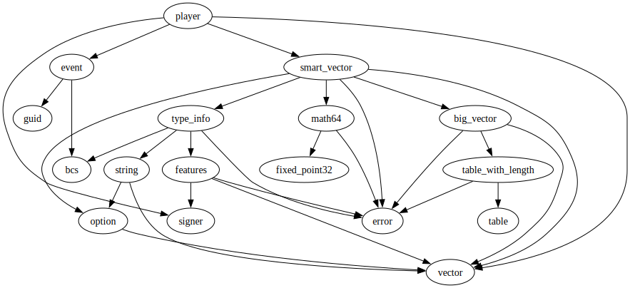
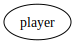

# Module `0x1b70e6e213bfb725f372840f616b3b6339d5ef17c0cacb3fe9a6ca79be1afbfd::player`

-  [Resource `Player`](#0x1b70e6e213bfb725f372840f616b3b6339d5ef17c0cacb3fe9a6ca79be1afbfd_player_Player)
-  [Struct `PlayerCreated`](#0x1b70e6e213bfb725f372840f616b3b6339d5ef17c0cacb3fe9a6ca79be1afbfd_player_PlayerCreated)
-  [Constants](#@Constants_0)
-  [Function `assert_player_exists`](#0x1b70e6e213bfb725f372840f616b3b6339d5ef17c0cacb3fe9a6ca79be1afbfd_player_assert_player_exists)
-  [Function `create_player`](#0x1b70e6e213bfb725f372840f616b3b6339d5ef17c0cacb3fe9a6ca79be1afbfd_player_create_player)
-  [Function `add_decision`](#0x1b70e6e213bfb725f372840f616b3b6339d5ef17c0cacb3fe9a6ca79be1afbfd_player_add_decision)
-  [Function `last_x_decisions`](#0x1b70e6e213bfb725f372840f616b3b6339d5ef17c0cacb3fe9a6ca79be1afbfd_player_last_x_decisions)

<pre><code><b>use</b> <a href="">0x1::event</a>;
<b>use</b> <a href="">0x1::signer</a>;
<b>use</b> <a href="">0x1::smart_vector</a>;
<b>use</b> <a href="">0x1::vector</a>;
</code></pre>

##### Show all the modules that "player" depends on directly or indirectly

##### Show all the modules that depend on "player" directly or indirectly

## Resource `Player`

<pre><code><b>struct</b> <a href="player.md#0x1b70e6e213bfb725f372840f616b3b6339d5ef17c0cacb3fe9a6ca79be1afbfd_player_Player">Player</a> <b>has</b> key
</code></pre>

##### Fields

<dl>
<dt>
<code>id: <b>address</b></code>
</dt>
<dd>

</dd>
<dt>
<code>decisions_ledger: <a href="_SmartVector">smart_vector::SmartVector</a>&lt;bool&gt;</code>
</dt>
<dd>

</dd>
</dl>

## Struct `PlayerCreated`

<pre><code>#[<a href="">event</a>]
<b>struct</b> <a href="player.md#0x1b70e6e213bfb725f372840f616b3b6339d5ef17c0cacb3fe9a6ca79be1afbfd_player_PlayerCreated">PlayerCreated</a> <b>has</b> drop, store
</code></pre>

##### Fields

<dl>
<dt>
<code>player_id: <b>address</b></code>
</dt>
<dd>

</dd>
</dl>

## Constants

The player already exists

<pre><code><b>const</b> <a href="player.md#0x1b70e6e213bfb725f372840f616b3b6339d5ef17c0cacb3fe9a6ca79be1afbfd_player_EPLAYER_EXISTS">EPLAYER_EXISTS</a>: u64 = 1;
</code></pre>

## Function `assert_player_exists`

Assert that the player exists

<pre><code><b>public</b> <b>fun</b> <a href="player.md#0x1b70e6e213bfb725f372840f616b3b6339d5ef17c0cacb3fe9a6ca79be1afbfd_player_assert_player_exists">assert_player_exists</a>(player_id: <b>address</b>)
</code></pre>

##### Implementation

<pre><code><b>public</b> <b>fun</b> <a href="player.md#0x1b70e6e213bfb725f372840f616b3b6339d5ef17c0cacb3fe9a6ca79be1afbfd_player_assert_player_exists">assert_player_exists</a>(player_id: <b>address</b>) {
    <b>assert</b>!(<b>exists</b>&lt;<a href="player.md#0x1b70e6e213bfb725f372840f616b3b6339d5ef17c0cacb3fe9a6ca79be1afbfd_player_Player">Player</a>&gt;(player_id), <a href="player.md#0x1b70e6e213bfb725f372840f616b3b6339d5ef17c0cacb3fe9a6ca79be1afbfd_player_EPLAYER_EXISTS">EPLAYER_EXISTS</a>);
}
</code></pre>

## Function `create_player`

Create a new player

<pre><code><b>public</b>(<b>friend</b>) <b>fun</b> <a href="player.md#0x1b70e6e213bfb725f372840f616b3b6339d5ef17c0cacb3fe9a6ca79be1afbfd_player_create_player">create_player</a>(signer_ref: &<a href="">signer</a>)
</code></pre>

##### Implementation

<pre><code><b>public</b>(<b>friend</b>) <b>fun</b> <a href="player.md#0x1b70e6e213bfb725f372840f616b3b6339d5ef17c0cacb3fe9a6ca79be1afbfd_player_create_player">create_player</a>(signer_ref: &<a href="">signer</a>) {
    <b>let</b> signer_addr = <a href="_address_of">signer::address_of</a>(signer_ref);
    <a href="player.md#0x1b70e6e213bfb725f372840f616b3b6339d5ef17c0cacb3fe9a6ca79be1afbfd_player_assert_player_exists">assert_player_exists</a>(signer_addr);
    <b>move_to</b>(
        signer_ref,
        <a href="player.md#0x1b70e6e213bfb725f372840f616b3b6339d5ef17c0cacb3fe9a6ca79be1afbfd_player_Player">Player</a> {
            id: signer_addr,
            decisions_ledger: <a href="_new">smart_vector::new</a>&lt;bool&gt;(),
        }
    );
    <a href="_emit">event::emit</a>(<a href="player.md#0x1b70e6e213bfb725f372840f616b3b6339d5ef17c0cacb3fe9a6ca79be1afbfd_player_PlayerCreated">PlayerCreated</a> { player_id: signer_addr });
}
</code></pre>

## Function `add_decision`

Add a decision to the player's ledger

<pre><code><b>public</b>(<b>friend</b>) <b>fun</b> <a href="player.md#0x1b70e6e213bfb725f372840f616b3b6339d5ef17c0cacb3fe9a6ca79be1afbfd_player_add_decision">add_decision</a>(signer_ref: &<a href="">signer</a>, decision: bool)
</code></pre>

##### Implementation

<pre><code><b>public</b>(<b>friend</b>) <b>fun</b> <a href="player.md#0x1b70e6e213bfb725f372840f616b3b6339d5ef17c0cacb3fe9a6ca79be1afbfd_player_add_decision">add_decision</a>(signer_ref: &<a href="">signer</a>, decision: bool) <b>acquires</b> <a href="player.md#0x1b70e6e213bfb725f372840f616b3b6339d5ef17c0cacb3fe9a6ca79be1afbfd_player_Player">Player</a> {
    <a href="player.md#0x1b70e6e213bfb725f372840f616b3b6339d5ef17c0cacb3fe9a6ca79be1afbfd_player_assert_player_exists">assert_player_exists</a>(<a href="_address_of">signer::address_of</a>(signer_ref));
    <b>let</b> <a href="player.md#0x1b70e6e213bfb725f372840f616b3b6339d5ef17c0cacb3fe9a6ca79be1afbfd_player">player</a> = <b>borrow_global_mut</b>&lt;<a href="player.md#0x1b70e6e213bfb725f372840f616b3b6339d5ef17c0cacb3fe9a6ca79be1afbfd_player_Player">Player</a>&gt;(<a href="_address_of">signer::address_of</a>(signer_ref));
    <a href="_push_back">smart_vector::push_back</a>(&<b>mut</b> <a href="player.md#0x1b70e6e213bfb725f372840f616b3b6339d5ef17c0cacb3fe9a6ca79be1afbfd_player">player</a>.decisions_ledger, decision);
}
</code></pre>

## Function `last_x_decisions`

Returns the player's x decisions from the decision ledger

<pre><code><b>public</b>(<b>friend</b>) <b>fun</b> <a href="player.md#0x1b70e6e213bfb725f372840f616b3b6339d5ef17c0cacb3fe9a6ca79be1afbfd_player_last_x_decisions">last_x_decisions</a>(player_id: <b>address</b>, x: u64): <a href="">vector</a>&lt;bool&gt;
</code></pre>

##### Implementation

<pre><code><b>public</b>(<b>friend</b>) <b>fun</b> <a href="player.md#0x1b70e6e213bfb725f372840f616b3b6339d5ef17c0cacb3fe9a6ca79be1afbfd_player_last_x_decisions">last_x_decisions</a>(player_id: <b>address</b>, x: u64): <a href="">vector</a>&lt;bool&gt; <b>acquires</b> <a href="player.md#0x1b70e6e213bfb725f372840f616b3b6339d5ef17c0cacb3fe9a6ca79be1afbfd_player_Player">Player</a> {
    <a href="player.md#0x1b70e6e213bfb725f372840f616b3b6339d5ef17c0cacb3fe9a6ca79be1afbfd_player_assert_player_exists">assert_player_exists</a>(player_id);
    <b>let</b> <a href="player.md#0x1b70e6e213bfb725f372840f616b3b6339d5ef17c0cacb3fe9a6ca79be1afbfd_player">player</a> = <b>borrow_global</b>&lt;<a href="player.md#0x1b70e6e213bfb725f372840f616b3b6339d5ef17c0cacb3fe9a6ca79be1afbfd_player_Player">Player</a>&gt;(player_id);
    // <b>let</b> decision_ledger_len = <a href="_length">smart_vector::length</a>(&<a href="player.md#0x1b70e6e213bfb725f372840f616b3b6339d5ef17c0cacb3fe9a6ca79be1afbfd_player">player</a>.decisions_ledger);
    <b>let</b> decision_ledger = <a href="_to_vector">smart_vector::to_vector</a>(&<a href="player.md#0x1b70e6e213bfb725f372840f616b3b6339d5ef17c0cacb3fe9a6ca79be1afbfd_player">player</a>.decisions_ledger);
    <a href="_reverse">vector::reverse</a>(&<b>mut</b> decision_ledger);
    // get the last x decisions
    <a href="_slice">vector::slice</a>(&decision_ledger, 0, x)
}
</code></pre>
