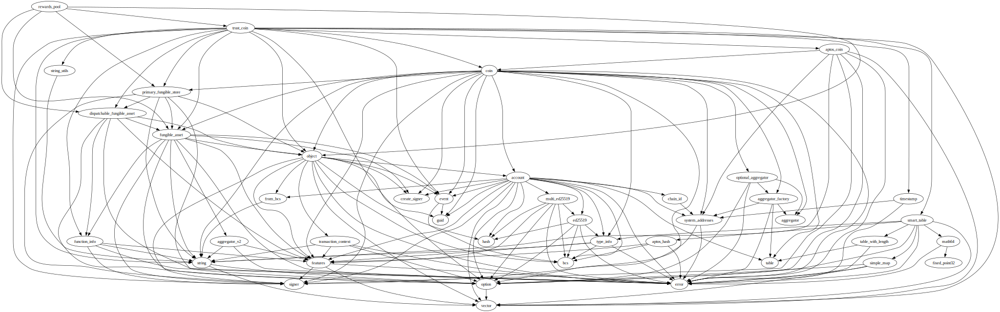
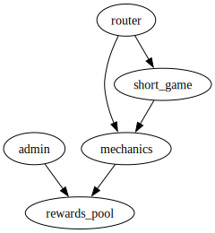

# Module `0x1b70e6e213bfb725f372840f616b3b6339d5ef17c0cacb3fe9a6ca79be1afbfd::rewards_pool`

-  [Resource `Info`](#0x1b70e6e213bfb725f372840f616b3b6339d5ef17c0cacb3fe9a6ca79be1afbfd_rewards_pool_Info)
-  [Function `init`](#0x1b70e6e213bfb725f372840f616b3b6339d5ef17c0cacb3fe9a6ca79be1afbfd_rewards_pool_init)
-  [Function `pool_signer`](#0x1b70e6e213bfb725f372840f616b3b6339d5ef17c0cacb3fe9a6ca79be1afbfd_rewards_pool_pool_signer)
-  [Function `deposit`](#0x1b70e6e213bfb725f372840f616b3b6339d5ef17c0cacb3fe9a6ca79be1afbfd_rewards_pool_deposit)
-  [Function `withdraw`](#0x1b70e6e213bfb725f372840f616b3b6339d5ef17c0cacb3fe9a6ca79be1afbfd_rewards_pool_withdraw)
-  [Function `pool_store_object`](#0x1b70e6e213bfb725f372840f616b3b6339d5ef17c0cacb3fe9a6ca79be1afbfd_rewards_pool_pool_store_object)
-  [Function `pool_address`](#0x1b70e6e213bfb725f372840f616b3b6339d5ef17c0cacb3fe9a6ca79be1afbfd_rewards_pool_pool_address)

<pre><code><b>use</b> <a href="">0x1::dispatchable_fungible_asset</a>;
<b>use</b> <a href="">0x1::fungible_asset</a>;
<b>use</b> <a href="">0x1::object</a>;
<b>use</b> <a href="">0x1::primary_fungible_store</a>;
<b>use</b> <a href="">0xce3824597867081e7e16b21f4d364f90b1abae40b92e23dd915e5330719c2e98::trust_coin</a>;
</code></pre>

##### Show all the modules that "rewards_pool" depends on directly or indirectly

##### Show all the modules that depend on "rewards_pool" directly or indirectly

## Resource `Info`

Global storage for the rewards pool

<pre><code><b>struct</b> <a href="rewards_pool.md#0x1b70e6e213bfb725f372840f616b3b6339d5ef17c0cacb3fe9a6ca79be1afbfd_rewards_pool_Info">Info</a> <b>has</b> key
</code></pre>

##### Fields

<dl>
<dt>
<code>store: <a href="_Object">object::Object</a>&lt;<a href="_FungibleStore">fungible_asset::FungibleStore</a>&gt;</code>
</dt>
<dd>

</dd>
<dt>
<code>extend_ref: <a href="_ExtendRef">object::ExtendRef</a></code>
</dt>
<dd>

</dd>
</dl>

## Function `init`

Initializes the info resource; callable by the time of deployment

<pre><code><b>public</b>(<b>friend</b>) <b>fun</b> <a href="rewards_pool.md#0x1b70e6e213bfb725f372840f616b3b6339d5ef17c0cacb3fe9a6ca79be1afbfd_rewards_pool_init">init</a>(deployer: &<a href="">signer</a>)
</code></pre>

##### Implementation

<pre><code><b>public</b>(<b>friend</b>) <b>fun</b> <a href="rewards_pool.md#0x1b70e6e213bfb725f372840f616b3b6339d5ef17c0cacb3fe9a6ca79be1afbfd_rewards_pool_init">init</a>(deployer: &<a href="">signer</a>) {
    <b>let</b> trust_coin_metadata = <a href="_metadata">trust_coin::metadata</a>();
    <b>let</b> withdraw_constructor_ref = &<a href="_create_named_object">object::create_named_object</a>(deployer, <a href="_withdraw_seed">trust_coin::withdraw_seed</a>());
    <b>move_to</b>(
        deployer,
        <a href="rewards_pool.md#0x1b70e6e213bfb725f372840f616b3b6339d5ef17c0cacb3fe9a6ca79be1afbfd_rewards_pool_Info">Info</a> {
            store: <a href="_create_store">fungible_asset::create_store</a>&lt;Metadata&gt;(withdraw_constructor_ref, trust_coin_metadata),
            extend_ref: <a href="_generate_extend_ref">object::generate_extend_ref</a>(withdraw_constructor_ref)
        }
    );
}
</code></pre>

## Function `pool_signer`

Returns the signer for the pool

<pre><code><b>public</b>(<b>friend</b>) <b>fun</b> <a href="rewards_pool.md#0x1b70e6e213bfb725f372840f616b3b6339d5ef17c0cacb3fe9a6ca79be1afbfd_rewards_pool_pool_signer">pool_signer</a>(): <a href="">signer</a>
</code></pre>

##### Implementation

<pre><code><b>public</b>(<b>friend</b>) <b>fun</b> <a href="rewards_pool.md#0x1b70e6e213bfb725f372840f616b3b6339d5ef17c0cacb3fe9a6ca79be1afbfd_rewards_pool_pool_signer">pool_signer</a>(): <a href="">signer</a> <b>acquires</b> <a href="rewards_pool.md#0x1b70e6e213bfb725f372840f616b3b6339d5ef17c0cacb3fe9a6ca79be1afbfd_rewards_pool_Info">Info</a> {
    <b>let</b> info = <b>borrow_global</b>&lt;<a href="rewards_pool.md#0x1b70e6e213bfb725f372840f616b3b6339d5ef17c0cacb3fe9a6ca79be1afbfd_rewards_pool_Info">Info</a>&gt;(@trust_16);
    <a href="_generate_signer_for_extending">object::generate_signer_for_extending</a>(&info.extend_ref)
}
</code></pre>

## Function `deposit`

Deposits the amount to the rewards pool

<pre><code><b>public</b>(<b>friend</b>) <b>fun</b> <a href="rewards_pool.md#0x1b70e6e213bfb725f372840f616b3b6339d5ef17c0cacb3fe9a6ca79be1afbfd_rewards_pool_deposit">deposit</a>(amount: u64, from: <b>address</b>)
</code></pre>

##### Implementation

<pre><code><b>public</b>(<b>friend</b>) <b>fun</b> <a href="rewards_pool.md#0x1b70e6e213bfb725f372840f616b3b6339d5ef17c0cacb3fe9a6ca79be1afbfd_rewards_pool_deposit">deposit</a>(amount: u64, from: <b>address</b>) <b>acquires</b> <a href="rewards_pool.md#0x1b70e6e213bfb725f372840f616b3b6339d5ef17c0cacb3fe9a6ca79be1afbfd_rewards_pool_Info">Info</a> {
    <b>let</b> info = <b>borrow_global</b>&lt;<a href="rewards_pool.md#0x1b70e6e213bfb725f372840f616b3b6339d5ef17c0cacb3fe9a6ca79be1afbfd_rewards_pool_Info">Info</a>&gt;(@trust_16);
    <b>let</b> withdrawer_signer_ref = &<a href="_generate_signer_for_extending">object::generate_signer_for_extending</a>(&info.extend_ref);
    <b>let</b> from_primary_store = <a href="_primary_store">primary_fungible_store::primary_store</a>(from, <a href="_metadata">trust_coin::metadata</a>());
    <b>let</b> fa = <a href="_withdraw">dispatchable_fungible_asset::withdraw</a>(withdrawer_signer_ref, from_primary_store, amount);
    <a href="_deposit">dispatchable_fungible_asset::deposit</a>(info.store, fa);
}
</code></pre>

## Function `withdraw`

Withdraws the amount from the rewards pool

<pre><code><b>public</b>(<b>friend</b>) <b>fun</b> <a href="rewards_pool.md#0x1b70e6e213bfb725f372840f616b3b6339d5ef17c0cacb3fe9a6ca79be1afbfd_rewards_pool_withdraw">withdraw</a>(amount: u64): <a href="_FungibleAsset">fungible_asset::FungibleAsset</a>
</code></pre>

##### Implementation

<pre><code><b>public</b>(<b>friend</b>) <b>fun</b> <a href="rewards_pool.md#0x1b70e6e213bfb725f372840f616b3b6339d5ef17c0cacb3fe9a6ca79be1afbfd_rewards_pool_withdraw">withdraw</a>(amount: u64): FungibleAsset <b>acquires</b> <a href="rewards_pool.md#0x1b70e6e213bfb725f372840f616b3b6339d5ef17c0cacb3fe9a6ca79be1afbfd_rewards_pool_Info">Info</a> {
    <b>let</b> info = <b>borrow_global</b>&lt;<a href="rewards_pool.md#0x1b70e6e213bfb725f372840f616b3b6339d5ef17c0cacb3fe9a6ca79be1afbfd_rewards_pool_Info">Info</a>&gt;(@trust_16);
    <b>let</b> withdrawer_signer_ref = &<a href="_generate_signer_for_extending">object::generate_signer_for_extending</a>(&info.extend_ref);
    <a href="_withdraw">dispatchable_fungible_asset::withdraw</a>(withdrawer_signer_ref, info.store, amount)
}
</code></pre>

## Function `pool_store_object`

Returns the object of the rewards pool store

<pre><code>#[view]
<b>public</b> <b>fun</b> <a href="rewards_pool.md#0x1b70e6e213bfb725f372840f616b3b6339d5ef17c0cacb3fe9a6ca79be1afbfd_rewards_pool_pool_store_object">pool_store_object</a>(): <a href="_Object">object::Object</a>&lt;<a href="_FungibleStore">fungible_asset::FungibleStore</a>&gt;
</code></pre>

##### Implementation

<pre><code><b>public</b> <b>fun</b> <a href="rewards_pool.md#0x1b70e6e213bfb725f372840f616b3b6339d5ef17c0cacb3fe9a6ca79be1afbfd_rewards_pool_pool_store_object">pool_store_object</a>(): Object&lt;FungibleStore&gt; <b>acquires</b> <a href="rewards_pool.md#0x1b70e6e213bfb725f372840f616b3b6339d5ef17c0cacb3fe9a6ca79be1afbfd_rewards_pool_Info">Info</a> {
    <b>let</b> info = <b>borrow_global</b>&lt;<a href="rewards_pool.md#0x1b70e6e213bfb725f372840f616b3b6339d5ef17c0cacb3fe9a6ca79be1afbfd_rewards_pool_Info">Info</a>&gt;(@trust_16);
    info.store
}
</code></pre>

## Function `pool_address`

Returns the address of the rewards pool store

<pre><code>#[view]
<b>public</b> <b>fun</b> <a href="rewards_pool.md#0x1b70e6e213bfb725f372840f616b3b6339d5ef17c0cacb3fe9a6ca79be1afbfd_rewards_pool_pool_address">pool_address</a>(): <b>address</b>
</code></pre>

##### Implementation

<pre><code><b>public</b> <b>fun</b> <a href="rewards_pool.md#0x1b70e6e213bfb725f372840f616b3b6339d5ef17c0cacb3fe9a6ca79be1afbfd_rewards_pool_pool_address">pool_address</a>(): <b>address</b> <b>acquires</b> <a href="rewards_pool.md#0x1b70e6e213bfb725f372840f616b3b6339d5ef17c0cacb3fe9a6ca79be1afbfd_rewards_pool_Info">Info</a> {
    <b>let</b> info = <b>borrow_global</b>&lt;<a href="rewards_pool.md#0x1b70e6e213bfb725f372840f616b3b6339d5ef17c0cacb3fe9a6ca79be1afbfd_rewards_pool_Info">Info</a>&gt;(@trust_16);
    <a href="_object_address">object::object_address</a>(&info.store)
}
</code></pre>
