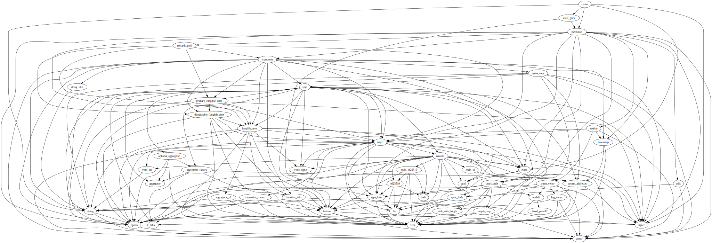
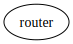

# Module `0x1b70e6e213bfb725f372840f616b3b6339d5ef17c0cacb3fe9a6ca79be1afbfd::router`

-  [Struct `SessionCreated`](#0x1b70e6e213bfb725f372840f616b3b6339d5ef17c0cacb3fe9a6ca79be1afbfd_router_SessionCreated)
-  [Constants](#@Constants_0)
-  [Function `admin_prepare_short_game`](#0x1b70e6e213bfb725f372840f616b3b6339d5ef17c0cacb3fe9a6ca79be1afbfd_router_admin_prepare_short_game)
-  [Function `join_game`](#0x1b70e6e213bfb725f372840f616b3b6339d5ef17c0cacb3fe9a6ca79be1afbfd_router_join_game)
-  [Function `submit_decision`](#0x1b70e6e213bfb725f372840f616b3b6339d5ef17c0cacb3fe9a6ca79be1afbfd_router_submit_decision)
-  [Function `admin_submit_pepper_and_finish_round`](#0x1b70e6e213bfb725f372840f616b3b6339d5ef17c0cacb3fe9a6ca79be1afbfd_router_admin_submit_pepper_and_finish_round)

<pre><code><b>use</b> <a href="">0x1::event</a>;
<b>use</b> <a href="">0x1::signer</a>;
<b>use</b> <a href="">0x1::string</a>;
<b>use</b> <a href="mechanics.md#0x1b70e6e213bfb725f372840f616b3b6339d5ef17c0cacb3fe9a6ca79be1afbfd_mechanics">0x1b70e6e213bfb725f372840f616b3b6339d5ef17c0cacb3fe9a6ca79be1afbfd::mechanics</a>;
<b>use</b> <a href="short_game.md#0x1b70e6e213bfb725f372840f616b3b6339d5ef17c0cacb3fe9a6ca79be1afbfd_short_game">0x1b70e6e213bfb725f372840f616b3b6339d5ef17c0cacb3fe9a6ca79be1afbfd::short_game</a>;
</code></pre>

##### Show all the modules that "router" depends on directly or indirectly

##### Show all the modules that depend on "router" directly or indirectly

## Struct `SessionCreated`

<pre><code>#[<a href="">event</a>]
<b>struct</b> <a href="router.md#0x1b70e6e213bfb725f372840f616b3b6339d5ef17c0cacb3fe9a6ca79be1afbfd_router_SessionCreated">SessionCreated</a> <b>has</b> drop, store
</code></pre>

##### Fields

<dl>
<dt>
<code>session_id: <b>address</b></code>
</dt>
<dd>

</dd>
<dt>
<code>game_type: <a href="_String">string::String</a></code>
</dt>
<dd>

</dd>
<dt>
<code>players: <a href="">vector</a>&lt;<b>address</b>&gt;</code>
</dt>
<dd>

</dd>
</dl>

## Constants

Not authorized

<pre><code><b>const</b> <a href="router.md#0x1b70e6e213bfb725f372840f616b3b6339d5ef17c0cacb3fe9a6ca79be1afbfd_router_ENOT_AUTHORIZED">ENOT_AUTHORIZED</a>: u64 = 1;
</code></pre>

## Function `admin_prepare_short_game`

Prepare a short game
Callable by session manager only

<pre><code><b>public</b>(<b>friend</b>) entry <b>fun</b> <a href="router.md#0x1b70e6e213bfb725f372840f616b3b6339d5ef17c0cacb3fe9a6ca79be1afbfd_router_admin_prepare_short_game">admin_prepare_short_game</a>(signer_ref: &<a href="">signer</a>, players: <a href="">vector</a>&lt;<b>address</b>&gt;)
</code></pre>

##### Implementation

<pre><code><b>public</b>(<b>friend</b>) entry <b>fun</b> <a href="router.md#0x1b70e6e213bfb725f372840f616b3b6339d5ef17c0cacb3fe9a6ca79be1afbfd_router_admin_prepare_short_game">admin_prepare_short_game</a>(
    signer_ref: &<a href="">signer</a>,
    players: <a href="">vector</a>&lt;<b>address</b>&gt;
) {
    // <b>assert</b> that the caller is a <a href="session.md#0x1b70e6e213bfb725f372840f616b3b6339d5ef17c0cacb3fe9a6ca79be1afbfd_session">session</a> manager
    <b>assert</b>!(<a href="_address_of">signer::address_of</a>(signer_ref) == @session_manager, <a href="router.md#0x1b70e6e213bfb725f372840f616b3b6339d5ef17c0cacb3fe9a6ca79be1afbfd_router_ENOT_AUTHORIZED">ENOT_AUTHORIZED</a>);
    <b>let</b> session_id = <a href="short_game.md#0x1b70e6e213bfb725f372840f616b3b6339d5ef17c0cacb3fe9a6ca79be1afbfd_short_game_prepare_game">short_game::prepare_game</a>(players);
    <a href="_emit">event::emit</a>(<a href="router.md#0x1b70e6e213bfb725f372840f616b3b6339d5ef17c0cacb3fe9a6ca79be1afbfd_router_SessionCreated">SessionCreated</a> { session_id, game_type: <a href="_utf8">string::utf8</a>(b"<a href="short_game.md#0x1b70e6e213bfb725f372840f616b3b6339d5ef17c0cacb3fe9a6ca79be1afbfd_short_game">short_game</a>"), players });
}
</code></pre>

## Function `join_game`

Join a game
Game starts when all players joined

<pre><code><b>public</b>(<b>friend</b>) entry <b>fun</b> <a href="router.md#0x1b70e6e213bfb725f372840f616b3b6339d5ef17c0cacb3fe9a6ca79be1afbfd_router_join_game">join_game</a>(signer_ref: &<a href="">signer</a>, session_id: <b>address</b>)
</code></pre>

##### Implementation

<pre><code><b>public</b>(<b>friend</b>) entry <b>fun</b> <a href="router.md#0x1b70e6e213bfb725f372840f616b3b6339d5ef17c0cacb3fe9a6ca79be1afbfd_router_join_game">join_game</a>(
    signer_ref: &<a href="">signer</a>,
    session_id: <b>address</b>
) {
    <a href="mechanics.md#0x1b70e6e213bfb725f372840f616b3b6339d5ef17c0cacb3fe9a6ca79be1afbfd_mechanics_join_game">mechanics::join_game</a>(signer_ref, session_id);
}
</code></pre>

## Function `submit_decision`

Submit a decision

<pre><code><b>public</b>(<b>friend</b>) entry <b>fun</b> <a href="router.md#0x1b70e6e213bfb725f372840f616b3b6339d5ef17c0cacb3fe9a6ca79be1afbfd_router_submit_decision">submit_decision</a>(signer_ref: &<a href="">signer</a>, session_id: <b>address</b>, round: u64, decision: <a href="">vector</a>&lt;u8&gt;)
</code></pre>

##### Implementation

<pre><code><b>public</b>(<b>friend</b>) entry <b>fun</b> <a href="router.md#0x1b70e6e213bfb725f372840f616b3b6339d5ef17c0cacb3fe9a6ca79be1afbfd_router_submit_decision">submit_decision</a>(
    signer_ref: &<a href="">signer</a>,
    session_id: <b>address</b>,
    round: u64,
    decision: <a href="">vector</a>&lt;u8&gt;
) {
    <a href="mechanics.md#0x1b70e6e213bfb725f372840f616b3b6339d5ef17c0cacb3fe9a6ca79be1afbfd_mechanics_submit_decision">mechanics::submit_decision</a>(signer_ref, session_id, round, decision);
}
</code></pre>

## Function `admin_submit_pepper_and_finish_round`

Submit a pepper
Callable by session manager only

<pre><code><b>public</b>(<b>friend</b>) entry <b>fun</b> <a href="router.md#0x1b70e6e213bfb725f372840f616b3b6339d5ef17c0cacb3fe9a6ca79be1afbfd_router_admin_submit_pepper_and_finish_round">admin_submit_pepper_and_finish_round</a>(signer_ref: &<a href="">signer</a>, session_id: <b>address</b>, round: u64, pepper: <a href="">vector</a>&lt;u8&gt;)
</code></pre>

##### Implementation

<pre><code><b>public</b>(<b>friend</b>) entry <b>fun</b> <a href="router.md#0x1b70e6e213bfb725f372840f616b3b6339d5ef17c0cacb3fe9a6ca79be1afbfd_router_admin_submit_pepper_and_finish_round">admin_submit_pepper_and_finish_round</a>(
    signer_ref: &<a href="">signer</a>,
    session_id: <b>address</b>,
    round: u64,
    pepper: <a href="">vector</a>&lt;u8&gt;
) {
    // <b>assert</b> that the caller is a <a href="session.md#0x1b70e6e213bfb725f372840f616b3b6339d5ef17c0cacb3fe9a6ca79be1afbfd_session">session</a> manager
    <b>assert</b>!(<a href="_address_of">signer::address_of</a>(signer_ref) == @session_manager, <a href="router.md#0x1b70e6e213bfb725f372840f616b3b6339d5ef17c0cacb3fe9a6ca79be1afbfd_router_ENOT_AUTHORIZED">ENOT_AUTHORIZED</a>);
    <a href="mechanics.md#0x1b70e6e213bfb725f372840f616b3b6339d5ef17c0cacb3fe9a6ca79be1afbfd_mechanics_submit_pepper">mechanics::submit_pepper</a>(session_id, round, pepper);
    <a href="mechanics.md#0x1b70e6e213bfb725f372840f616b3b6339d5ef17c0cacb3fe9a6ca79be1afbfd_mechanics_finish_round">mechanics::finish_round</a>(session_id, round);
    // <b>if</b> last round, end game
    <b>if</b> (<a href="mechanics.md#0x1b70e6e213bfb725f372840f616b3b6339d5ef17c0cacb3fe9a6ca79be1afbfd_mechanics_rounds_count">mechanics::rounds_count</a>(session_id) == round + 1) {
        <a href="mechanics.md#0x1b70e6e213bfb725f372840f616b3b6339d5ef17c0cacb3fe9a6ca79be1afbfd_mechanics_finish_game">mechanics::finish_game</a>(session_id);
    }
}
</code></pre>
