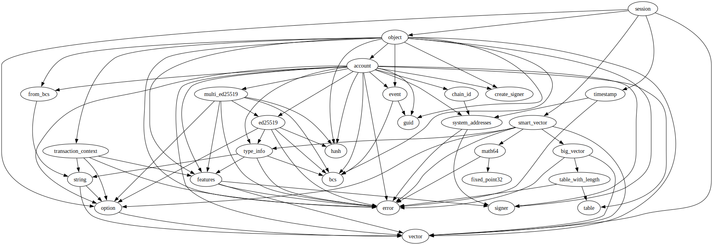
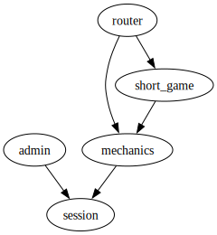

# Module `0x1b70e6e213bfb725f372840f616b3b6339d5ef17c0cacb3fe9a6ca79be1afbfd::session`

-  [Resource `GlobalInfo`](#0x1b70e6e213bfb725f372840f616b3b6339d5ef17c0cacb3fe9a6ca79be1afbfd_session_GlobalInfo)
-  [Resource `SessionInfo`](#0x1b70e6e213bfb725f372840f616b3b6339d5ef17c0cacb3fe9a6ca79be1afbfd_session_SessionInfo)
-  [Resource `Badge`](#0x1b70e6e213bfb725f372840f616b3b6339d5ef17c0cacb3fe9a6ca79be1afbfd_session_Badge)
-  [Constants](#@Constants_0)
-  [Function `assert_session_valid`](#0x1b70e6e213bfb725f372840f616b3b6339d5ef17c0cacb3fe9a6ca79be1afbfd_session_assert_session_valid)
-  [Function `assert_players_eligibility`](#0x1b70e6e213bfb725f372840f616b3b6339d5ef17c0cacb3fe9a6ca79be1afbfd_session_assert_players_eligibility)
-  [Function `assert_player_registered_in_session`](#0x1b70e6e213bfb725f372840f616b3b6339d5ef17c0cacb3fe9a6ca79be1afbfd_session_assert_player_registered_in_session)
-  [Function `assert_player_active_in_session`](#0x1b70e6e213bfb725f372840f616b3b6339d5ef17c0cacb3fe9a6ca79be1afbfd_session_assert_player_active_in_session)
-  [Function `init`](#0x1b70e6e213bfb725f372840f616b3b6339d5ef17c0cacb3fe9a6ca79be1afbfd_session_init)
-  [Function `create_session`](#0x1b70e6e213bfb725f372840f616b3b6339d5ef17c0cacb3fe9a6ca79be1afbfd_session_create_session)
-  [Function `start_session`](#0x1b70e6e213bfb725f372840f616b3b6339d5ef17c0cacb3fe9a6ca79be1afbfd_session_start_session)
-  [Function `end_session`](#0x1b70e6e213bfb725f372840f616b3b6339d5ef17c0cacb3fe9a6ca79be1afbfd_session_end_session)
-  [Function `session_signer`](#0x1b70e6e213bfb725f372840f616b3b6339d5ef17c0cacb3fe9a6ca79be1afbfd_session_session_signer)
-  [Function `session_exists`](#0x1b70e6e213bfb725f372840f616b3b6339d5ef17c0cacb3fe9a6ca79be1afbfd_session_session_exists)
-  [Function `has_active_session`](#0x1b70e6e213bfb725f372840f616b3b6339d5ef17c0cacb3fe9a6ca79be1afbfd_session_has_active_session)
-  [Function `active_session_id`](#0x1b70e6e213bfb725f372840f616b3b6339d5ef17c0cacb3fe9a6ca79be1afbfd_session_active_session_id)
-  [Function `player_is_in_session`](#0x1b70e6e213bfb725f372840f616b3b6339d5ef17c0cacb3fe9a6ca79be1afbfd_session_player_is_in_session)
-  [Function `is_active`](#0x1b70e6e213bfb725f372840f616b3b6339d5ef17c0cacb3fe9a6ca79be1afbfd_session_is_active)
-  [Function `players`](#0x1b70e6e213bfb725f372840f616b3b6339d5ef17c0cacb3fe9a6ca79be1afbfd_session_players)
-  [Function `add_badge_to_player`](#0x1b70e6e213bfb725f372840f616b3b6339d5ef17c0cacb3fe9a6ca79be1afbfd_session_add_badge_to_player)
-  [Function `remove_badges_from_players`](#0x1b70e6e213bfb725f372840f616b3b6339d5ef17c0cacb3fe9a6ca79be1afbfd_session_remove_badges_from_players)

<pre><code><b>use</b> <a href="">0x1::object</a>;
<b>use</b> <a href="">0x1::option</a>;
<b>use</b> <a href="">0x1::smart_vector</a>;
<b>use</b> <a href="">0x1::timestamp</a>;
<b>use</b> <a href="">0x1::vector</a>;
</code></pre>

##### Show all the modules that "session" depends on directly or indirectly

##### Show all the modules that depend on "session" directly or indirectly

## Resource `GlobalInfo`

Global storage for the global information; serves as a lobby

<pre><code><b>struct</b> <a href="session.md#0x1b70e6e213bfb725f372840f616b3b6339d5ef17c0cacb3fe9a6ca79be1afbfd_session_GlobalInfo">GlobalInfo</a> <b>has</b> key
</code></pre>

##### Fields

<dl>
<dt>
<code>active_sessions: <a href="_SmartVector">smart_vector::SmartVector</a>&lt;<b>address</b>&gt;</code>
</dt>
<dd>

</dd>
</dl>

## Resource `SessionInfo`

Global storage for the game data

<pre><code><b>struct</b> <a href="session.md#0x1b70e6e213bfb725f372840f616b3b6339d5ef17c0cacb3fe9a6ca79be1afbfd_session_SessionInfo">SessionInfo</a> <b>has</b> key
</code></pre>

##### Fields

<dl>
<dt>
<code>created_at: u64</code>
</dt>
<dd>

</dd>
<dt>
<code>started_at: <a href="_Option">option::Option</a>&lt;u64&gt;</code>
</dt>
<dd>

</dd>
<dt>
<code>players: <a href="">vector</a>&lt;<b>address</b>&gt;</code>
</dt>
<dd>

</dd>
<dt>
<code>extend_ref: <a href="_ExtendRef">object::ExtendRef</a></code>
</dt>
<dd>

</dd>
</dl>

## Resource `Badge`

Global resource stored under wallets that got matched and are in a session

<pre><code><b>struct</b> <a href="session.md#0x1b70e6e213bfb725f372840f616b3b6339d5ef17c0cacb3fe9a6ca79be1afbfd_session_Badge">Badge</a> <b>has</b> key
</code></pre>

##### Fields

<dl>
<dt>
<code>session_id: <b>address</b></code>
</dt>
<dd>

</dd>
</dl>

## Constants

A player has an active game or did not leave the previous game

<pre><code><b>const</b> <a href="session.md#0x1b70e6e213bfb725f372840f616b3b6339d5ef17c0cacb3fe9a6ca79be1afbfd_session_EPLAYER_HAS_ACTIVE_GAME">EPLAYER_HAS_ACTIVE_GAME</a>: u64 = 1;
</code></pre>

The session is wrong or not valid

<pre><code><b>const</b> <a href="session.md#0x1b70e6e213bfb725f372840f616b3b6339d5ef17c0cacb3fe9a6ca79be1afbfd_session_ESESSION_INVALID">ESESSION_INVALID</a>: u64 = 2;
</code></pre>

The time is invalid

<pre><code><b>const</b> <a href="session.md#0x1b70e6e213bfb725f372840f616b3b6339d5ef17c0cacb3fe9a6ca79be1afbfd_session_ETIME_INVALID">ETIME_INVALID</a>: u64 = 3;
</code></pre>

## Function `assert_session_valid`

sanity check to ensure the session is valid

<pre><code><b>public</b> <b>fun</b> <a href="session.md#0x1b70e6e213bfb725f372840f616b3b6339d5ef17c0cacb3fe9a6ca79be1afbfd_session_assert_session_valid">assert_session_valid</a>(session_id: <b>address</b>)
</code></pre>

##### Implementation

<pre><code><b>public</b> <b>fun</b> <a href="session.md#0x1b70e6e213bfb725f372840f616b3b6339d5ef17c0cacb3fe9a6ca79be1afbfd_session_assert_session_valid">assert_session_valid</a>(session_id: <b>address</b>) {
    <b>assert</b>!(<a href="session.md#0x1b70e6e213bfb725f372840f616b3b6339d5ef17c0cacb3fe9a6ca79be1afbfd_session_session_exists">session_exists</a>(session_id), <a href="session.md#0x1b70e6e213bfb725f372840f616b3b6339d5ef17c0cacb3fe9a6ca79be1afbfd_session_ESESSION_INVALID">ESESSION_INVALID</a>);
}
</code></pre>

## Function `assert_players_eligibility`

Sanity check to ensure players are eligible to play

<pre><code><b>public</b> <b>fun</b> <a href="session.md#0x1b70e6e213bfb725f372840f616b3b6339d5ef17c0cacb3fe9a6ca79be1afbfd_session_assert_players_eligibility">assert_players_eligibility</a>(players: <a href="">vector</a>&lt;<b>address</b>&gt;)
</code></pre>

##### Implementation

<pre><code><b>public</b> <b>fun</b> <a href="session.md#0x1b70e6e213bfb725f372840f616b3b6339d5ef17c0cacb3fe9a6ca79be1afbfd_session_assert_players_eligibility">assert_players_eligibility</a>(players: <a href="">vector</a>&lt;<b>address</b>&gt;) {
    for (i in 0..<a href="_length">vector::length</a>(&players)) {
        <b>let</b> player_addr = *<a href="_borrow">vector::borrow</a>(&players, i);
        // ensure <a href="player.md#0x1b70e6e213bfb725f372840f616b3b6339d5ef17c0cacb3fe9a6ca79be1afbfd_player">player</a> are not in <a href="">any</a> active game
        <b>assert</b>!(!<a href="session.md#0x1b70e6e213bfb725f372840f616b3b6339d5ef17c0cacb3fe9a6ca79be1afbfd_session_has_active_session">has_active_session</a>(player_addr), <a href="session.md#0x1b70e6e213bfb725f372840f616b3b6339d5ef17c0cacb3fe9a6ca79be1afbfd_session_EPLAYER_HAS_ACTIVE_GAME">EPLAYER_HAS_ACTIVE_GAME</a>);
    }
}
</code></pre>

## Function `assert_player_registered_in_session`

Sanity check to ensure the player's address is registered in the session

<pre><code><b>public</b> <b>fun</b> <a href="session.md#0x1b70e6e213bfb725f372840f616b3b6339d5ef17c0cacb3fe9a6ca79be1afbfd_session_assert_player_registered_in_session">assert_player_registered_in_session</a>(player_addr: <b>address</b>, session_id: <b>address</b>)
</code></pre>

##### Implementation

<pre><code><b>public</b> <b>fun</b> <a href="session.md#0x1b70e6e213bfb725f372840f616b3b6339d5ef17c0cacb3fe9a6ca79be1afbfd_session_assert_player_registered_in_session">assert_player_registered_in_session</a>(player_addr: <b>address</b>, session_id: <b>address</b>) <b>acquires</b> <a href="session.md#0x1b70e6e213bfb725f372840f616b3b6339d5ef17c0cacb3fe9a6ca79be1afbfd_session_SessionInfo">SessionInfo</a> {
    <b>let</b> session_info = <b>borrow_global</b>&lt;<a href="session.md#0x1b70e6e213bfb725f372840f616b3b6339d5ef17c0cacb3fe9a6ca79be1afbfd_session_SessionInfo">SessionInfo</a>&gt;(session_id);
    <b>let</b> players = session_info.players;
    <b>let</b> (player_exists, _) = <a href="_index_of">vector::index_of</a>(&players, &player_addr);
    <b>assert</b>!(player_exists, <a href="session.md#0x1b70e6e213bfb725f372840f616b3b6339d5ef17c0cacb3fe9a6ca79be1afbfd_session_ESESSION_INVALID">ESESSION_INVALID</a>);
}
</code></pre>

## Function `assert_player_active_in_session`

Sanity check to ensure the player is in the session

<pre><code><b>public</b> <b>fun</b> <a href="session.md#0x1b70e6e213bfb725f372840f616b3b6339d5ef17c0cacb3fe9a6ca79be1afbfd_session_assert_player_active_in_session">assert_player_active_in_session</a>(players: <a href="">vector</a>&lt;<b>address</b>&gt;, session_id: <b>address</b>)
</code></pre>

##### Implementation

<pre><code><b>public</b> <b>fun</b> <a href="session.md#0x1b70e6e213bfb725f372840f616b3b6339d5ef17c0cacb3fe9a6ca79be1afbfd_session_assert_player_active_in_session">assert_player_active_in_session</a>(players: <a href="">vector</a>&lt;<b>address</b>&gt;, session_id: <b>address</b>) <b>acquires</b> <a href="session.md#0x1b70e6e213bfb725f372840f616b3b6339d5ef17c0cacb3fe9a6ca79be1afbfd_session_Badge">Badge</a> {
    for (i in 0..<a href="_length">vector::length</a>(&players)) {
        <b>let</b> player_addr = *<a href="_borrow">vector::borrow</a>(&players, i);
        <b>assert</b>!(<a href="session.md#0x1b70e6e213bfb725f372840f616b3b6339d5ef17c0cacb3fe9a6ca79be1afbfd_session_player_is_in_session">player_is_in_session</a>(player_addr, session_id), <a href="session.md#0x1b70e6e213bfb725f372840f616b3b6339d5ef17c0cacb3fe9a6ca79be1afbfd_session_ESESSION_INVALID">ESESSION_INVALID</a>);
    }
}
</code></pre>

## Function `init`

Initializes the global info resource

<pre><code><b>public</b>(<b>friend</b>) <b>fun</b> <a href="session.md#0x1b70e6e213bfb725f372840f616b3b6339d5ef17c0cacb3fe9a6ca79be1afbfd_session_init">init</a>(deployer: &<a href="">signer</a>)
</code></pre>

##### Implementation

<pre><code><b>public</b>(<b>friend</b>) <b>fun</b> <a href="session.md#0x1b70e6e213bfb725f372840f616b3b6339d5ef17c0cacb3fe9a6ca79be1afbfd_session_init">init</a>(deployer: &<a href="">signer</a>) {
    <b>move_to</b>(
        deployer,
        <a href="session.md#0x1b70e6e213bfb725f372840f616b3b6339d5ef17c0cacb3fe9a6ca79be1afbfd_session_GlobalInfo">GlobalInfo</a> {
            active_sessions: <a href="_new">smart_vector::new</a>&lt;<b>address</b>&gt;()
        }
    )
}
</code></pre>

## Function `create_session`

Function to create a new session; usable only by defined signers
Returns the session id
The number of players and the deposit amount are specific to a game type and are defined in the game type module

<pre><code><b>public</b>(<b>friend</b>) <b>fun</b> <a href="session.md#0x1b70e6e213bfb725f372840f616b3b6339d5ef17c0cacb3fe9a6ca79be1afbfd_session_create_session">create_session</a>(players: <a href="">vector</a>&lt;<b>address</b>&gt;): <b>address</b>
</code></pre>

##### Implementation

<pre><code><b>public</b>(<b>friend</b>) <b>fun</b> <a href="session.md#0x1b70e6e213bfb725f372840f616b3b6339d5ef17c0cacb3fe9a6ca79be1afbfd_session_create_session">create_session</a>(
    players: <a href="">vector</a>&lt;<b>address</b>&gt;
): <b>address</b> {
    // eligibility check
    <a href="session.md#0x1b70e6e213bfb725f372840f616b3b6339d5ef17c0cacb3fe9a6ca79be1afbfd_session_assert_players_eligibility">assert_players_eligibility</a>(players);
    // create a <a href="session.md#0x1b70e6e213bfb725f372840f616b3b6339d5ef17c0cacb3fe9a6ca79be1afbfd_session">session</a> <a href="">object</a> and deposit the amount
    <b>let</b> constructor_ref = &<a href="_create_object">object::create_object</a>(@trust_16);
    <b>let</b> id = <a href="_address_from_constructor_ref">object::address_from_constructor_ref</a>(constructor_ref);
    // create <a href="session.md#0x1b70e6e213bfb725f372840f616b3b6339d5ef17c0cacb3fe9a6ca79be1afbfd_session">session</a> info resource and <b>move</b> it <b>to</b> the <a href="session.md#0x1b70e6e213bfb725f372840f616b3b6339d5ef17c0cacb3fe9a6ca79be1afbfd_session">session</a> <a href="">object</a>
    <b>move_to</b>(
        &<a href="_generate_signer">object::generate_signer</a>(constructor_ref),
        <a href="session.md#0x1b70e6e213bfb725f372840f616b3b6339d5ef17c0cacb3fe9a6ca79be1afbfd_session_SessionInfo">SessionInfo</a> {
            created_at: <a href="_now_seconds">timestamp::now_seconds</a>(),
            started_at: <a href="_none">option::none</a>(),
            players,
            extend_ref: <a href="_generate_extend_ref">object::generate_extend_ref</a>(constructor_ref)
        }
    );

    id
}
</code></pre>

## Function `start_session`

Function to trigger when all players have joined the game
This will trigger the game to start

<pre><code><b>public</b>(<b>friend</b>) <b>fun</b> <a href="session.md#0x1b70e6e213bfb725f372840f616b3b6339d5ef17c0cacb3fe9a6ca79be1afbfd_session_start_session">start_session</a>(session_id: <b>address</b>)
</code></pre>

##### Implementation

<pre><code><b>public</b>(<b>friend</b>) <b>fun</b> <a href="session.md#0x1b70e6e213bfb725f372840f616b3b6339d5ef17c0cacb3fe9a6ca79be1afbfd_session_start_session">start_session</a>(session_id: <b>address</b>) <b>acquires</b> <a href="session.md#0x1b70e6e213bfb725f372840f616b3b6339d5ef17c0cacb3fe9a6ca79be1afbfd_session_GlobalInfo">GlobalInfo</a>, <a href="session.md#0x1b70e6e213bfb725f372840f616b3b6339d5ef17c0cacb3fe9a6ca79be1afbfd_session_SessionInfo">SessionInfo</a> {
    // trigger the game <b>to</b> start
    <b>let</b> session_info = <b>borrow_global_mut</b>&lt;<a href="session.md#0x1b70e6e213bfb725f372840f616b3b6339d5ef17c0cacb3fe9a6ca79be1afbfd_session_SessionInfo">SessionInfo</a>&gt;(session_id);
    <b>let</b> time_now_seconds = <a href="_now_seconds">timestamp::now_seconds</a>();
    <b>assert</b>!(session_info.created_at &lt;= time_now_seconds, <a href="session.md#0x1b70e6e213bfb725f372840f616b3b6339d5ef17c0cacb3fe9a6ca79be1afbfd_session_ETIME_INVALID">ETIME_INVALID</a>);
    session_info.started_at = <a href="_some">option::some</a>(time_now_seconds);
    // add the <a href="session.md#0x1b70e6e213bfb725f372840f616b3b6339d5ef17c0cacb3fe9a6ca79be1afbfd_session">session</a> <b>to</b> the active sessions list
    <b>let</b> global_info = <b>borrow_global_mut</b>&lt;<a href="session.md#0x1b70e6e213bfb725f372840f616b3b6339d5ef17c0cacb3fe9a6ca79be1afbfd_session_GlobalInfo">GlobalInfo</a>&gt;(@trust_16);
    <a href="_push_back">smart_vector::push_back</a>(&<b>mut</b> global_info.active_sessions, session_id);
}
</code></pre>

## Function `end_session`

Function to end the session
This will trigger the game to end

<pre><code><b>public</b>(<b>friend</b>) <b>fun</b> <a href="session.md#0x1b70e6e213bfb725f372840f616b3b6339d5ef17c0cacb3fe9a6ca79be1afbfd_session_end_session">end_session</a>(session_id: <b>address</b>)
</code></pre>

##### Implementation

<pre><code><b>public</b>(<b>friend</b>) <b>fun</b> <a href="session.md#0x1b70e6e213bfb725f372840f616b3b6339d5ef17c0cacb3fe9a6ca79be1afbfd_session_end_session">end_session</a>(session_id: <b>address</b>) <b>acquires</b> <a href="session.md#0x1b70e6e213bfb725f372840f616b3b6339d5ef17c0cacb3fe9a6ca79be1afbfd_session_Badge">Badge</a>, <a href="session.md#0x1b70e6e213bfb725f372840f616b3b6339d5ef17c0cacb3fe9a6ca79be1afbfd_session_SessionInfo">SessionInfo</a>, <a href="session.md#0x1b70e6e213bfb725f372840f616b3b6339d5ef17c0cacb3fe9a6ca79be1afbfd_session_GlobalInfo">GlobalInfo</a> {
    // ensure <a href="session.md#0x1b70e6e213bfb725f372840f616b3b6339d5ef17c0cacb3fe9a6ca79be1afbfd_session">session</a> <b>exists</b>
    <b>let</b> session_info = <b>borrow_global_mut</b>&lt;<a href="session.md#0x1b70e6e213bfb725f372840f616b3b6339d5ef17c0cacb3fe9a6ca79be1afbfd_session_SessionInfo">SessionInfo</a>&gt;(session_id);
    // remove badges from players
    for (i in 0..<a href="_length">vector::length</a>(&session_info.players)) {
        <b>let</b> player_addr = *<a href="_borrow">vector::borrow</a>(&session_info.players, i);
        <a href="session.md#0x1b70e6e213bfb725f372840f616b3b6339d5ef17c0cacb3fe9a6ca79be1afbfd_session_remove_badges_from_players">remove_badges_from_players</a>(player_addr);
    };
    // remove the <a href="session.md#0x1b70e6e213bfb725f372840f616b3b6339d5ef17c0cacb3fe9a6ca79be1afbfd_session">session</a> from the <b>global</b> info
    <b>let</b> global_info = <b>borrow_global_mut</b>&lt;<a href="session.md#0x1b70e6e213bfb725f372840f616b3b6339d5ef17c0cacb3fe9a6ca79be1afbfd_session_GlobalInfo">GlobalInfo</a>&gt;(@trust_16);
    <b>let</b> active_sessions = &<b>mut</b> global_info.active_sessions;
    <b>let</b> (session_exists, index) = <a href="_index_of">smart_vector::index_of</a>(active_sessions, &session_id);
    <b>assert</b>!(session_exists, <a href="session.md#0x1b70e6e213bfb725f372840f616b3b6339d5ef17c0cacb3fe9a6ca79be1afbfd_session_ESESSION_INVALID">ESESSION_INVALID</a>);
    <a href="_remove">smart_vector::remove</a>(active_sessions, index);
}
</code></pre>

## Function `session_signer`

Function to get the signer of the session manager object

<pre><code><b>public</b>(<b>friend</b>) <b>fun</b> <a href="session.md#0x1b70e6e213bfb725f372840f616b3b6339d5ef17c0cacb3fe9a6ca79be1afbfd_session_session_signer">session_signer</a>(session_id: <b>address</b>): <a href="">signer</a>
</code></pre>

##### Implementation

<pre><code><b>public</b>(<b>friend</b>) <b>fun</b> <a href="session.md#0x1b70e6e213bfb725f372840f616b3b6339d5ef17c0cacb3fe9a6ca79be1afbfd_session_session_signer">session_signer</a>(session_id: <b>address</b>): <a href="">signer</a> <b>acquires</b> <a href="session.md#0x1b70e6e213bfb725f372840f616b3b6339d5ef17c0cacb3fe9a6ca79be1afbfd_session_SessionInfo">SessionInfo</a> {
    <b>let</b> session_info = <b>borrow_global</b>&lt;<a href="session.md#0x1b70e6e213bfb725f372840f616b3b6339d5ef17c0cacb3fe9a6ca79be1afbfd_session_SessionInfo">SessionInfo</a>&gt;(session_id);
    <a href="_generate_signer_for_extending">object::generate_signer_for_extending</a>(&session_info.extend_ref)
}
</code></pre>

## Function `session_exists`

Returns if the session exists

<pre><code>#[view]
<b>public</b> <b>fun</b> <a href="session.md#0x1b70e6e213bfb725f372840f616b3b6339d5ef17c0cacb3fe9a6ca79be1afbfd_session_session_exists">session_exists</a>(session_id: <b>address</b>): bool
</code></pre>

##### Implementation

<pre><code><b>public</b> <b>fun</b> <a href="session.md#0x1b70e6e213bfb725f372840f616b3b6339d5ef17c0cacb3fe9a6ca79be1afbfd_session_session_exists">session_exists</a>(session_id: <b>address</b>): bool {
    <b>exists</b>&lt;<a href="session.md#0x1b70e6e213bfb725f372840f616b3b6339d5ef17c0cacb3fe9a6ca79be1afbfd_session_SessionInfo">SessionInfo</a>&gt;(session_id)
}
</code></pre>

## Function `has_active_session`

Returns true if a player is in a session

<pre><code>#[view]
<b>public</b> <b>fun</b> <a href="session.md#0x1b70e6e213bfb725f372840f616b3b6339d5ef17c0cacb3fe9a6ca79be1afbfd_session_has_active_session">has_active_session</a>(player_addr: <b>address</b>): bool
</code></pre>

##### Implementation

<pre><code><b>public</b> <b>fun</b> <a href="session.md#0x1b70e6e213bfb725f372840f616b3b6339d5ef17c0cacb3fe9a6ca79be1afbfd_session_has_active_session">has_active_session</a>(player_addr: <b>address</b>): bool {
    <b>exists</b>&lt;<a href="session.md#0x1b70e6e213bfb725f372840f616b3b6339d5ef17c0cacb3fe9a6ca79be1afbfd_session_Badge">Badge</a>&gt;(player_addr)
}
</code></pre>

## Function `active_session_id`

Returns the active session id of a player

<pre><code>#[view]
<b>public</b> <b>fun</b> <a href="session.md#0x1b70e6e213bfb725f372840f616b3b6339d5ef17c0cacb3fe9a6ca79be1afbfd_session_active_session_id">active_session_id</a>(player_addr: <b>address</b>): <a href="_Option">option::Option</a>&lt;<b>address</b>&gt;
</code></pre>

##### Implementation

<pre><code><b>public</b> <b>fun</b> <a href="session.md#0x1b70e6e213bfb725f372840f616b3b6339d5ef17c0cacb3fe9a6ca79be1afbfd_session_active_session_id">active_session_id</a>(player_addr: <b>address</b>): Option&lt;<b>address</b>&gt; <b>acquires</b> <a href="session.md#0x1b70e6e213bfb725f372840f616b3b6339d5ef17c0cacb3fe9a6ca79be1afbfd_session_Badge">Badge</a> {
    <b>if</b> (<a href="session.md#0x1b70e6e213bfb725f372840f616b3b6339d5ef17c0cacb3fe9a6ca79be1afbfd_session_has_active_session">has_active_session</a>(player_addr)) {
        <b>let</b> badge = <b>borrow_global</b>&lt;<a href="session.md#0x1b70e6e213bfb725f372840f616b3b6339d5ef17c0cacb3fe9a6ca79be1afbfd_session_Badge">Badge</a>&gt;(player_addr);
        <a href="_some">option::some</a>(badge.session_id)
    } <b>else</b> {
        <a href="_none">option::none</a>()
    }
}
</code></pre>

## Function `player_is_in_session`

Returns true if the player is in the session

<pre><code>#[view]
<b>public</b> <b>fun</b> <a href="session.md#0x1b70e6e213bfb725f372840f616b3b6339d5ef17c0cacb3fe9a6ca79be1afbfd_session_player_is_in_session">player_is_in_session</a>(player_addr: <b>address</b>, session_id: <b>address</b>): bool
</code></pre>

##### Implementation

<pre><code><b>public</b> <b>fun</b> <a href="session.md#0x1b70e6e213bfb725f372840f616b3b6339d5ef17c0cacb3fe9a6ca79be1afbfd_session_player_is_in_session">player_is_in_session</a>(player_addr: <b>address</b>, session_id: <b>address</b>): bool <b>acquires</b> <a href="session.md#0x1b70e6e213bfb725f372840f616b3b6339d5ef17c0cacb3fe9a6ca79be1afbfd_session_Badge">Badge</a> {
    <b>if</b> (<a href="session.md#0x1b70e6e213bfb725f372840f616b3b6339d5ef17c0cacb3fe9a6ca79be1afbfd_session_has_active_session">has_active_session</a>(player_addr)) {
        <b>let</b> badge = <b>borrow_global</b>&lt;<a href="session.md#0x1b70e6e213bfb725f372840f616b3b6339d5ef17c0cacb3fe9a6ca79be1afbfd_session_Badge">Badge</a>&gt;(player_addr);
        badge.session_id == session_id
    } <b>else</b> {
        <b>false</b>
    }
}
</code></pre>

## Function `is_active`

Returns whether the session is active or not

<pre><code>#[view]
<b>public</b> <b>fun</b> <a href="session.md#0x1b70e6e213bfb725f372840f616b3b6339d5ef17c0cacb3fe9a6ca79be1afbfd_session_is_active">is_active</a>(session_id: <b>address</b>): bool
</code></pre>

##### Implementation

<pre><code><b>public</b> <b>fun</b> <a href="session.md#0x1b70e6e213bfb725f372840f616b3b6339d5ef17c0cacb3fe9a6ca79be1afbfd_session_is_active">is_active</a>(session_id: <b>address</b>): bool <b>acquires</b> <a href="session.md#0x1b70e6e213bfb725f372840f616b3b6339d5ef17c0cacb3fe9a6ca79be1afbfd_session_GlobalInfo">GlobalInfo</a> {
    <b>let</b> global_info = <b>borrow_global</b>&lt;<a href="session.md#0x1b70e6e213bfb725f372840f616b3b6339d5ef17c0cacb3fe9a6ca79be1afbfd_session_GlobalInfo">GlobalInfo</a>&gt;(@trust_16);
    <a href="_contains">smart_vector::contains</a>(&global_info.active_sessions, &session_id)
}
</code></pre>

## Function `players`

Returns the addresses of the players in the session

<pre><code>#[view]
<b>public</b> <b>fun</b> <a href="session.md#0x1b70e6e213bfb725f372840f616b3b6339d5ef17c0cacb3fe9a6ca79be1afbfd_session_players">players</a>(session_id: <b>address</b>): <a href="">vector</a>&lt;<b>address</b>&gt;
</code></pre>

##### Implementation

<pre><code><b>public</b> <b>fun</b> <a href="session.md#0x1b70e6e213bfb725f372840f616b3b6339d5ef17c0cacb3fe9a6ca79be1afbfd_session_players">players</a>(session_id: <b>address</b>): <a href="">vector</a>&lt;<b>address</b>&gt; <b>acquires</b> <a href="session.md#0x1b70e6e213bfb725f372840f616b3b6339d5ef17c0cacb3fe9a6ca79be1afbfd_session_SessionInfo">SessionInfo</a> {
    <b>let</b> session_info = <b>borrow_global</b>&lt;<a href="session.md#0x1b70e6e213bfb725f372840f616b3b6339d5ef17c0cacb3fe9a6ca79be1afbfd_session_SessionInfo">SessionInfo</a>&gt;(session_id);
    session_info.players
}
</code></pre>

## Function `add_badge_to_player`

Internal function to add badges to players joining a session, disallowing them to join another session

<pre><code><b>public</b>(<b>friend</b>) <b>fun</b> <a href="session.md#0x1b70e6e213bfb725f372840f616b3b6339d5ef17c0cacb3fe9a6ca79be1afbfd_session_add_badge_to_player">add_badge_to_player</a>(signer_ref: &<a href="">signer</a>, session_id: <b>address</b>)
</code></pre>

##### Implementation

<pre><code><b>public</b>(<b>friend</b>) <b>fun</b> <a href="session.md#0x1b70e6e213bfb725f372840f616b3b6339d5ef17c0cacb3fe9a6ca79be1afbfd_session_add_badge_to_player">add_badge_to_player</a>(signer_ref: &<a href="">signer</a>, session_id: <b>address</b>) {
    <b>move_to</b>(signer_ref, <a href="session.md#0x1b70e6e213bfb725f372840f616b3b6339d5ef17c0cacb3fe9a6ca79be1afbfd_session_Badge">Badge</a> { session_id });
}
</code></pre>

## Function `remove_badges_from_players`

Internal function to remove badges from players, allowing them to leave the session

<pre><code><b>public</b>(<b>friend</b>) <b>fun</b> <a href="session.md#0x1b70e6e213bfb725f372840f616b3b6339d5ef17c0cacb3fe9a6ca79be1afbfd_session_remove_badges_from_players">remove_badges_from_players</a>(player_addr: <b>address</b>)
</code></pre>

##### Implementation

<pre><code><b>public</b>(<b>friend</b>) <b>fun</b> <a href="session.md#0x1b70e6e213bfb725f372840f616b3b6339d5ef17c0cacb3fe9a6ca79be1afbfd_session_remove_badges_from_players">remove_badges_from_players</a>(player_addr: <b>address</b>) <b>acquires</b> <a href="session.md#0x1b70e6e213bfb725f372840f616b3b6339d5ef17c0cacb3fe9a6ca79be1afbfd_session_Badge">Badge</a> {
    <b>let</b> <a href="session.md#0x1b70e6e213bfb725f372840f616b3b6339d5ef17c0cacb3fe9a6ca79be1afbfd_session_Badge">Badge</a> { session_id: _ } = <b>move_from</b>&lt;<a href="session.md#0x1b70e6e213bfb725f372840f616b3b6339d5ef17c0cacb3fe9a6ca79be1afbfd_session_Badge">Badge</a>&gt;(player_addr);
}
</code></pre>
