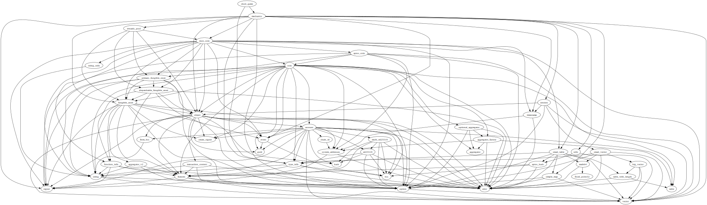
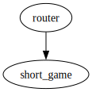

# Module `0x1b70e6e213bfb725f372840f616b3b6339d5ef17c0cacb3fe9a6ca79be1afbfd::short_game`

-  [Struct `ShortGame`](#0x1b70e6e213bfb725f372840f616b3b6339d5ef17c0cacb3fe9a6ca79be1afbfd_short_game_ShortGame)
-  [Constants](#@Constants_0)
-  [Function `prepare_game`](#0x1b70e6e213bfb725f372840f616b3b6339d5ef17c0cacb3fe9a6ca79be1afbfd_short_game_prepare_game)
-  [Function `players_count`](#0x1b70e6e213bfb725f372840f616b3b6339d5ef17c0cacb3fe9a6ca79be1afbfd_short_game_players_count)
-  [Function `rounds_count`](#0x1b70e6e213bfb725f372840f616b3b6339d5ef17c0cacb3fe9a6ca79be1afbfd_short_game_rounds_count)
-  [Function `round_duration`](#0x1b70e6e213bfb725f372840f616b3b6339d5ef17c0cacb3fe9a6ca79be1afbfd_short_game_round_duration)

<pre><code><b>use</b> <a href="">0x1::type_info</a>;
<b>use</b> <a href="mechanics.md#0x1b70e6e213bfb725f372840f616b3b6339d5ef17c0cacb3fe9a6ca79be1afbfd_mechanics">0x1b70e6e213bfb725f372840f616b3b6339d5ef17c0cacb3fe9a6ca79be1afbfd::mechanics</a>;
</code></pre>

##### Show all the modules that "short_game" depends on directly or indirectly

##### Show all the modules that depend on "short_game" directly or indirectly

## Struct `ShortGame`

Struct for the short game mode

<pre><code><b>struct</b> <a href="short_game.md#0x1b70e6e213bfb725f372840f616b3b6339d5ef17c0cacb3fe9a6ca79be1afbfd_short_game_ShortGame">ShortGame</a>
</code></pre>

##### Fields

<dl>
<dt>
<code>dummy_field: bool</code>
</dt>
<dd>

</dd>
</dl>

## Constants

The number of players is invalid

<pre><code><b>const</b> <a href="short_game.md#0x1b70e6e213bfb725f372840f616b3b6339d5ef17c0cacb3fe9a6ca79be1afbfd_short_game_EPLAYERS_COUNT_INVALID">EPLAYERS_COUNT_INVALID</a>: u64 = 1;
</code></pre>

The total number of players allowed per game

<pre><code><b>const</b> <a href="short_game.md#0x1b70e6e213bfb725f372840f616b3b6339d5ef17c0cacb3fe9a6ca79be1afbfd_short_game_PLAYERS_COUNT">PLAYERS_COUNT</a>: u8 = 2;
</code></pre>

The total number of rounds in a game

<pre><code><b>const</b> <a href="short_game.md#0x1b70e6e213bfb725f372840f616b3b6339d5ef17c0cacb3fe9a6ca79be1afbfd_short_game_ROUNDS_COUNT">ROUNDS_COUNT</a>: u8 = 1;
</code></pre>

Round duration in seconds

<pre><code><b>const</b> <a href="short_game.md#0x1b70e6e213bfb725f372840f616b3b6339d5ef17c0cacb3fe9a6ca79be1afbfd_short_game_ROUND_DURATION">ROUND_DURATION</a>: u64 = 60;
</code></pre>

## Function `prepare_game`

prepare game

<pre><code><b>public</b>(<b>friend</b>) <b>fun</b> <a href="short_game.md#0x1b70e6e213bfb725f372840f616b3b6339d5ef17c0cacb3fe9a6ca79be1afbfd_short_game_prepare_game">prepare_game</a>(players: <a href="">vector</a>&lt;<b>address</b>&gt;): <b>address</b>
</code></pre>

##### Implementation

<pre><code><b>public</b>(<b>friend</b>) <b>fun</b> <a href="short_game.md#0x1b70e6e213bfb725f372840f616b3b6339d5ef17c0cacb3fe9a6ca79be1afbfd_short_game_prepare_game">prepare_game</a>(players: <a href="">vector</a>&lt;<b>address</b>&gt;): <b>address</b> {
    <b>assert</b>!(<a href="_length">vector::length</a>(&players) == (<a href="short_game.md#0x1b70e6e213bfb725f372840f616b3b6339d5ef17c0cacb3fe9a6ca79be1afbfd_short_game_PLAYERS_COUNT">PLAYERS_COUNT</a> <b>as</b> u64), <a href="short_game.md#0x1b70e6e213bfb725f372840f616b3b6339d5ef17c0cacb3fe9a6ca79be1afbfd_short_game_EPLAYERS_COUNT_INVALID">EPLAYERS_COUNT_INVALID</a>);
    <b>let</b> durations = <a href="_empty">vector::empty</a>&lt;u64&gt;();
    for (i in 0..<a href="short_game.md#0x1b70e6e213bfb725f372840f616b3b6339d5ef17c0cacb3fe9a6ca79be1afbfd_short_game_ROUNDS_COUNT">ROUNDS_COUNT</a>) {
        <a href="_push_back">vector::push_back</a>(&<b>mut</b> durations, <a href="short_game.md#0x1b70e6e213bfb725f372840f616b3b6339d5ef17c0cacb3fe9a6ca79be1afbfd_short_game_ROUND_DURATION">ROUND_DURATION</a>);
    };

    <a href="mechanics.md#0x1b70e6e213bfb725f372840f616b3b6339d5ef17c0cacb3fe9a6ca79be1afbfd_mechanics_prepare_game">mechanics::prepare_game</a>(
        <a href="_type_of">type_info::type_of</a>&lt;<a href="short_game.md#0x1b70e6e213bfb725f372840f616b3b6339d5ef17c0cacb3fe9a6ca79be1afbfd_short_game_ShortGame">ShortGame</a>&gt;(),
        players,
        (<a href="short_game.md#0x1b70e6e213bfb725f372840f616b3b6339d5ef17c0cacb3fe9a6ca79be1afbfd_short_game_ROUNDS_COUNT">ROUNDS_COUNT</a> <b>as</b> u64),
        durations
    )
}
</code></pre>

## Function `players_count`

Returns the players count required for a short game

<pre><code>#[view]
<b>public</b> <b>fun</b> <a href="short_game.md#0x1b70e6e213bfb725f372840f616b3b6339d5ef17c0cacb3fe9a6ca79be1afbfd_short_game_players_count">players_count</a>(): u8
</code></pre>

##### Implementation

<pre><code><b>public</b> <b>fun</b> <a href="short_game.md#0x1b70e6e213bfb725f372840f616b3b6339d5ef17c0cacb3fe9a6ca79be1afbfd_short_game_players_count">players_count</a>(): u8 { <a href="short_game.md#0x1b70e6e213bfb725f372840f616b3b6339d5ef17c0cacb3fe9a6ca79be1afbfd_short_game_PLAYERS_COUNT">PLAYERS_COUNT</a> }
</code></pre>

## Function `rounds_count`

Returns the rounds count required for a short game

<pre><code>#[view]
<b>public</b> <b>fun</b> <a href="short_game.md#0x1b70e6e213bfb725f372840f616b3b6339d5ef17c0cacb3fe9a6ca79be1afbfd_short_game_rounds_count">rounds_count</a>(): u8
</code></pre>

##### Implementation

<pre><code><b>public</b> <b>fun</b> <a href="short_game.md#0x1b70e6e213bfb725f372840f616b3b6339d5ef17c0cacb3fe9a6ca79be1afbfd_short_game_rounds_count">rounds_count</a>(): u8 { <a href="short_game.md#0x1b70e6e213bfb725f372840f616b3b6339d5ef17c0cacb3fe9a6ca79be1afbfd_short_game_ROUNDS_COUNT">ROUNDS_COUNT</a> }
</code></pre>

## Function `round_duration`

Returns the round duration required for a short game

<pre><code>#[view]
<b>public</b> <b>fun</b> <a href="short_game.md#0x1b70e6e213bfb725f372840f616b3b6339d5ef17c0cacb3fe9a6ca79be1afbfd_short_game_round_duration">round_duration</a>(): u64
</code></pre>

##### Implementation

<pre><code><b>public</b> <b>fun</b> <a href="short_game.md#0x1b70e6e213bfb725f372840f616b3b6339d5ef17c0cacb3fe9a6ca79be1afbfd_short_game_round_duration">round_duration</a>(): u64 { <a href="short_game.md#0x1b70e6e213bfb725f372840f616b3b6339d5ef17c0cacb3fe9a6ca79be1afbfd_short_game_ROUND_DURATION">ROUND_DURATION</a> }
</code></pre>
