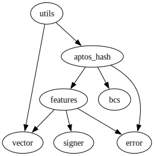

# Module `0x1b70e6e213bfb725f372840f616b3b6339d5ef17c0cacb3fe9a6ca79be1afbfd::utils`

-  [Function `hashed_cooperate`](#0x1b70e6e213bfb725f372840f616b3b6339d5ef17c0cacb3fe9a6ca79be1afbfd_utils_hashed_cooperate)
-  [Function `hashed_compete`](#0x1b70e6e213bfb725f372840f616b3b6339d5ef17c0cacb3fe9a6ca79be1afbfd_utils_hashed_compete)

<pre><code><b>use</b> <a href="">0x1::aptos_hash</a>;
<b>use</b> <a href="">0x1::vector</a>;
</code></pre>

##### Show all the modules that "utils" depends on directly or indirectly

##### Show all the modules that depend on "utils" directly or indirectly

## Function `hashed_cooperate`

<pre><code>#[view]
<b>public</b> <b>fun</b> <a href="utils.md#0x1b70e6e213bfb725f372840f616b3b6339d5ef17c0cacb3fe9a6ca79be1afbfd_utils_hashed_cooperate">hashed_cooperate</a>(pepper: <a href="">vector</a>&lt;u8&gt;): <a href="">vector</a>&lt;u8&gt;
</code></pre>

##### Implementation

<pre><code><b>public</b> <b>fun</b> <a href="utils.md#0x1b70e6e213bfb725f372840f616b3b6339d5ef17c0cacb3fe9a6ca79be1afbfd_utils_hashed_cooperate">hashed_cooperate</a>(pepper: <a href="">vector</a>&lt;u8&gt;): <a href="">vector</a>&lt;u8&gt; {
    // <b>true</b> for cooperate
    <a href="_append">vector::append</a>(&<b>mut</b> pepper, <a href="">vector</a>[1]);
    <a href="_blake2b_256">aptos_hash::blake2b_256</a>(pepper)
}
</code></pre>

## Function `hashed_compete`

<pre><code>#[view]
<b>public</b> <b>fun</b> <a href="utils.md#0x1b70e6e213bfb725f372840f616b3b6339d5ef17c0cacb3fe9a6ca79be1afbfd_utils_hashed_compete">hashed_compete</a>(pepper: <a href="">vector</a>&lt;u8&gt;): <a href="">vector</a>&lt;u8&gt;
</code></pre>

##### Implementation

<pre><code><b>public</b> <b>fun</b> <a href="utils.md#0x1b70e6e213bfb725f372840f616b3b6339d5ef17c0cacb3fe9a6ca79be1afbfd_utils_hashed_compete">hashed_compete</a>(pepper: <a href="">vector</a>&lt;u8&gt;): <a href="">vector</a>&lt;u8&gt; {
    // <b>false</b> for compete
    <a href="_append">vector::append</a>(&<b>mut</b> pepper, <a href="">vector</a>[0]);
    <a href="_blake2b_256">aptos_hash::blake2b_256</a>(pepper)
}
</code></pre>
